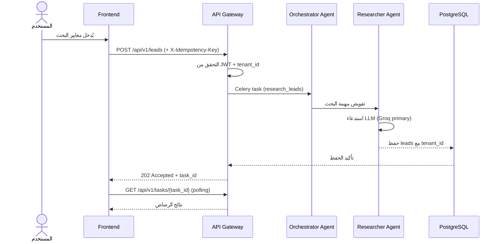

# Dealix — البنية المعمارية

> **الإصدار:** 1.0.0 · **آخر تحديث:** 2025  
> **الروابط ذات الصلة:** [API Reference](./docs/API.md) · [دليل النشر](./docs/DEPLOYMENT.md)

---

## نظرة عامة

Dealix منصة مبيعات B2B مدعومة بالذكاء الاصطناعي، مُصمَّمة أصلاً للسوق السعودي مع دعم كامل للغة العربية (Arabic-first RTL). تتكوّن المنصة من ثماني وكلاء ذكاء اصطناعي متخصصة تعمل بتنسيق تام لأتمتة دورة المبيعات الكاملة: من اكتشاف الرصاص (Lead Discovery) حتى إغلاق الصفقة (Deal Closing)، مع التزام راسخ بمتطلبات الامتثال المحلية (ZATCA, PDPL, SDAIA, NCA).

**المبادئ التأسيسية:**
- **Arabic-first:** جميع النصوص والواجهات والبيانات الافتراضية باللغة العربية مع دعم RTL
- **Multi-tenant:** عزل كامل بين المستأجرين (Tenants) على مستوى الصفوف والاستعلامات
- **Idempotency:** مفتاح idempotency على كل نقطة طرفية مُعدِّلة (mutation endpoint)
- **Audit-first:** سلسلة hash لسجلات التدقيق لا يمكن التلاعب بها
- **Truth Registry:** لا يُدّعى أي ميزة "live" دون 30 يوماً من قياسات الأداء الفعلية

---

## الطبقات الرئيسية

### 1. طبقة العرض — Frontend

| التقنية | الإصدار | الغرض |
|---------|---------|-------|
| Next.js | 15.x | إطار React مع SSR/SSG |
| React | 19.x | بناء واجهات المستخدم |
| TypeScript | 5.7 | سلامة الأنواع |
| Tailwind CSS | 3.4 | تصميم RTL-first |

**الخصائص الأساسية:**
- جميع المكونات مبنية بـ `dir="rtl"` افتراضياً
- تحميل الخطوط العربية (Noto Sans Arabic / IBM Plex Arabic) عبر `next/font`
- Server Components للصفحات الثقيلة، Client Components للتفاعل الفوري
- التواصل مع الـ backend عبر HTTPS/JWT
- إدارة الحالة عبر Zustand + React Query (server state)

### 2. طبقة API — Backend

| التقنية | الإصدار | الغرض |
|---------|---------|-------|
| FastAPI | 0.115 | إطار REST API غير متزامن |
| Python | 3.12 | لغة البرمجة |
| Pydantic v2 | 2.x | التحقق من البيانات |
| SQLAlchemy | 2.x | ORM + async sessions |
| Alembic | 1.x | هجرة قواعد البيانات |

**المسؤوليات:**
- بوابة API موحّدة (API Gateway): المصادقة، rate limiting، idempotency، تسجيل التدقيق
- توجيه الطلبات إلى الوكلاء المناسبين عبر Celery tasks
- إدارة JWT: إصدار + تجديد tokens
- فرض سياسات الـ tenant isolation قبل كل استعلام

### 3. طبقة الذكاء الاصطناعي — AI Agents

ثمانية وكلاء متخصصة تعمل بصورة غير متزامنة عبر Celery، مع توجيه ذكي للنماذج اللغوية:

```
LLM Router:
  Primary  → Groq API (llama-3.3-70b)   [زمن استجابة منخفض]
  Fallback → OpenAI API (gpt-4o-mini)   [عند تجاوز الحصة أو الخطأ]
```

انظر قسم **AI Agents — الوصف التفصيلي** أدناه.

### 4. طبقة البيانات — Data

| التقنية | الإصدار | الغرض |
|---------|---------|-------|
| PostgreSQL | 16 | قاعدة البيانات الرئيسية |
| Redis | 7 | التخزين المؤقت (Cache) + message broker |
| Celery | 5 | معالجة المهام الخلفية |

**مبادئ البيانات:**
- Row-Level Security (RLS) لعزل tenant
- كل جدول يحتوي على `tenant_id` مُفهرَس
- audit_logs محمية بـ hash chain لا يمكن تغييرها بصمت
- يومياً: pg_dump → S3-compatible storage

### 5. طبقة التكامل — Integrations

| الخدمة | الغرض | الاتجاه |
|--------|-------|---------|
| WhatsApp Business API | التواصل مع العملاء | ذهاب + إياب |
| ZATCA API | الفوترة الإلكترونية | ذهاب |
| Groq API | النموذج اللغوي الأساسي | ذهاب |
| OpenAI API | النموذج اللغوي الاحتياطي | ذهاب |
| Prometheus | مقاييس الأداء | ذهاب |
| Sentry | تتبع الأخطاء | ذهاب |

---

## مخطط المكونات (ASCII)

```
┌─────────────────────────────────────────────────────────────┐
│                  Frontend (Next.js 15)                       │
│                   Arabic-First · RTL                         │
│         React 19 · TypeScript 5.7 · Tailwind 3.4 RTL        │
└───────────────────────────┬─────────────────────────────────┘
                            │ HTTPS / JWT
                            ▼
┌─────────────────────────────────────────────────────────────┐
│                 API Gateway (FastAPI 0.115)                  │
│     Rate Limit · Auth/JWT · Idempotency · Audit Log         │
│              Python 3.12 · Pydantic v2                       │
└──┬──────────┬────────────┬──────────┬──────────┬────────────┘
   │          │            │          │          │
   ▼          ▼            ▼          ▼          ▼
[Orchestrator][Researcher][Qualifier][Outreach][Closer]
[Compliance] [Analytics] [WhatsApp]
   │                                            │
   └────────────────────────────────────────────┘
                        │
              ┌─────────▼──────────┐
              │   Celery Workers   │
              │  (Redis as broker) │
              └─────────┬──────────┘
                        │
         ┌──────────────┼──────────────┐
         ▼              ▼              ▼
   ┌──────────┐  ┌──────────┐  ┌────────────────┐
   │PostgreSQL│  │  Redis   │  │  LLM Router    │
   │    16    │  │    7     │  │ Groq → OpenAI  │
   └──────────┘  └──────────┘  └────────────────┘
                                       │
                          ┌────────────┼────────────┐
                          ▼            ▼             ▼
                   [Groq API]   [OpenAI API]  [WhatsApp API]
                  llama-3.3-70b  gpt-4o-mini
```

---

## تدفقات البيانات الرئيسية

### تدفق 1: توليد الرصاص — Lead Generation



### تدفق 2: التأهيل — Qualification

```
المستخدم → POST /api/v1/leads/{id}/qualify
    ↓
API Gateway (auth + idempotency check)
    ↓
Orchestrator Agent → Qualifier Agent
    ↓
Qualifier: تحليل بيانات الرصاص عبر LLM
    ↓
نتيجة: درجة التأهيل (0-100) + التبرير (عربي)
    ↓
تحديث قاعدة البيانات + إشعار Webhook
    ↓
Frontend: عرض درجة التأهيل والتوصيات
```

### تدفق 3: التواصل — Outreach via WhatsApp

```
Outreach Agent تستقبل leads مؤهَّلة
    ↓
توليد رسالة شخصية (عربي) عبر LLM
    ↓
Compliance Agent: مراجعة المحتوى (PDPL)
    ↓ (موافقة)
WhatsApp Business API: إرسال الرسالة
    ↓
تسجيل: conversation_id + timestamp + hash
    ↓
Webhook inbound: استقبال ردود العميل
    ↓
WhatsApp Agent: معالجة الردود + تحديث CRM
```

### تدفق 4: الإغلاق — Closing

```
Closer Agent تستقبل إشارة "اهتمام قوي"
    ↓
تحليل سياق المحادثة الكاملة
    ↓
اقتراح خطوة الإغلاق المثلى (عرض، عقد، اتصال)
    ↓
Compliance Agent: مراجعة العرض (ZATCA)
    ↓
إرسال العرض + تسجيل في audit log (hash chain)
    ↓
Analytics Agent: تحديث funnel metrics
```

---

## AI Agents — الوصف التفصيلي

### 1. Orchestrator — المنسّق

| الخاصية | القيمة |
|---------|--------|
| **الدور** | تنسيق الوكلاء الأخرى وإدارة سير العمل |
| **المدخلات** | طلب مستخدم + سياق tenant + حالة الرصاص |
| **المخرجات** | تسلسل مهام Celery موجَّه للوكلاء المناسبة |
| **LLM** | Groq (llama-3.3-70b) → OpenAI (gpt-4o-mini) |
| **Cache TTL** | لا cache (orchestration حيّة دائماً) |
| **الخاصية المميزة** | يحتفظ بـ workflow state في Redis |

### 2. Researcher — الباحث

| الخاصية | القيمة |
|---------|--------|
| **الدور** | اكتشاف وجمع بيانات الرصاص المحتملين |
| **المدخلات** | معايير البحث (قطاع، حجم، موقع) |
| **المخرجات** | قائمة leads مع بيانات الشركة والمسؤولين |
| **LLM** | Groq primary |
| **Cache TTL** | 24 ساعة لنتائج البحث المتماثلة |

### 3. Qualifier — المؤهِّل

| الخاصية | القيمة |
|---------|--------|
| **الدور** | تقييم جودة الرصاص وإسناد درجة تأهيل |
| **المدخلات** | بيانات الرصاص + معايير ICP (Ideal Customer Profile) |
| **المخرجات** | درجة 0-100 + تبرير نصي عربي + توصية |
| **LLM** | Groq primary → OpenAI fallback |
| **Cache TTL** | لا cache (التقييم يعتمد على بيانات حيّة) |

### 4. Outreach — التواصل

| الخاصية | القيمة |
|---------|--------|
| **الدور** | توليد وإرسال رسائل تواصل شخصية |
| **المدخلات** | بيانات الرصاص + قالب الرسالة + سياق tenant |
| **المخرجات** | رسالة WhatsApp مخصصة (عربي) |
| **LLM** | Groq primary |
| **Cache TTL** | 1 ساعة لقوالب الرسائل |

### 5. Closer — المُغلِق

| الخاصية | القيمة |
|---------|--------|
| **الدور** | اقتراح وتنفيذ خطوات إغلاق الصفقة |
| **المدخلات** | سجل المحادثة الكامل + بيانات الصفقة |
| **المخرجات** | خطوة إغلاق مُوصى بها + مسودة عرض |
| **LLM** | OpenAI (gpt-4o-mini) — دقة أعلى للإغلاق |
| **Cache TTL** | لا cache |

### 6. Compliance — الامتثال

| الخاصية | القيمة |
|---------|--------|
| **الدور** | مراجعة المحتوى والعمليات للامتثال التنظيمي |
| **المدخلات** | نص الرسالة / العرض / البيانات |
| **المخرجات** | موافقة ✓ أو رفض مع سبب مفصّل |
| **LLM** | Groq primary |
| **Cache TTL** | لا cache (كل محتوى يُراجَع باستقلالية) |
| **الأنظمة** | ZATCA, PDPL, SDAIA, NCA |

### 7. Analytics — التحليلات

| الخاصية | القيمة |
|---------|--------|
| **الدور** | رصد مقاييس المبيعات وتوليد تقارير الأداء |
| **المدخلات** | أحداث funnel من قاعدة البيانات |
| **المخرجات** | تقارير، مخططات، تنبيهات انحراف |
| **LLM** | Groq (تفسير النتائج فقط) |
| **Cache TTL** | 15 دقيقة للتقارير المجمَّعة |

### 8. WhatsApp Agent — وكيل واتساب

| الخاصية | القيمة |
|---------|--------|
| **الدور** | إدارة المحادثات الواردة عبر WhatsApp Business API |
| **المدخلات** | رسائل Webhook الواردة |
| **المخرجات** | ردود تلقائية + تحديث سجل CRM |
| **LLM** | Groq primary |
| **Cache TTL** | session context: 4 ساعات |

---

## قرارات معمارية — ADRs

### ADR-001: اختيار Groq كـ Primary LLM

**الحالة:** مُعتمَد  
**السياق:** المنصة تتطلب زمن استجابة منخفضاً لتجربة مستخدم سلسة في التواصل المباشر.  
**القرار:** Groq API مع llama-3.3-70b كنموذج أساسي، OpenAI gpt-4o-mini كاحتياط.  
**المبرر:** Groq يوفر استدلالاً (inference) سريعاً جداً مع جودة عالية للغة العربية. OpenAI كاحتياط يضمن الاستمرارية.  
**العواقب:** تبعية لمزوّدَين خارجيَّين — يُخفَّف بـ circuit breaker وإعادة المحاولة التلقائية.

### ADR-002: PostgreSQL مقابل MongoDB

**الحالة:** مُعتمَد  
**السياق:** البيانات تحتوي على علاقات معقدة بين tenants، leads، conversations، deals.  
**القرار:** PostgreSQL 16 مع Row-Level Security.  
**المبرر:** العلاقات الجوهرية تستفيد من النموذج العلائقي. RLS يبسّط tenant isolation ويقلل مخاطر تسرب البيانات.  
**العواقب:** يتطلب تصميماً دقيقاً للـ schema، لكن يمنح ضمانات ACID كاملة.

### ADR-003: Celery للمهام الخلفية

**الحالة:** مُعتمَد  
**السياق:** استدعاءات LLM وعمليات WhatsApp غير متزامنة بطبيعتها وقد تستغرق عشرات الثواني.  
**القرار:** Celery 5 مع Redis كـ message broker وresult backend.  
**المبرر:** يفصل API response فوراً عن تنفيذ المهمة، ويتيح retry، scheduling، وmonitoring عبر Flower.  
**العواقب:** يُضاف تعقيد التشغيل (worker management)، يُعوَّض بـ Docker Compose في التطوير.

### ADR-004: Tenant Isolation Strategy

**الحالة:** مُعتمَد  
**السياق:** منصة multi-tenant — يجب أن تكون بيانات كل tenant معزولة تماماً.  
**القرار:** عزل بمستويين: (1) Row-Level Security على مستوى PostgreSQL، (2) فلترة `tenant_id` في كل استعلام SQLAlchemy.  
**المبرر:** الدفاع بعمق (Defense in Depth) — خطأ برمجي في الطبقة العليا لا يُسرّب بيانات لأن RLS تحمي في الطبقة الأدنى.  
**العواقب:** يجب اختبار كل استعلام جديد مع tenant IDs متعددة.

### ADR-005: Hash Chain للـ Audit Logs

**الحالة:** مُعتمَد  
**السياق:** متطلبات SDAIA وNCA تشترط سلامة سجلات التدقيق.  
**القرار:** كل سجل audit يحتوي على `previous_hash` — بناء سلسلة هاش لا يمكن تعديلها بصمت.  
**المبرر:** أي محاولة تعديل سجل تاريخي تكسر السلسلة وتُكشَف فوراً.  
**العواقب:** لا يمكن حذف سجلات audit — يُعالج بـ soft-delete وretention policies.

### ADR-006: Arabic-First UI Invariant

**الحالة:** مُعتمَد — ثابت غير قابل للكسر  
**السياق:** السوق المستهدف سعودي بالأساس، والتجربة الأولى يجب أن تكون عربية.  
**القرار:** جميع المكونات تُبنى بـ RTL افتراضياً. اللغة الإنجليزية خيار إضافي، ليست الافتراض.  
**المبرر:** التصميم RTL-first أسلم من تحويل LTR إلى RTL لاحقاً — يتجنب مشاكل التخطيط التراكمية.  
**العواقب:** المكتبات الخارجية يجب التحقق من دعمها RTL قبل الإضافة.

---

## قواعد ثابتة — Invariants

يجب أن تظل هذه القواعد صحيحة في كل حالة دون استثناء:

| # | القاعدة | التطبيق |
|---|---------|---------|
| **I-1** | **Arabic-First RTL** | كل مكون واجهة يُنشأ بـ `dir="rtl"` افتراضياً |
| **I-2** | **Idempotency على كل mutation** | `X-Idempotency-Key` header مطلوب في POST/PUT/PATCH |
| **I-3** | **Hash Chain لـ Audit Logs** | كل سجل يرتبط بالسابق عبر SHA-256 |
| **I-4** | **Tenant Isolation** | RLS + `tenant_id` filter في كل استعلام |
| **I-5** | **Truth Registry** | لا يُدَّعى أي ميزة "live" دون 30 يوماً من telemetry موثّق |
| **I-6** | **Claims Registry** | ممنوع: "bank-grade"، "military-grade"، "SOC 2"، "ISO 27001" بدون شهادة فعلية |
| **I-7** | **LLM Fallback** | كل استدعاء LLM يمر عبر Router مع circuit breaker |
| **I-8** | **Compliance Gate** | أي رسالة تُرسَل للعملاء تمر عبر Compliance Agent أولاً |

---

## الروابط والمراجع

- [توثيق API](./docs/API.md) — نقاط الطرفية، المصادقة، Idempotency
- [دليل النشر](./docs/DEPLOYMENT.md) — Docker, Kubernetes, CI/CD
- [ZATCA API Documentation](https://zatca.gov.sa/ar/E-Invoicing/Pages/default.aspx)
- [PDPL — نظام حماية البيانات الشخصية](https://sdaia.gov.sa/ar/SDAIA/about/Pages/PersonalDataProtection.aspx)
