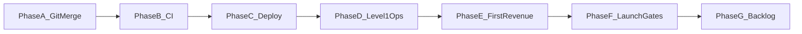

# Dealix — خطة الإكمال الشاملة (تنفيذ + نشر + عميل)

هذا المستند **خطة عمل واحدة** لإيصال Dealix من «وثائق وفرع» إلى «شيء يراه العميل ويُقاس». يفترض أنك قد تملك أكثر من فرع (مثل `cursor/level-1-full-ops-pack-a8b4` أو `claude/service-activation-console-IA2JK`) — **الدمج إلى `main` والنشر** هما الحلقة التي غالباً تُنسى.

**مرافق باللغة والمسار الإنجليزي/المختلط:** [COMMERCIAL_LAUNCH_MASTER_PLAN.md](COMMERCIAL_LAUNCH_MASTER_PLAN.md) (مراحل تدشين تجاري + روابط POST_MERGE وStaging).

---

## 0) الحقيقة عن هذا الريبو مقابل «23 مرحلة»

بعض أوامر الـ closure prompts تفترض سكربتات واختبارات **غير موجودة** في `VoXc2/dealix` الحالي، مثل:

- `scripts/repo_architecture_audit.py`
- `scripts/forbidden_claims_audit.py`
- `scripts/verify_service_tower.py`
- `scripts/verify_delivery_workflows.py`
- مجموعة `tests/test_operator_saudi_safety.py` وغيرها من ملفات الاختبار المذكورة في prompt خارجي

**السياسة:** لا نُنشئ stubs وهمية لتمرير verdict. ما يوجد فعلياً:

| التحقق | المسار في الريبو |
|--------|------------------|
| compileall | `python -m compileall api auto_client_acquisition` |
| pytest كامل | `APP_ENV=test pytest -q --no-cov` (كما في CI) |
| smoke in-process | `python scripts/smoke_inprocess.py` |
| smoke staging | `python scripts/smoke_staging.py --base-url "$STAGING_BASE_URL"` |
| launch readiness | `python scripts/launch_readiness_check.py --base-url "$STAGING_BASE_URL"` |
| طباعة المسارات | `python scripts/print_routes.py` |
| CI | [.github/workflows/ci.yml](../.github/workflows/ci.yml) — يشتغل على **push/PR إلى `main`** أو `dealix-v3-autonomous-revenue-os` فقط |

إذا احتجت سكربتات audit لاحقاً، عرّفها في PR منفصل مع اختبارات حقيقية — لا تُدرج في «إكمال شاملة» كوهم.

---

## 1) خريطة المراحل (الترتيب الإلزامي)



| المرحلة | الهدف | DoD |
|---------|--------|-----|
| **A — Git** | كل العمل على `main` (أو فرع تكامل واحد) | PR مدمج؛ لا فرع يتقدم على الإنتاج بدون merge |
| **B — CI** | GitHub Actions أخضر على الـ PR | Checks خضراء قبل الدمج |
| **C — Deploy** | نفس الـ commit على staging/prod | `/health` 200؛ `launch_readiness_check` OK حيث ينطبق |
| **D — Level 1 Ops** | Form + Sheet + Script | [LEVEL_1_ACCEPTANCE_CHECKLIST_AR.md](ops/full_ops_pack/LEVEL_1_ACCEPTANCE_CHECKLIST_AR.md) |
| **E — أول إيراد** | Pilot + Proof يدوي | صف في اللوحة + Proof Pack + فاتورة/التزام |
| **F — بوابات الإطلاق** | قرار GO/NO-GO عام | [LAUNCH_GATES.md](LAUNCH_GATES.md) + [PUBLIC_LAUNCH_CHECKLIST.md](PUBLIC_LAUNCH_CHECKLIST.md) |
| **G — Backlog** | ميزات كبيرة بعد الإثبات | [POST_LAUNCH_BACKLOG.md](ops/POST_LAUNCH_BACKLOG.md) |

---

## 2) المرحلة A — إغلاق Git (لا عميل بدون merge)

1. **ادمج** كل فرع فيه عمل جاهز (مثلاً PR لـ Level 1 ops، أو أي PR آخر مفتوح) إلى `main` بعد مراجعة.
2. على الجهاز الجديد: `git fetch && git checkout main && git pull`.
3. **لا تعتمد** على «الكود على الفرع فقط» كدليل للعميل — الإنتاج يقرأ عادة `main` بعد النشر.

**مشكلة شائعة:** CI لا يعمل على push لفرع عشوائي — انظر القسم 7.

---

## 3) المرحلة B — CI

- افتح **PR إلى `main`**؛ الـ workflow في [ci.yml](../.github/workflows/ci.yml) يشغّل `compileall`، `pytest`، `smoke_inprocess.py`، وخطوات إضافية.
- **DoD:** كل checks خضراء قبل merge.

---

## 4) المرحلة C — النشر والتحقق

1. انشر `main` على بيئتك (Railway / VPS — انظر [RAILWAY_DEPLOY_GUIDE_AR.md](RAILWAY_DEPLOY_GUIDE_AR.md) أو [DEPLOY_CHECKLIST.md](DEPLOY_CHECKLIST.md)).
2. نفّذ:
   ```bash
   export STAGING_BASE_URL="https://api.dealix.me"
   curl -i "${STAGING_BASE_URL}/health"
   python3 scripts/launch_readiness_check.py --base-url "$STAGING_BASE_URL"
   ```
3. **DoD:** استجابة 200 على `/health`؛ مخرجات السكربت توضح النجاح أو السبب الفعلي للفشل.

---

## 5) المرحلة D — Level 1 Full Ops (وصول العميل بدون كود إضافي)

اتبع بالترتيب:

1. [TURN_ON_FULL_OPS_AR.md](ops/TURN_ON_FULL_OPS_AR.md)
2. [DEALIX_FULL_OPS_SETUP.md](ops/full_ops_pack/DEALIX_FULL_OPS_SETUP.md)
3. [CUSTOMER_FULL_OPS_JOURNEY_AR.md](CUSTOMER_FULL_OPS_JOURNEY_AR.md) (رحلة العميل)
4. [LEVEL_1_ACCEPTANCE_CHECKLIST_AR.md](ops/full_ops_pack/LEVEL_1_ACCEPTANCE_CHECKLIST_AR.md) (أدلة)

**DoD:** Form → Sheet → صف تجريبي كامل + Proof قابل للعرض.

---

## 6) المرحلة E — أول إيراد (مسار واقعي)

- [OFFER_LADDER.md](OFFER_LADDER.md) + [MANUAL_PAYMENT_SOP.md](ops/MANUAL_PAYMENT_SOP.md)
- [NORTH_STAR_AR.md](strategic/NORTH_STAR_AR.md) — المقياس: Proof + Pilot قبل MRR الواسع

**DoD:** دفع أو التزام مكتوب + Proof Pack مُسلَّم.

---

## 7) المرحلة F — الإطلاق العام (عند الجاهزية فقط)

- [LAUNCH_GATES.md](LAUNCH_GATES.md) — لا ادّعاء «إطلاق كامل» دون استيفاء القاعدة المذكورة هناك.
- [PUBLIC_LAUNCH_CHECKLIST.md](PUBLIC_LAUNCH_CHECKLIST.md)

---

## 8) المرحلة G — ما بعد الإثبات (لا تنفّذ قبل E)

- Self-Growth OS كامل، operator safety tests، service tower runtime، إلخ — حسب [POST_LAUNCH_BACKLOG.md](ops/POST_LAUNCH_BACKLOG.md) و**محفّزات ship-when** (مفتاح بحث حقيقي، أول ProofEvent، إلخ).

---

## 9) جدول «من يملك ماذا» (Founder vs Engineering)

| المهمة | المالك |
|--------|--------|
| Merge + deploy + مفاتيح بيئة | Founder / DevOps |
| Google Sheet + Form + موافقات العملاء | Founder + تشغيل |
| رسائل وكالات + متابعة | Founder |
| كتابة سكربتات audit غير الموجودة | Engineering في PR لاحق |

---

## 10) روابط المرجعية السريعة (في هذا الريبو)

| الوثيقة | الاستخدام |
|---------|-----------|
| [LAUNCH_MASTER_PLAN_AR.md](LAUNCH_MASTER_PLAN_AR.md) | تدشين مرحلي |
| [CUSTOMER_FULL_OPS_JOURNEY_AR.md](CUSTOMER_FULL_OPS_JOURNEY_AR.md) | رحلة العميل |
| [NORTH_STAR_AR.md](strategic/NORTH_STAR_AR.md) | المخرج والقياس |

> إذا كانت عندك على فرع آخر وثائق إضافية (مثل Executive Decision Pack أو Strategic Master Plan 2026)، ادمجها إلى `main` ثم أضف رابطها هنا أو في `LAUNCH_MASTER_PLAN_AR.md`.

---

## 11) تفعيل CI على فرع عمل طويل (اختياري)

في [.github/workflows/ci.yml](../.github/workflows/ci.yml) حالياً:

```yaml
push:
  branches: [main, dealix-v3-autonomous-revenue-os]
```

إذا أردت أن **كل push** على فرع مثل `claude/service-activation-console-IA2JK` يشغّل CI بدون انتظار PR، أضف اسم الفرع إلى القائمة في PR صغير منفصل (سطر واحد) — **بعد** موافقة الفريق على تشغيل CI على ذلك الفرع (تكلفة minutes).

---

## 12) خلاصة تنفيذية (جملة واحدة)

**ادمج إلى `main` → تأكد CI أخضر → انشر → شغّل Level 1 مع أدلة → أول Pilot + Proof → ثم افتح البوابات العامة؛ لا تبني 23 مرحلة دفعة واحدة ولا stubs للاختبارات المفقودة.**
