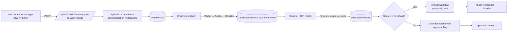

# Data flow

End-to-end path of a customer lead through Dealix.

Reference paths:

- Public surface: `api/routers/public.py`, `api/routers/leads.py`.
- Middleware: `api/middleware/tenant_isolation.py`,
  `api/middleware/bopla_redaction.py`, `api/security/rate_limit.py`.
- Enrichment: `dealix/enrichment/{wathq,apollo,clearbit}_client.py`.
- Scoring: `auto_client_acquisition/pipelines/scoring.py`.
- Durable workflows: `dealix/workflows/inngest_app.py`.
- Notifications: `dealix/integrations/knock_client.py`.
