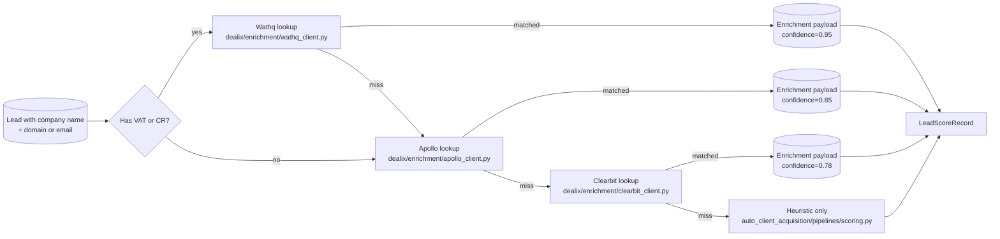

# Enrichment chain

Wathq is tried first when a Saudi VAT/CR is available — it's the
authoritative source and short-circuits the slower paid vendors.

Each client short-circuits when its env key is unset; the orchestrator
in `dealix/enrichment/__init__.enrich()` walks the chain top-to-bottom
and returns the first confident match.
