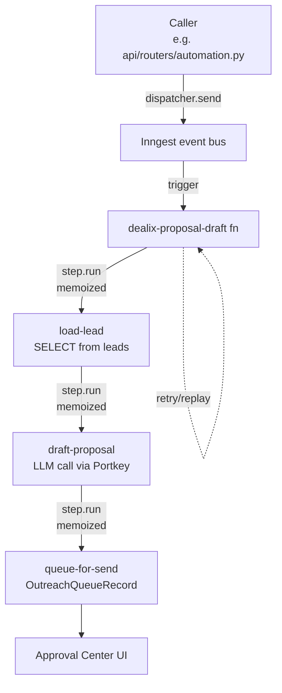

# Durable workflows

Long-running LLM flows live in Inngest so a worker restart doesn't
re-spend tokens. Short async work stays on arq.

Why memoization matters:

- Worker crash between `draft-proposal` and `queue-for-send`?
  Replay starts at `queue-for-send` — the LLM call doesn't repeat.
- Customer pauses the function from the Inngest UI?
  No state held in the FastAPI process; safe to redeploy.

Reference paths:

- Runtime: `dealix/workflows/inngest_app.py`.
- LLM routing: `dealix/llm/portkey_gateway.py` adds tenant_id metadata.
- Approval UI: `frontend/src/components/approvals/`.
