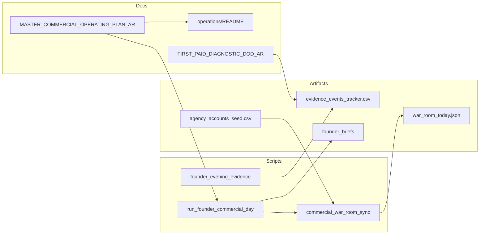
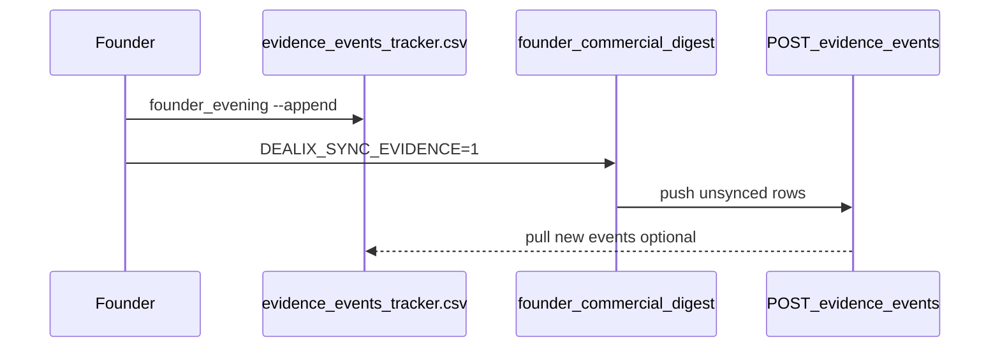
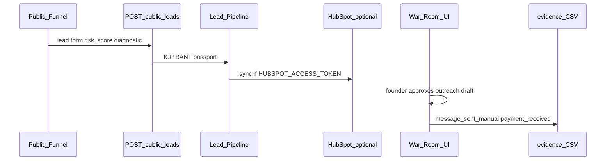

# مرجع مراجعة سريعة: الوثائق التجارية ↔ ما هو منفَّذ في Dealix

**الغرض:** ربط خطة التشغيل ([MASTER_COMMERCIAL_OPERATING_PLAN_AR.md](MASTER_COMMERCIAL_OPERATING_PLAN_AR.md) وملحقاتها) بما هو موجود فعلياً في المستودع — سكربتات، CSV، بوابات، واجهات، API، وحوكمة.

**خريطة القيمة (18 قسمًا — منتج · امتثال · تسليم · KPI · سوق):** [COMMERCIAL_VALUE_MAP_AR.md](COMMERCIAL_VALUE_MAP_AR.md) · `py -3 scripts/commercial_value_map_status.py`

**حزمة استخبارات السوق 2025–2026:** [MARKET_INTELLIGENCE_MASTER_INDEX_AR.md](MARKET_INTELLIGENCE_MASTER_INDEX_AR.md) — 21 وثيقة · `py -3 scripts/market_intelligence_status.py` · يُحقَن في digest الصباحي

**ابدأ يومياً:** [MASTER_COMMERCIAL_OPERATING_PLAN_AR.md](MASTER_COMMERCIAL_OPERATING_PLAN_AR.md) · [operations/README.md](operations/README.md)

---

## فهرس

1. [المبدأ ومراحل MASTER](#المبدأ-ومراحل-master)
2. [خريطة يومية](#خريطة-يومية-صباح--مساء--واجهة)
3. [خطوات الصباح الكاملة](#خطوات-الصباح-الكامل-run_founder_commercial_day)
4. [مسار الإغلاق والأدلة](#مسار-الإغلاق-discovery--عرض--دفع-يدوي--proof)
5. [أسبوعياً ومحتوى](#أسبوعياً-scorecard-وتوسيع-الاستهداف-ومحتوى)
6. [بوابات التحقق](#بوابات-التحقق-soft--موحّد--paid)
7. [كتالوج السكربتات](#كتالوج-السكربتات-حسب-الوظيفة)
8. [وحدات Python](#وحدات-dealixcommercial_ops)
9. [واجهات وAPI](#واجهات-ops-وقمع-عام-و-api)
10. [إعدادات ومتغيرات](#إعدادات-config-ومتغيرات-بيئة)
11. [KPI وCRM](#kpi-وcrm-بدون-أرقام-مخترعة)
12. [تسليم Proof وحزم عميل](#تسليم-proof-وحزم-عميل)
13. [GTM واستهداف](#gtm-واستهداف-ومotion-a)
14. [حوكمة وممنوعات](#حوكمة-وممنوعات)
15. [ملحقات استراتيجية](#ملحقات-مراجعة-سريعة-استراتيجية--إغلاق)
16. [لقطة حالة آلية](#لقطة-حالة-آلية-commercial_value_map_status)
17. [API كامل](#api-كامل-public--ops-autopilot--evidence--revenue-os)
18. [مكونات Frontend](#مكونات-frontend-↔-صفحات-ops)
19. [اختبارات و smoke](#اختبارات-pytest-و-smoke)
20. [مزامنة الأدلة](#مزامنة-الأدلة-csv--api)
21. [حقول CSV الوكالات](#حقول-csv-الوكالات-agency_accounts_seed)
22. [Revenue OS و Business NOW](#revenue-os--decision-passport--business-now)
23. [Truth Matrix وتكاملات](#truth-matrix-وتكاملات-خارجية)
24. [استخبارات السوق](#استخبارات-السوق-20252026)
25. [حالة محلية var](#حالة-محلية-var-ومخرجات-آلية)
26. [استكشاف أخطاء FAIL](#استكشاف-أخطاء-عند-fail)
27. [CI/CD و GitHub Actions](#cicd-و-github-actions)
28. [نشر Railway وإنتاج](#نشر-railway-وإنتاج)
29. [فوترة ودفع وموافقات](#فوترة-ودفع-moyasar-ومركز-الموافقات)
30. [North Star وخريطة OS](#north-star-metrics-و-code_map_os)
31. [مجلدات playbooks وعينات](#مجلدات-playbooks--samples--checklists)
32. [وكلاء Cursor](#وكلاء-cursor-للمؤسس)
33. [مسار Lead E2E](#مسار-lead-e2e-من-الويب-إلى-crm)
34. [فهرس وثائق commercial](#فهرس-مجلد-doccommercial)
35. [مصفوفة متغيرات بيئة](#مصفوفة-متغيرات-بيئة-كاملة)
36. [Checklist تنفيذي](#checklist-تنفيذي-مراجعة-سريعة)

---

## المبدأ ومراحل MASTER

القيمة في الوثائق: **إيراد مدفوع + Proof Pack قبل التوسع التقني**. لا ادعاء «إطلاق كامل» قبل [LAUNCH_GATES.md](../LAUNCH_GATES.md) و[PAID_LAUNCH_AFTER_SOFT_PASS_AR.md](PAID_LAUNCH_AFTER_SOFT_PASS_AR.md).

| مرحلة | الهدف | وثيقة |
|-------|--------|------|
| 0 | آلة إغلاق + Discovery قبل ديمو | [EVIDENCE_EVENTS_CLOSE_PATH_AR.md](operations/EVIDENCE_EVENTS_CLOSE_PATH_AR.md) |
| 1 | أول `payment_received` + `proof_pack_delivered` | [FIRST_PAID_DIAGNOSTIC_DOD_AR.md](operations/FIRST_PAID_DIAGNOSTIC_DOD_AR.md) |
| 2 | تكرار Motion A (وكالة) | [operations/motion_a_agency/](operations/motion_a_agency/) |
| 3 | شريك + إحالة | [PARTNER_ONBOARDING_KIT_AR.md](operations/PARTNER_ONBOARDING_KIT_AR.md) |
| 4 | AEO + Objection Engine | [AEO_CONTENT_CALENDAR_AR.md](operations/AEO_CONTENT_CALENDAR_AR.md) |
| 5 | منصة | بعد تكرار الأدلة — لا تسبق الإيراد |

**Soft vs Paid (MASTER):**

| مرحلة | تحقق |
|-------|------|
| Soft Launch | [COMMERCIAL_LAUNCH_CHECKLIST_AR.md](COMMERCIAL_LAUNCH_CHECKLIST_AR.md) · `verify_commercial_launch_ready.py` |
| Paid Launch | `--strict` · `verify_paid_launch_readiness.py` · Moyasar/HubSpot/Calendly/PostHog |

**مسارات ثابتة** (`dealix/commercial_ops/paths.py`):

| مفتاح | مسار |
|-------|------|
| أحداث الأدلة | `docs/commercial/operations/evidence_events_tracker.csv` |
| أهداف Motion A | `docs/commercial/operations/targeting/agency_accounts_seed.csv` |
| War Room اليوم | `data/war_room_today.json` |
| موجزات المؤسس | `data/founder_briefs/` |
| سوشال | `dealix/config/social_content_queue.yaml` |
| ICP وكالة | `dealix/config/icp_agency_wedge.yaml` |

---

## خريطة يومية: صباح / مساء / واجهة

| ما تريد مراجعته | الوثيقة | التنفيذ |
|-----------------|---------|---------|
| صباح canonical | MASTER · [COMMERCIAL_LAUNCH_CHECKLIST_AR.md](COMMERCIAL_LAUNCH_CHECKLIST_AR.md) | `run_founder_commercial_day` (انظر [الخطوات الكاملة](#خطوات-الصباح-الكامل-run_founder_commercial_day)) |
| اختصار Windows | نفس | `founder_morning.ps1` |
| مساء — أدلة | MASTER · DoD | `founder_evening.ps1` / `founder_evening_evidence.py --append` |
| مراجعة بصرية | [DEALIX_REVENUE_WAR_ROOM_AR.md](../ops/DEALIX_REVENUE_WAR_ROOM_AR.md) | `/ar/ops/founder` · `/ar/ops/war-room` · `/ar/ops/approvals` |



### أوامر نسخ سريع

```powershell
powershell -File scripts/founder_morning.ps1
powershell -File scripts/run_founder_commercial_day.ps1
powershell -File scripts/founder_evening.ps1
powershell -File scripts/founder_evening.ps1 -Append -Company "اسم الوكالة" -EventType message_sent_manual
```

```bash
bash scripts/run_founder_commercial_day.sh
py -3 scripts/founder_evening_evidence.py --append --company "Agency X" --event-type message_sent_manual
```

### توسعة شاملة (استهداف + سوشال + War Room + Value Plan)

```powershell
# توسعة كاملة (100+ هدف، سوشال 16 أسبوع، 8 اجتماعات، لقطة value plan)
py -3 scripts/expand_commercial_ops_all.py

# موجة ABM الثانية (150 هدف) + إثراء warm
py -3 scripts/expand_commercial_ops_all.py --wave2 --enrich-warm

# موجة 3 (200) · موجة 4 (250) + سوشال 28 أسبوع
py -3 scripts/expand_commercial_ops_all.py --wave4 --enrich-warm --cycle-weeks 28

# أنابيب Motions A/B/C/D
py -3 scripts/founder_all_motions_pipeline.py --top-n 5

# يوم قيمة: توسعة + حلقة المؤسس + بوابة مدفوع
powershell -File scripts/run_value_plan_day.ps1

# صباح مع توسعة تلقائية للـ pool
$env:DEALIX_EXPAND_POOL = "1"   # أو full لتشغيل expand_commercial_ops_all
powershell -File scripts/founder_morning.ps1
```

---

## خطوات الصباح الكامل (`run_founder_commercial_day`)

ترتيب التنفيذ الفعلي في [`scripts/run_founder_commercial_day.ps1`](../../scripts/run_founder_commercial_day.ps1) (ومثيل `.sh`):

| # | خطوة | سكربت | مخرج / ملاحظة |
|---|------|--------|----------------|
| 0 | Daily ops bridge | `run_dealix_daily_ops.py` | `--api-only` إن وُجد `DEALIX_ADMIN_API_KEY` وإلا `--skip-api` |
| 1 | موجز مؤسس | `dealix_founder_daily_brief.py` | `data/founder_briefs/brief_YYYY-MM-DD.md` |
| 2 | KPI تجاري | `bootstrap_founder_kpi_import.py` · `apply_kpi_founder_commercial.py --status` | من `kpi_founder_commercial_import.yaml` فقط |
| opt | Business NOW | `run_business_now.ps1` | مع `-WithBusinessNow` أو `-Full` |
| 3 | War Room | `commercial_war_room_sync.py` | `data/war_room_today.json` |
| 4 | استيراد أهداف CSV | `import_war_room_targets.py --apply` | `--via-api` عند وجود مفتاح admin |
| 5 | Digest | `founder_commercial_digest.py` | `commercial_YYYY-MM-DD.md`؛ `--sync-evidence` مع `DEALIX_SYNC_EVIDENCE=1` |
| 5b | مسودات لمسة | `generate_war_room_touch_drafts.py --top-n 10` | draft_only |
| 6 | سوشال اليوم | `social_queue_today.py` | مسودة LinkedIn — لا إرسال آلي |
| 7 | SOAEN + doctrine | `founder_soaen_daily.py` | `soaen_YYYY-MM-DD.md` |
| 8 | AEO verdict | `founder_revenue_day_runner.py --skip-substeps` | |
| 9 | توسيع سوشال 12 أسبوع | `expand_social_queue_12w.py` | |
| 10 | حزم اجتماعات soft | `prepare_soft_launch_meetings.py --top-n 5` | [soft_launch_meetings_tracker.yaml](operations/soft_launch_meetings_tracker.yaml) |
| 11 | Motion A pipeline | `founder_motion_a_pipeline.py --top-n 10` | `motion_a_YYYY-MM-DD.md` |
| 12 | First paid tracker | `verify_first_paid_diagnostic_tracker.py` | `FIRST_PAID_DIAGNOSTIC_VERDICT` |
| 13 | طابور موافقة محتوى | `queue_content_drafts_for_approval.py --dry-run` | |
| 14 | Scorecard (جمعة) | `founder_weekly_scorecard.py` | تلقائياً يوم الجمعة في السكربت |

**مساءً (خارج الحلقة):** `founder_evening.ps1` · اختياري: `log_founder_commercial_day_evidence.py` (تشغّل في نهاية الصباح كتذكير).

**فهرس المخرجات:** `data/founder_briefs/index.json`

**Wrapper أوسع:** `run_founder_revenue_day.sh` / `.ps1` — commercial + Business NOW (لا يستبدل الصباح canonical).

---

## مسار الإغلاق: Discovery → عرض → دفع يدوي → Proof

**مسار كامل (نص):** [EVIDENCE_EVENTS_CLOSE_PATH_AR.md](operations/EVIDENCE_EVENTS_CLOSE_PATH_AR.md)

```text
lead_identified → message_sent_manual → reply_received → discovery_completed
→ demo_booked → scope_requested → invoice_sent → payment_received
→ delivery_started → proof_pack_delivered → upsell_candidate | closed_lost
```

### أنواع `event_type` المسجّلة في CSV (كود: `COMMERCIAL_EVIDENCE_TYPES`)

| event_type | معنى تقريبي |
|------------|-------------|
| `message_sent_manual` | إرسال بموافقة |
| `reply_received` | رد |
| `demo_booked` | ديمو محجوز |
| `scope_requested` | طلب نطاق |
| `invoice_sent` | فاتورة |
| `payment_received` | دفع |
| `proof_pack_delivered` | Proof مسلّم |
| `partner_intro_created` | مقدّمة شريك |
| `referral_requested` | إحالة |

**حقول صف CSV** (`evidence_append.FIELDNAMES`): `event_id`, `event_date`, `event_type`, `company`, `contact`, `motion`, `offer_id`, `owner`, `source_channel`, `notes`, `next_action`, `next_action_date`, `war_room_status`.

**قالب vs صفقة حقيقية:** صفوف `notes` تبدأ بـ `template_` أو `company` فارغ أو أسماء تشغيل (`Dealix Founder Commercial Day`) **لا تُحسب** في `first_paid_tracker` ولا Proof أسبوعي — استخدم `founder_evening -Append` لشركة حقيقية.

| الموضوع | وثيقة | تنفيذ |
|---------|-------|--------|
| DoD أول Diagnostic | [FIRST_PAID_DIAGNOSTIC_DOD_AR.md](operations/FIRST_PAID_DIAGNOSTIC_DOD_AR.md) | أحداث CSV أعلاه + مراجعة بشرية |
| دفع يدوي | [MANUAL_PAYMENT_SOP.md](../ops/MANUAL_PAYMENT_SOP.md) | سجّل `payment_received` — لا محاكي دفع |
| تحقق الأنبوب | — | `verify_first_paid_diagnostic_tracker.py` · `first_paid_tracker.py` |
| P0 وكالات | MASTER Motion A | `rotate_agency_targets.py` · `expand_agency_targets_seed.py` |

**سلّم المؤسس:** Diagnostic 4,999–15,000 SAR → Sprint 499 / Data Pack 1,500 → Growth 2,999 **فقط بعد** Proof — [DEALIX_REVOPS_PACKAGES_AR.md](DEALIX_REVOPS_PACKAGES_AR.md).

**بعد كل اجتماع:** [founder_meeting_debrief_template.yaml](operations/founder_meeting_debrief_template.yaml) · [FOUNDER_SALES_LOOP_AR.md](operations/FOUNDER_SALES_LOOP_AR.md).

---

## أسبوعياً: Scorecard وتوسيع الاستهداف ومحتوى

| الموضوع | وثيقة | تنفيذ |
|---------|-------|--------|
| قالب يدوي | [COMMERCIAL_WEEKLY_SCORECARD_AR.md](operations/COMMERCIAL_WEEKLY_SCORECARD_AR.md) | Pilots + Proof من CSV |
| توليد آلي | MASTER | `founder_weekly_scorecard.py` → `weekly_scorecard_*.md` |
| استراتيجية أسبوعية | [DEALIX_UNIFIED_REVENUE_ATLAS_AR.md](DEALIX_UNIFIED_REVENUE_ATLAS_AR.md) | قنوات، Motions، قمع |
| تكتيك عميق | [DEALIX_SALES_GTM_SOVEREIGN_MASTER_AR.md](DEALIX_SALES_GTM_SOVEREIGN_MASTER_AR.md) | سوشال، استهداف |
| محتوى أسبوعي | operations/README | `generate_commercial_content_pack.py` → `operations/drafts/` |
| مسودات var | — | `generate_weekly_content_drafts.py` → `var/content_drafts/` |

**≥80 صف وكالات:** `verify_commercial_launch_ready.py --strict` (وإلا حد أدنى 20).

```powershell
py -3 scripts/founder_weekly_scorecard.py
py -3 scripts/expand_agency_targets_seed.py
py -3 scripts/verify_commercial_launch_ready.py --strict
```

---

## بوابات التحقق: Soft → موحّد → Paid

| البوابة | الأمر | عند FAIL |
|---------|-------|----------|
| Soft | `py -3 scripts/verify_commercial_launch_ready.py` | مسارات ملفات، pytest bundle، صفوف CSV؛ `--with-api` `--with-frontend-build` |
| موحّد go-live | `verify_dealix_commercial_go_live.ps1` | ① `verify_founder_operating_system` ② soft ③ `company_ready_verify -SkipGoLive` ④ `run_dealix_daily_ops --dry-run --skip-api` |
| Soft→Paid خطة | `founder_soft_to_paid_verify.ps1` | `--strict` + `verify_paid_launch_readiness` + `verify_first_paid_diagnostic_tracker` |
| بوابة Paid + أدلة | `founder_paid_launch_gate.py` | يقرأ `first_paid_tracker` ثم `verify_paid_launch_readiness` |
| Paid doc | [PAID_LAUNCH_AFTER_SOFT_PASS_AR.md](PAID_LAUNCH_AFTER_SOFT_PASS_AR.md) | Railway · `official_launch_verify.sh` |
| تتبع بوابات | [PAID_LAUNCH_TRACKER_AR.md](PAID_LAUNCH_TRACKER_AR.md) · [LAUNCH_GATES.md](../LAUNCH_GATES.md) | G2/G3/O3/Moyasar — FOUNDER_ACTION |
| تنفيذ فوري (بدون Moyasar) | [LAUNCH_EXECUTION_NOW_AR.md](LAUNCH_EXECUTION_NOW_AR.md) | |

**مخرجات الحكم:**

- `COMMERCIAL_LAUNCH_READY: PASS|FAIL`
- `DEALIX_OFFICIAL_LAUNCH_VERDICT=PASS|FAIL`
- `FIRST_PAID_DIAGNOSTIC_VERDICT=...` (من tracker)
- `PAID_LAUNCH_READINESS=...` / `FOUNDER_SOFT_TO_PAID=ROADMAP_OK`

**تكاملات (لا ادّعاء live بدون مفاتيح):** `MOYASAR_*` · `HUBSPOT_ACCESS_TOKEN` · `CALENDLY_*` · `POSTHOG_API_KEY` · `GMAIL_CLIENT_ID` — يطبعها `verify_paid_launch_readiness.py`.

---

## كتالوج السكربتات (حسب الوظيفة)

### يومي / مؤسس

| سكربت | وظيفة |
|--------|--------|
| `run_founder_commercial_day` | حلقة صباح canonical |
| `founder_morning.ps1` | اختصار → commercial day |
| `founder_evening_evidence.py` | تذكير + `--append` CSV |
| `founder_commercial_digest.py` | digest + sync evidence |
| `founder_soaen_daily.py` | SOAEN يومي |
| `founder_motion_a_pipeline.py` | P0 Motion A |
| `log_founder_commercial_day_evidence.py` | حدث تشغيل يومي |
| `dealix_founder_daily_brief.py` | موجز |
| `run_dealix_daily_ops.py` | جسر Postgres/autopilot/health |

### War Room واستهداف

| سكربت | وظيفة |
|--------|--------|
| `commercial_war_room_sync.py` | `war_room_today.json` |
| `import_war_room_targets.py` | CSV → War Room |
| `generate_war_room_touch_drafts.py` | مسودات لمسة |
| `rotate_agency_targets.py` | P0 يومي من CSV |
| `expand_agency_targets_seed.py` | توسيع ≥80 صف (`--wave2` → 120) |
| `founder_commercial_expand` | توسيع شامل: pool + War Room + scorecard + gates |
| `export_value_plan_snapshot.py` | لقطة Value Plan JSON/MD |
| `run_value_plan_day` | صباح + verify soft + snapshot |

### محتوى / موافقات

| سكربت | وظيفة |
|--------|--------|
| `social_queue_today.py` | منشور اليوم (مسودة) |
| `expand_social_queue_12w.py` | توسيع التقويم |
| `queue_content_drafts_for_approval.py` | طابور موافقة |
| `generate_weekly_content_drafts.py` | مسودات أسبوعية |
| `prepare_soft_launch_meetings.py` | حزم اجتماعات |

### تحقق / إطلاق

| سكربت | وظيفة |
|--------|--------|
| `verify_commercial_launch_ready.py` | Soft |
| `verify_dealix_commercial_go_live` | موحّد 4 خطوات |
| `verify_paid_launch_readiness.py` | Paid env + docs |
| `verify_first_paid_diagnostic_tracker.py` | أنبوب أول دفع |
| `verify_founder_operating_system.ps1` | Founder OS |
| `founder_soft_to_paid_verify` | strict + paid + tracker |
| `founder_paid_launch_gate.py` | بوابة Paid بعد soft |
| `verify_commercial_fe_be.py` | smoke FE/BE |
| `company_ready_verify` | جاهزية شركة |

### تسليم / حزم

| سكربت | وظيفة |
|--------|--------|
| `generate_client_pack.py` | حزمة عميل — [CLIENT_PACK_SOP_AR.md](operations/CLIENT_PACK_SOP_AR.md) |
| `apply_kpi_founder_commercial.py` | KPI من import |
| `bootstrap_founder_kpi_import.py` | تهيئة import |

---

## وحدات `dealix/commercial_ops`

| وحدة | دور |
|------|-----|
| `paths.py` | مسارات CSV/JSON/YAML |
| `evidence_append.py` / `evidence_csv.py` | CSV + sync `POST /api/v1/evidence/events` |
| `first_paid_tracker.py` | تحليل أول Diagnostic |
| `weekly_scorecard_commercial.py` | scorecard من CSV |
| `motion_a_pipeline.py` | خط أنابيب Motion A |
| `targeting_csv.py` / `targeting_rotation.py` | CSV وكالات + P0 |
| `war_room_import.py` / `outreach_drafts.py` | War Room |
| `digest.py` / `daily_pack.py` | موجزات |
| `social_queue.py` | تقويم سوشال |
| `doctrine.py` | قواعد تشغيل (11 non-negotiables في الاختبارات) |
| `strategy_refs.py` | مراجع أسبوعية من YAML |
| `client_pack.py` | حزمة عميل |
| `kpi_snapshot.py` | لقطة KPI |
| `value_plan.py` | لقطة موحّدة: gates + Motion A + evidence (حقيقي vs قالب) |
| `api_client.py` | عميل API admin |
| `railway_launch.py` | فحص env إنتاج |

---

## واجهات Ops وقمع عام و API

### قمع عام (GTM)

| مسار | غرض |
|------|-----|
| `/[locale]` | CommercialLaunchHome |
| `/dealix-diagnostic` | Diagnostic |
| `/risk-score` | Risk Score |
| `/proof-pack` | Proof |
| `/learn/[slug]` | AEO مقالات |
| `/partners` | شركاء |

### Ops (يتطلب `X-Admin-API-Key` أو proxy)

| مسار UI | غرض |
|---------|-----|
| `/[locale]/ops` | hub |
| `/ops/founder` | مركز قيادة 90 د |
| `/ops/war-room` | غرفة تصريف |
| `/ops/marketing` | تسويق اليوم + factory |
| `/ops/sales` | مبيعات |
| `/ops/partners` | شركاء |
| `/ops/evidence` | أدلة |
| `/ops/approvals` | موافقات |

**محلي:** `NEXT_PUBLIC_API_URL` · `DEALIX_ADMIN_API_KEY` أو `NEXT_PUBLIC_USE_DEALIX_OPS_PROXY=1` + `DEALIX_ADMIN_API_KEY` على الخادم.

### API (ملخص)

انظر [API كامل](#api-كامل-public--ops-autopilot--evidence--revenue-os) أدناه. Routers: [`revenue_ops_autopilot.py`](../../api/routers/revenue_ops_autopilot.py) · [`marketing_ops.py`](../../api/routers/marketing_ops.py).

---

## إعدادات (config) ومتغيرات بيئة

| ملف / متغير | غرض |
|-------------|-----|
| `dealix/config/social_content_queue.yaml` | منشورات LinkedIn |
| `dealix/config/icp_agency_wedge.yaml` | ICP وكالة |
| `dealix/config/icp_segments.yaml` | شرائح |
| `dealix/config/founder_weekly_strategy_refs.yaml` | مراجع أسبوعية |
| `dealix/config/gtm_abm_wave1.yaml` | موجة ABM (إن وُجد) |
| `DEALIX_API_BASE` / `DEALIX_ADMIN_API_KEY` | API + Ops |
| `DEALIX_SYNC_EVIDENCE=1` | CSV ↔ API evidence |
| `DEALIX_VERIFY_WITH_API=1` | تحقق soft مع API حي |
| `DEALIX_VERIFY_WITH_FRONTEND_BUILD=1` | `npm run build` في التحقق |

**GitHub Actions:** `founder_commercial_daily.yml` · `daily-revenue-machine.yml` — secrets: `DEALIX_API_BASE`, `DEALIX_ADMIN_API_KEY`, `DEALIX_SYNC_EVIDENCE`.

---

## KPI وCRM (بدون أرقام مخترعة)

| خطوة | مسار / أمر |
|------|------------|
| مثال import | `dealix/transformation/kpi_founder_commercial_import.example.yaml` → `kpi_founder_commercial_import.yaml` (gitignored) |
| تطبيق | `apply_kpi_founder_commercial.py` |
| registry | `dealix/transformation/kpi_founder_commercial_registry.yaml` |
| API | `GET /api/v1/transformation/kpi-snapshot` |

**قاعدة:** لا اختراع pipeline أو إيراد في الأتمتة — فقط من CRM/import الحقيقي.

---

## تسليم Proof وحزم عميل

| مورد | مسار |
|------|------|
| قالب Proof (10 أقسام) | [../delivery/PROOF_PACK_TEMPLATE.md](../delivery/PROOF_PACK_TEMPLATE.md) |
| عيّنة وكالة | [sample_proof_pack/SAMPLE_PROOF_PACK_AGENCY_AR.md](operations/sample_proof_pack/SAMPLE_PROOF_PACK_AGENCY_AR.md) |
| Motion A Proof | [motion_a_agency/PROOF_PACK_AGENCY_AR.md](operations/motion_a_agency/PROOF_PACK_AGENCY_AR.md) |
| ترتيب أدلة 1–5 | [PROOF_STACK_ORDER_AR.md](operations/PROOF_STACK_ORDER_AR.md) |
| SOP حزمة عميل | [CLIENT_PACK_SOP_AR.md](operations/CLIENT_PACK_SOP_AR.md) |
| Ops pack مؤسس | [ops_client_pack/](ops_client_pack/) |

---

## GTM واستهداف وMotion A

| Motion | متى | مرجع |
|--------|-----|------|
| **A** Agency | وكالة/حملات — **الوتد الحالي** | [motion_a_agency/](operations/motion_a_agency/) · [ABM_WAVE1_ICP_AR.md](operations/targeting/ABM_WAVE1_ICP_AR.md) |
| B Direct | عيادة/عقار/B2B | [DEALIX_COMMERCIAL_SCALE_SYSTEM_AR.md](DEALIX_COMMERCIAL_SCALE_SYSTEM_AR.md) |
| C Consultant | CRM/automation | نفس |
| D Executive | CEO/حوكمة | Control Tower — لا «10 leads» للكبار |

**GTM داخلي vs عملاء:** [GTM_DUAL_TRACK_CLARIFICATION_AR.md](operations/GTM_DUAL_TRACK_CLARIFICATION_AR.md)

**بحث سوق / PDPL:** [GTM_SAUDI_WEB_RESEARCH_PLAYBOOK_AR.md](GTM_SAUDI_WEB_RESEARCH_PLAYBOOK_AR.md) · [MARKET_INTELLIGENCE_PDPL_LEGAL_REVIEW_AR.md](MARKET_INTELLIGENCE_PDPL_LEGAL_REVIEW_AR.md)

| أداة | أمر / API |
|------|-----------|
| لقطة GTM | `py -3 scripts/founder_gtm_status.py` · `GET /api/v1/ops-autopilot/founder/gtm-stack` |
| تحقق حزمة GTM | `py -3 scripts/verify_gtm_stack.py` → `DEALIX_GTM_STACK_VERDICT=PASS` |
| debrief بعد مكالمة | `py -3 scripts/founder_meeting_debrief_init.py --company "..."` |
| قنوات warm | [GTM_CHANNELS_PLAYBOOK_AR.md](operations/GTM_CHANNELS_PLAYBOOK_AR.md) |
| اعتراضات | [GTM_OBJECTION_MATRIX_AR.md](operations/GTM_OBJECTION_MATRIX_AR.md) |
| ROI مشتريات | [GTM_ROI_ONEPAGER_TEMPLATE_AR.md](operations/GTM_ROI_ONEPAGER_TEMPLATE_AR.md) |
| مراجعة جمعة | [GTM_WEEKLY_REVIEW_CHECKLIST_AR.md](operations/GTM_WEEKLY_REVIEW_CHECKLIST_AR.md) |
| لوب + TTV | [FOUNDER_SALES_LOOP_AR.md](operations/FOUNDER_SALES_LOOP_AR.md) |

**SOAEN:** Source → Owner → Approval → Evidence → Next Action — في كل touchpoint.

---

## حوكمة وممنوعات

| قاعدة | مرجع |
|-------|------|
| لا واتساب بارد / لا LinkedIn DM آلي | [COMMERCIAL_GOVERNANCE_GATES_AR.md](operations/COMMERCIAL_GOVERNANCE_GATES_AR.md) · `.cursor/rules/dealix-v3.mdc` |
| لا Gmail/تقويم خارجي بدون موافقة | نفس |
| لا upsell قبل `proof_pack_delivered` | DoD · doctrine tests |
| لا revenue قبل `payment_received` | DoD |
| مسودة + موافقة لكل إرسال خارجي | War Room · approvals UI |
| RFC إرسال تلقائي | [GATED_AUTO_SEND_RFC_AR.md](operations/GATED_AUTO_SEND_RFC_AR.md) — **معطّل افتراضياً** |

**اعتراضات:** [objection_engine_registry.yaml](operations/objection_engine_registry.yaml)

---

## ملحقات مراجعة سريعة (استراتيجية + إغلاق)

| موضوع | مسار |
|-------|------|
| Control Tower · Motions · SOAEN | [DEALIX_COMMERCIAL_SCALE_SYSTEM_AR.md](DEALIX_COMMERCIAL_SCALE_SYSTEM_AR.md) |
| هندسة قرار الشراء | [FULL_OPS_CLOSE_ENGINE_AR.md](FULL_OPS_CLOSE_ENGINE_AR.md) |
| يوم واحد | [FOUNDER_REVENUE_DAY_ONE_AR.md](../ops/FOUNDER_REVENUE_DAY_ONE_AR.md) |
| نظام تشغيل المؤسس | [FOUNDER_OPERATING_SYSTEM_AR.md](../ops/FOUNDER_OPERATING_SYSTEM_AR.md) |
| آلة يومية شركة | [DEALIX_COMPANY_DAILY_AUTOPILOT_AR.md](DEALIX_COMPANY_DAILY_AUTOPILOT_AR.md) |
| شركة جاهزة | [DEALIX_COMPANY_READY_MASTER_AR.md](../company/DEALIX_COMPANY_READY_MASTER_AR.md) |
| مقارنة GTM خارجية | [FOUNDER_GTM_BENCHMARKS_AR.md](operations/FOUNDER_GTM_BENCHMARKS_AR.md) |
| خريطة قيمة + سوق | [COMMERCIAL_VALUE_MAP_AR.md](COMMERCIAL_VALUE_MAP_AR.md) |
| Sales kit | [../sales-kit/START_HERE.md](../sales-kit/START_HERE.md) |

---

## لقطة حالة آلية (`commercial_value_map_status`)

أمر واحد يجمع: أول دفع · صفوف CSV · KPI معلّق · `FOUNDER_ACTION`:

```powershell
py -3 scripts/commercial_value_map_status.py
py -3 scripts/commercial_value_map_status.py --json
```

| مخرج | معنى |
|------|------|
| `agency_seed_rows` / `agency_seed_strict_ok` | جاهزية `--strict` (≥80) |
| `pipeline` / `FIRST_PAID_*` | من `first_paid_tracker` |
| `crm_kpi_pending` | import CRM غير مملوء |
| `brief_latest` | آخر موجز في `data/founder_briefs/` |

منطق: `dealix/commercial_ops/value_map_status.py` · لقطة Value Plan: `value_plan.py` · `export_value_plan_snapshot.py`.

---

## API كامل (public · ops-autopilot · evidence · revenue-os)

**رأس الطلب (Ops):** `X-Admin-API-Key: $DEALIX_ADMIN_API_KEY`

### Public GTM (`/api/v1/public`)

| Method | Path | غرض |
|--------|------|-----|
| POST | `/leads` | lead عام → pipeline |
| POST | `/risk-score` | Risk Score funnel |
| GET | `/proof-pack/sample` | عيّنة Proof |
| POST | `/partner-apply` | شراكة (يحظر copy مضلل) |
| POST | `/booking-request` | طلب حجز |
| POST | `/support` | تذكرة دعم |
| GET | `/services` | كتالوج خدمات عام |
| GET | `/knowledge/answer?q=` | AEO إجابة |

### Ops Autopilot (`/api/v1/ops-autopilot`)

| Method | Path | غرض |
|--------|------|-----|
| GET | `/founder-dashboard` | لوحة مؤسس |
| GET | `/founder/daily-pack` | حزمة يومية API |
| GET | `/founder/value-plan` | Value Plan (top_n) |
| GET | `/war-room/today-pack` | حزمة War Room اليوم |
| GET | `/war-room` · `/war-room/summary` | قائمة/ملخص |
| POST | `/war-room` · PATCH `/war-room/{id}` | إنشاء/تحديث |
| POST | `/war-room/import-targets` | استيراد من CSV |
| POST | `/war-room/{id}/generate-outreach` | مسودة outreach |
| GET | `/targeting/today` · `/targeting/p0-today` | P0 اليوم |
| GET | `/targeting/pool` | مجمع الأهداف |
| POST | `/targeting/import` | استيراد استهداف |
| GET | `/marketing/social-today` | منشور اليوم |
| POST | `/marketing/social-today/mark` | تعليم منشور |
| POST | `/marketing/queue-approval` | طابور موافقة |
| GET | `/marketing/objection-draft?slug=` | مسودة اعتراض |
| GET | `/marketing/calendar` | تقويم محتوى |
| GET | `/sales/objections` | سجل اعتراضات |
| GET | `/leads` · `/leads/{id}` | leads ops |
| POST | `/leads/{id}/advance-stage` | مرحلة pipeline |
| GET | `/leads/{id}/meeting-brief` | brief اجتماع |
| POST | `/client-pack/generate` | حزمة عميل |
| GET | `/full-ops-health` | صحة Full Ops |
| POST | `/ingest/replay-postgres` | replay leads من DB |
| GET | `/sales/pipeline` | لقطة pipeline (sales_ops) |

### Evidence (`/api/v1/evidence`)

| Method | Path | غرض |
|--------|------|-----|
| POST | `/events` | إنشاء حدث (من CSV sync) |
| GET | `/events` | قائمة أحداث |

### Revenue OS · Leads · Business NOW

| Method | Path | غرض |
|--------|------|-----|
| GET | `/api/v1/revenue-os/catalog` | Source Registry + actions |
| POST | `/api/v1/revenue-os/anti-waste/check` | لا إجراء خارجي بلا جواز |
| POST | `/api/v1/revenue-os/signals/normalize` | MarketSignal → Why Now |
| GET | `/api/v1/decision-passport/golden-chain` | سلسلة ذهبية |
| POST | `/api/v1/leads` | pipeline كامل + passport |
| GET | `/api/v1/business-now/snapshot` | 8 أعمدة (admin) |
| GET | `/api/v1/business-now/commercial-strategy` | استراتيجية تجارية |
| GET | `/api/v1/transformation/kpi-snapshot` | KPI من registry |

---

## مكونات Frontend ↔ صفحات Ops

| صفحة `app/[locale]/ops/...` | مكوّن رئيسي |
|-----------------------------|-------------|
| `founder` | `OpsFounderCommandCenter.tsx` · `FounderCommandCenter.tsx` |
| `war-room` | `OpsFounderWarRoom.tsx` · `RevenueWarRoomTable.tsx` |
| `marketing` | `OpsMarketingHub.tsx` · `OpsMarketingSocial.tsx` |
| `sales` | `OpsSalesPipeline.tsx` |
| `evidence` | `OpsEvidenceLedger.tsx` |
| `partners` | `OpsPartnersPanel.tsx` |
| `targeting` | `OpsTargetingPanel.tsx` |
| `approvals` | (موافقات محتوى/إرسال) |
| `page.tsx` (hub) | `OpsHubHealthCards.tsx` |

**قمع عام:** `CommercialLaunchHome.tsx` · `DealixDiagnosticLanding.tsx` · `RiskScoreFunnel.tsx` · `ProofPackSampleView.tsx` · `PartnerApplyForm.tsx`

**Proxy محلي:** `frontend/src/app/api/dealix-proxy/` عند `NEXT_PUBLIC_USE_DEALIX_OPS_PROXY=1`.

---

## اختبارات pytest و smoke

**حزمة soft launch** (`verify_commercial_launch_ready` → `run_pytest_bundle`):

```bash
pytest tests/test_founder_commercial_digest.py tests/test_targeting_rotation.py \
  tests/test_outreach_drafts.py tests/test_affiliate_compliance.py \
  tests/test_external_ingest_bridge.py tests/test_client_pack.py \
  tests/test_value_plan_ops.py -q --no-cov
```

**اختبارات إضافية مرتبطة بالتجاري:**

| ملف | يغطي |
|-----|--------|
| `test_commercial_doctrine.py` | 11 non-negotiables |
| `test_first_paid_diagnostic_tracker.py` | أنبوب أول دفع |
| `test_founder_commercial_day_evidence.py` | أدلة يوم تشغيل |
| `test_gtm_commercial_stack.py` | تكديس GTM |
| `test_revenue_ops_autopilot.py` | router autopilot |
| `test_founder_daily_pack_api.py` | daily-pack API |
| `test_prepare_soft_launch_meetings.py` | اجتماعات soft |
| `test_founder_strategy_refs.py` | strategy refs YAML |

**Smoke API (phase 2 في verify):** targeting/today · marketing/calendar · full-ops-health · public/leads · knowledge/answer · partner-apply 422.

**FE/BE:** `py -3 scripts/verify_commercial_fe_be.py` (مع `--with-api` في التحقق الشامل).

---

## مزامنة الأدلة (CSV ↔ API)



| أمر | اتجاه |
|-----|--------|
| `founder_commercial_digest.py --sync-evidence` | CSV → API |
| `--pull-evidence` | API → CSV (صفوف جديدة) |
| `log_founder_commercial_day_evidence.py` | حدث `founder_commercial_day_ran` |

**عمود `synced_api`:** يُعلَّم بعد نجاح POST (انظر `evidence_csv.py`).

---

## حقول CSV الوكالات (`agency_accounts_seed`)

أعمدة `TARGET_FIELDS` في `targeting_csv.py`:

| عمود | استخدام |
|------|---------|
| `company` · `contact` | هوية الحساب |
| `segment` · `pain_hypothesis` | ICP |
| `channel` · `motion` · `offer_id` | قناة وعرض (A → `ten_lead_audit`) |
| `status` · `priority` | P0/P1 في rotation |
| `next_action` · `next_action_date` | SOAEN Next Action |
| `notes` | سياق War Room |

**تدوير P0:** `rotate_agency_targets.py --top-n 10 --cooldown-days 3 --apply` يحدّث `next_action_date`.

---

## Revenue OS · Decision Passport · Business NOW

| قدرة | وثيقة | أمر/UI |
|------|--------|--------|
| Decision Passport | [AGENTS.md](../../AGENTS.md) §Decision Passport | `GET /api/v1/decision-passport/*` |
| Revenue catalog | [DEALIX_UNIFIED_REVENUE_ATLAS_AR.md](DEALIX_UNIFIED_REVENUE_ATLAS_AR.md) | `GET /api/v1/revenue-os/catalog` |
| Anti-waste | doctrine | `POST .../anti-waste/check` |
| Business NOW | [DEALIX_BUSINESS_NOW_AR.md](../business/DEALIX_BUSINESS_NOW_AR.md) | `/ar/business-now` · `run_business_now.ps1` |
| استراتيجية تجارية | [DEALIX_COMMERCIAL_STRATEGY_AR.md](../business/DEALIX_COMMERCIAL_STRATEGY_AR.md) | `GET .../commercial-strategy` |
| عروض كتالوج | `auto_client_acquisition/service_catalog/registry.py` | [COMMERCIAL_WIRING_MAP.md](../COMMERCIAL_WIRING_MAP.md) |

**سلم خدمات UI:** `/ar/services` · Sprint: `/ar/offer/lead-intelligence-sprint`.

---

## Truth Matrix وتكاملات خارجية

| موضوع | مرجع |
|-------|------|
| مصداقية التكاملات | [FOUNDER_INTEGRATION_TRUTH_MATRIX_AR.md](../ops/FOUNDER_INTEGRATION_TRUTH_MATRIX_AR.md) |
| YAML | `dealix/transformation/founder_integration_truth.yaml` |
| HubSpot على lead | `HUBSPOT_ACCESS_TOKEN` — sync عند capture/war-room patch |
| Calendly | `POST /api/v1/webhooks/calendly` · `CALENDLY_URL` |
| Moyasar | `POST /api/v1/checkout` — **لا ادّعاء live** بدون مفاتيح |
| وكلاء مؤسس | [FOUNDER_AGENT_PLAYBOOK_AR.md](../ops/FOUNDER_AGENT_PLAYBOOK_AR.md) |

**قاعدة:** لا وعود على تكامل **red** في Truth Matrix.

---

## استخبارات السوق (2025–2026)

**فهرس:** [MARKET_INTELLIGENCE_MASTER_INDEX_AR.md](MARKET_INTELLIGENCE_MASTER_INDEX_AR.md)

| محور | وثيقة |
|------|--------|
| سوق SaaS سعودي | [MARKET_INTELLIGENCE_SAUDI_SAAS_MARKET_AR.md](MARKET_INTELLIGENCE_SAUDI_SAAS_MARKET_AR.md) |
| PDPL / عقود | [MARKET_INTELLIGENCE_PDPL_LEGAL_REVIEW_AR.md](MARKET_INTELLIGENCE_PDPL_LEGAL_REVIEW_AR.md) |
| استضافة / region | [INFRA_HOSTING_REGION_RUBRIC_AR.md](INFRA_HOSTING_REGION_RUBRIC_AR.md) |
| RevOps مؤسس | [MARKET_INTELLIGENCE_FOUNDER_REVOPS_GTM_AR.md](MARKET_INTELLIGENCE_FOUNDER_REVOPS_GTM_AR.md) |
| AI بحوكمة | [MARKET_INTELLIGENCE_GOVERNED_AI_CATEGORY_AR.md](MARKET_INTELLIGENCE_GOVERNED_AI_CATEGORY_AR.md) |
| Why Now | [POSITIONING_WHY_NOW_SAUDI_ONEPAGER_AR.md](POSITIONING_WHY_NOW_SAUDI_ONEPAGER_AR.md) |
| تنفيذ يومي | [MARKET_INTELLIGENCE_IMPLEMENTATION_PLAYBOOK_AR.md](MARKET_INTELLIGENCE_IMPLEMENTATION_PLAYBOOK_AR.md) |
| اعتراضات | [MARKET_INTELLIGENCE_OBJECTIONS_PDPL_AR.md](MARKET_INTELLIGENCE_OBJECTIONS_PDPL_AR.md) |
| مشتريات / RFP | [MARKET_INTELLIGENCE_PROCUREMENT_FAQ_AR.md](MARKET_INTELLIGENCE_PROCUREMENT_FAQ_AR.md) |

---

## حالة محلية `var/` ومخرجات آلية

| مسار | غرض |
|------|-----|
| `var/lead-inbox.jsonl` | leads محلية / ingest |
| `var/marketing_factory.json` | مصنع محتوى |
| `var/revenue_ops_autopilot.json` | state autopilot |
| `data/founder_briefs/index.json` | فهرس موجزات اليوم |
| `data/founder_briefs/DAILY_PACK_*.md` | حزمة يومية مجمّعة |
| `data/war_room_today.json` | War Room بعد sync |

**لا تُلتزم في git** عادة — مصدر الحقيقة التشغيلي للأدلة يبقى **CSV** + CRM import.

---

## استكشاف أخطاء عند FAIL

| عرض | سبب محتمل | إجراء |
|-----|-------------|--------|
| `COMMERCIAL_LAUNCH_READY: FAIL` pytest | import دائري أو env | شغّل حزمة pytest أعلاه مع `ADMIN_API_KEYS=dev` |
| `missing docs/...` | ملف محذوف | أعد من git أو `expand_commercial_stack.py` |
| `targeting rows < 80` مع `--strict` | CSV قصير | `expand_agency_targets_seed.py` |
| `verify_commercial_fe_be` | API غير شغّال | `uvicorn api.main:app` + `.env.local` frontend |
| `DEALIX_OFFICIAL_LAUNCH_VERDICT=FAIL` | أحد 4 خطوات go-live | افصل اللوج: founder OS → soft → company → daily_ops |
| `crm_kpi_pending: true` | لا import | انسخ example YAML واملأ من HubSpot |
| `FOUNDER_EVENING_VERDICT=ACTION` | لا أدلة اليوم | `founder_evening -Append` |
| Paid `FOUNDER_ACTION` | مفاتيح ناقصة | MASTER §Paid · `verify_paid_launch_readiness` |

**توسيع المستودع (صيانة حزمة تجارية):**

```powershell
powershell -File scripts/founder_commercial_expand.ps1
py -3 scripts/expand_commercial_operating_stack.py
```

---

## CI/CD و GitHub Actions

| Workflow | Cron (UTC) | تقريب KSA | ماذا يشغّل |
|----------|------------|-----------|------------|
| [`founder_commercial_daily.yml`](../../.github/workflows/founder_commercial_daily.yml) | `0 5 * * 0-4` | ~08:00 أحد–خميس | `run_founder_commercial_day.sh` + رفع `data/founder_briefs/` |
| [`daily-revenue-machine.yml`](../../.github/workflows/daily-revenue-machine.yml) | `0 4 * * *` | ~07:00 يومياً | مسودات Gmail/LinkedIn عبر API (يتخطى إن لا secrets) |
| [`founder_content_weekly.yml`](../../.github/workflows/founder_content_weekly.yml) | أسبوعي | — | `generate_commercial_content_pack.py` |
| [`weekly-founder-content.yml`](../../.github/workflows/weekly-founder-content.yml) | أسبوعي | — | مسودات محتوى إضافية |
| [`business_now_snapshot.yml`](../../.github/workflows/business_now_snapshot.yml) | مجدول | — | لقطة Business NOW |
| [`cto_weekly_anchor.yml`](../../.github/workflows/cto_weekly_anchor.yml) | أسبوعي | — | checklist + KPI platform |

**Secrets (Actions):**

| Secret | Workflow |
|--------|----------|
| `DEALIX_API_BASE` | commercial daily · revenue machine |
| `DEALIX_ADMIN_API_KEY` | commercial daily · evidence sync |
| `DEALIX_SYNC_EVIDENCE` | `1` لمزامنة CSV |
| `DEALIX_API_KEY` | revenue machine (ليس admin) |

**تشغيل يدوي:** GitHub → Actions → `workflow_dispatch` على `Founder Commercial Daily`.

---

## نشر Railway وإنتاج

| خطوة | أمر / وثيقة |
|------|-------------|
| فحص env API | `python scripts/railway_launch_env_check.py` |
| Bootstrap DB + War Room | `bash scripts/railway_prod_bootstrap.sh` |
| إطلاق رسمي | `bash scripts/official_launch_verify.sh` → `OFFICIAL_LAUNCH_VERDICT` |
| تنفيذ A–D | `bash scripts/launch_execution_railway.sh` |
| دليل Railway | [RAILWAY_DEPLOY_GUIDE_AR.md](../RAILWAY_DEPLOY_GUIDE_AR.md) · [PHASE_C_PRODUCTION_LAUNCH_AR.md](../ops/PHASE_C_PRODUCTION_LAUNCH_AR.md) |
| حالة Moyasar للمؤسس | `GET /api/v1/founder/launch-status` (انظر `founder_launch_status.py`) |

**متطلبات API إنتاج** (`railway_launch.check_railway_api_env`): `DATABASE_URL` · `APP_SECRET_KEY` · `ENVIRONMENT=production` · `CORS_ORIGINS` · `ADMIN_API_KEYS`.

**Frontend إنتاج:** `NEXT_PUBLIC_API_URL` · `NEXT_PUBLIC_DEALIX_ADMIN_API_KEY` (أو proxy).

---

## فوترة ودفع (Moyasar) ومركز الموافقات

| موضوع | مسار |
|-------|------|
| خطط عامة | `GET /api/v1/pricing/plans` |
| Checkout | `POST /api/v1/checkout` → Moyasar invoice → webhook |
| دفع يدوي (Soft) | [MANUAL_PAYMENT_SOP.md](../ops/MANUAL_PAYMENT_SOP.md) — لا بديل عن الموافقة |
| تقرير دفع مؤسس | `founder_launch_status` · `scripts/moyasar_live_cutover.py` |
| خريطة تجارية | `api/routers/commercial_map.py` |

**مركز الموافقات (لا إرسال خارجي تلقائي):**

| Method | Path | غرض |
|--------|------|-----|
| GET | `/api/v1/approvals` | قائمة معلّقة |
| POST | `/api/v1/approvals/{id}/decide` | approve/reject |
| POST | `/api/v1/approvals/sweep-expired` | انتهاء صلاحية |
| UI | `/[locale]/ops/approvals` أو `/ar/approvals` | واجهة المؤسس |

**حوكمة:** `dealix/governance/approvals.py` — outbound >50 chars · risk ≥0.7 · إجراءات حرجة.

---

## North Star metrics و CODE_MAP OS

| مرجع | غرض |
|------|------|
| [NORTH_STAR_METRICS_AR.md](NORTH_STAR_METRICS_AR.md) | إيراد · تسليم · AI · حوكمة · مبيعات |
| [CODE_MAP_OS_TO_MODULES_AR.md](CODE_MAP_OS_TO_MODULES_AR.md) | Strategy/Revenue/Governance/Data → حزم Python + API |

**Sprint APIs (مسودات فقط):**

```bash
POST /api/v1/commercial/engagements/lead-intelligence-sprint
POST /api/v1/commercial/engagements/support-desk-sprint
POST /api/v1/commercial/engagements/quick-win-ops
```

**تحقق Revenue OS:** `bash scripts/revenue_os_master_verify.sh` → `DEALIX_REVENUE_OS_VERDICT`.

---

## مجلدات playbooks · samples · checklists

| مجلد | غرض |
|------|------|
| [playbooks/](playbooks/README_AR.md) | مسودات playbooks قطاعية |
| [samples/](samples/) | تقارير عينة (Sprint AR) |
| [checklists/](checklists/) | قوائم تسليم (مثلاً Lead Intelligence Sprint) |
| [templates/](templates/) | SOW · نطاق Sprint |
| [operations/motion_a_agency/](operations/motion_a_agency/) | نطاق وكالة · Proof · upsell |
| [operations/aeo_drafts/](operations/aeo_drafts/) | مسودات صفحات إجابة |

**توليد حزمة محتوى:** `generate_commercial_content_pack.py` → `operations/drafts/` (gitignored).

---

## وكلاء Cursor للمؤسس

| مهمة | وكيل / قاعدة |
|------|----------------|
| عروض · outreach · CRM نص | `dealix-sales` · [.cursor/rules/dealix-founder-sales.mdc](../../.cursor/rules/dealix-founder-sales.mdc) |
| Proof · تسليم · Sprint | `dealix-delivery` |
| pytest · API · migrations | `dealix-engineer` |
| أسبوعي · أولويات · 90 يوم | `dealix-pm` |
| وثائق AR/EN | `dealix-content` |

**قواعد المنتج العامة:** [.cursor/rules/dealix-v3.mdc](../../.cursor/rules/dealix-v3.mdc) — لا cold WhatsApp · لا LinkedIn آلي.

---

## مسار Lead E2E (من الويب إلى CRM)



| مرحلة | أين يُسجَّل |
|-------|-------------|
| Lead وارد | Postgres + inbox · `var/lead-inbox.jsonl` محلي |
| تأهيل | Decision Passport في استجابة `POST /api/v1/leads` |
| متابعة | War Room patch · outreach drafts |
| إغلاق | CSV events + DoD Proof |

---

## فهرس مجلد `docs/commercial/`

| نوع | أمثلة |
|-----|--------|
| **دخول يومي** | MASTER · QUICK_REFERENCE · VALUE_MAP · LAUNCH_CHECKLIST |
| **استراتيجية** | UNIFIED_REVENUE_ATLAS · SALES_GTM_SOVEREIGN · SCALE_SYSTEM · FULL_OPS_CLOSE |
| **إطلاق** | PAID_LAUNCH_* · LAUNCH_EXECUTION_NOW · COMPANY_DAILY_AUTOPILOT |
| **سوق** | MARKET_INTELLIGENCE_* · POSITIONING_WHY_NOW · INFRA_HOSTING |
| **منتج/شركة** | AI_OPERATING_COMPANY · REVOPS_PACKAGES · CODE_MAP · NORTH_STAR |
| **تنفيذ** | [operations/](operations/README.md) · [ops_client_pack/](ops_client_pack/) |
| **فهرس كامل** | [README.md](README.md) |

---

## مصفوفة متغيرات بيئة كاملة

| متغير | طبقة | مطلوب لـ |
|-------|------|----------|
| `DATABASE_URL` | API | Postgres · revenue memory |
| `APP_SECRET_KEY` | API | جلسات وأمان |
| `ENVIRONMENT` | API | `production` للإنتاج |
| `ADMIN_API_KEYS` / `DEALIX_ADMIN_API_KEY` | API/محلي | Ops · evidence |
| `CORS_ORIGINS` | API | نطاق الواجهة |
| `NEXT_PUBLIC_API_URL` | FE | عنوان backend |
| `NEXT_PUBLIC_DEALIX_ADMIN_API_KEY` | FE | Ops UI محلي |
| `NEXT_PUBLIC_USE_DEALIX_OPS_PROXY` | FE | proxy بدل مفتاح في المتصفح |
| `HUBSPOT_ACCESS_TOKEN` | API | CRM sync |
| `CALENDLY_URL` · `CALENDLY_WEBHOOK_SIGNING_KEY` | API | حجز |
| `MOYASAR_SECRET_KEY` · `MOYASAR_WEBHOOK_SECRET` | API | Paid checkout |
| `POSTHOG_API_KEY` | API | تحليلات GTM |
| `GMAIL_CLIENT_ID` (+ secret) | API | مسودات بريد |
| `DEALIX_SYNC_EVIDENCE` | سكربت | CSV ↔ API |
| `DEALIX_VERIFY_WITH_API` | verify | smoke حي |
| `APP_ENV=test` | pytest | عزل اختبارات |

**مثال محلي:** انسخ `.env.example` → `.env` · `frontend/.env.local` من `.env.local.example`.

---

## Checklist تنفيذي (مراجعة سريعة)

1. **MASTER** + **operations/README** — المرحلة 0–5.
2. **صباح:** `run_founder_commercial_day` → `/ops/founder` + War Room + أعلى 10 P0.
3. **نهار:** لمسات بعد موافقة — `/ops/approvals` · مسودات War Room.
4. **مساء:** سطر في `evidence_events_tracker.csv` (`founder_evening -Append`).
5. **صفقات:** **FIRST_PAID_DIAGNOSTIC_DOD** + **MANUAL_PAYMENT_SOP** ↔ أحداث CSV.
6. **جمعة:** **COMMERCIAL_WEEKLY_SCORECARD** / `founder_weekly_scorecard.py`.
7. **بوابات:** soft → عند التحضير لـ Paid: `founder_soft_to_paid_verify` أو `--strict` + `verify_paid_launch_readiness` + **LAUNCH_GATES**.
8. **لقطة آلية:** `py -3 scripts/commercial_value_map_status.py` قبل مراجعة أسبوعية.
9. **عند FAIL:** [استكشاف أخطاء](#استكشاف-أخطاء-عند-fail) — لا تتخطَّ خطوة go-live فاشلة.
10. **أسبوعياً (ops):** راجع [CI/CD](#cicd-و-github-actions) artifacts · [North Star](NORTH_STAR_METRICS_AR.md) · `commercial_value_map_status.py`.

---

*مرجع تنفيذي شامل (**36 قسمًا**)؛ يكمّل MASTER · [COMMERCIAL_VALUE_MAP_AR.md](COMMERCIAL_VALUE_MAP_AR.md) · [MARKET_INTELLIGENCE_MASTER_INDEX_AR.md](MARKET_INTELLIGENCE_MASTER_INDEX_AR.md). آخر تحديث: 2026-05-18.*
