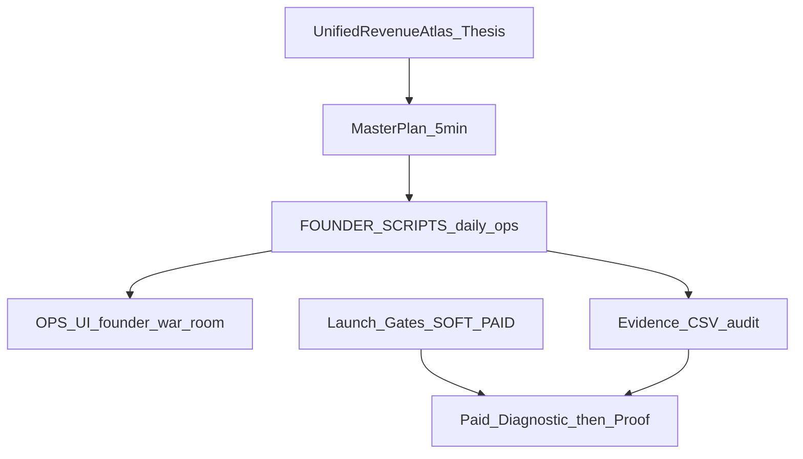
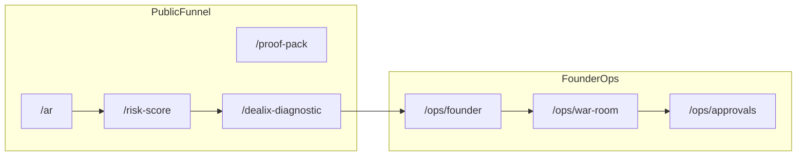

# خريطة القيمة المادية والتجارية — Dealix

**الغرض:** نقطة دخول **شاملة** تربط ما يولّد أو يحمي الإيراد داخل المستودع (استراتيجية، منتج، تشغيل، امتثال، تسليم، سوق خارجي) مع أوامر تحقق قابلة للتشغيل.

**حالة لحظية:** `py -3 scripts/commercial_value_map_status.py` · `--json` للآلات

**مرجع تنفيذي شامل (36 قسمًا):** [COMMERCIAL_OPS_QUICK_REFERENCE_AR.md](COMMERCIAL_OPS_QUICK_REFERENCE_AR.md) — CI/CD · Railway · Moyasar · approvals · env matrix

---

## 0) لقطة الحالة (آلة)

| مؤشر | معنى مادي |
|------|-----------|
| `FIRST_PAID_DIAGNOSTIC_VERDICT` | هل أغلقت أول صفقة حقيقية (دفع + Proof)؟ |
| `COMMERCIAL_LAUNCH_READY` | هل Soft Launch تقني جاهز للبيع اليدوي؟ |
| `PAID_LAUNCH_READINESS` | هل مسار Moyasar/إنتاج مكتمل؟ |
| `agency_seed_rows >= 80` | هل الاستهداف يتحمل `--strict`؟ |
| `crm_kpi_pending` | هل ما زلت بدون أرقام CRM حقيقية؟ |

```powershell
py -3 scripts/commercial_value_map_status.py
py -3 scripts/verify_commercial_launch_ready.py
py -3 scripts/verify_paid_launch_readiness.py
```

---

## 1) ما الذي يخدمك «مادياً» بدقة؟

Dealix = **Revenue OS** (Post-Lead Revenue Operations)، وليس CRM عاماً.

| نوع القيمة | ماذا يعني عملياً | أين يُقاس |
|------------|------------------|-----------|
| **تركيز وقت المؤسس** | لا بناء مزايا قبل أول Diagnostic مدفوع + Proof | `first_paid_diagnostic` في brief |
| **سلم بيع** | Diagnostic → Sprint/Data Pack → Growth بعد Proof فقط | DoD + RevOps packages |
| **آلة يومية** | موجز + War Room + مسودات + أدلة | `run_founder_commercial_day` |
| **بوابات إطلاق** | Soft الآن · Paid لاحقاً | verify scripts |
| **تنبؤ ومصداقية** | KPI من CRM فقط | `kpi_founder_commercial_import.yaml` |
| **حماية قانونية/سمعة** | PDPL · لا بارد · لا أدلة مزيفة | doctrine + governance gates |

**قرار تنفيذي:** [MASTER_COMMERCIAL_OPERATING_PLAN_AR.md](MASTER_COMMERCIAL_OPERATING_PLAN_AR.md) · [.cursor/rules/dealix-founder-sales.mdc](../../.cursor/rules/dealix-founder-sales.mdc)

---

## 2) خريطة التدفق (داخل المستودع)





---

## 3) إيقاع يومي (~25–90 دقيقة)

| وقت | المؤسس | المرجع | التنفيذ |
|-----|--------|--------|---------|
| صباح | Control Tower + موجز + 10 P0 | [MASTER](MASTER_COMMERCIAL_OPERATING_PLAN_AR.md) | `powershell -File scripts/run_founder_commercial_day.ps1` |
| نهار | لمسات بعد موافقة | [DEALIX_REVENUE_WAR_ROOM_AR.md](../ops/DEALIX_REVENUE_WAR_ROOM_AR.md) | `/ar/ops/founder` · war-room · approvals |
| مساء | سطر أدلة | [FIRST_PAID_DIAGNOSTIC_DOD_AR.md](operations/FIRST_PAID_DIAGNOSTIC_DOD_AR.md) | `founder_evening.ps1` |

**مخرجات الصباح:**

| مخرج | مسار |
|------|------|
| حزمة يومية | `data/founder_briefs/DAILY_PACK_YYYY-MM-DD.md` |
| موجز | `data/founder_briefs/brief_YYYY-MM-DD.md` |
| Digest | `data/founder_briefs/commercial_YYYY-MM-DD.md` |
| War Room | `data/war_room_today.json` |
| Motion A | `data/founder_briefs/motion_a_YYYY-MM-DD.md` |
| SOAEN | `data/founder_briefs/soaen_YYYY-MM-DD.md` |
| فهرس | `data/founder_briefs/index.json` |

**خطة 90 دقيقة (من digest):** brief → 10 لمسات → موافقات → LinkedIn يدوي → ديمو → شريك → CSV evidence → تحديث War Room.

---

## 4) إيقاع أسبوعي

| متى | اقرأ / نفّذ | لماذا |
|-----|-------------|-------|
| أسبوعياً | [DEALIX_UNIFIED_REVENUE_ATLAS_AR.md](DEALIX_UNIFIED_REVENUE_ATLAS_AR.md) | قمع · قنوات · Motions · تعظيم قيمة |
| أسبوعياً | [DEALIX_SALES_GTM_SOVEREIGN_MASTER_AR.md](DEALIX_SALES_GTM_SOVEREIGN_MASTER_AR.md) | حاكمية · سوشال · Commercial Proof Loop |
| جمعة | [COMMERCIAL_WEEKLY_SCORECARD_AR.md](operations/COMMERCIAL_WEEKLY_SCORECARD_AR.md) | Pilots + Proof مسلّمة |
| جمعة (آلة) | `py -3 scripts/founder_weekly_scorecard.py` | `data/founder_briefs/weekly_scorecard_*.md` |
| عند توسيع قائمة | [GTM_SAUDI_WEB_RESEARCH_PLAYBOOK_AR.md](GTM_SAUDI_WEB_RESEARCH_PLAYBOOK_AR.md) | ABM · لوب مؤسس · Proof stack |

**وتد حالي:** Motion **A** (وكالات) — [operations/motion_a_agency/](operations/motion_a_agency/) · [targeting/ABM_WAVE1_ICP_AR.md](operations/targeting/ABM_WAVE1_ICP_AR.md)

---

## 5) إيقاع شهري / ربع سنوي

| متى | ماذا | مرجع |
|-----|------|------|
| شهري | مراجعة قنوات (هل قناتان فقط؟) | الأطلس §4 |
| شهري | تحديث اعتراضات → محتوى | [objection_engine_registry.yaml](operations/objection_engine_registry.yaml) |
| ربع سنوي | تسعير وحزم | [DEALIX_REVOPS_PACKAGES_AR.md](DEALIX_REVOPS_PACKAGES_AR.md) |
| ربع سنوي | امتثال PDPL/DPA | [MARKET_INTELLIGENCE_PDPL_LEGAL_REVIEW_AR.md](MARKET_INTELLIGENCE_PDPL_LEGAL_REVIEW_AR.md) |
| عند توسع فريق | 9 أنظمة تشغيل | [DEALIX_AI_OPERATING_COMPANY_AR.md](DEALIX_AI_OPERATING_COMPANY_AR.md) |

---

## 6) سلم البيع والاقتصاد

| # | عرض | سعر مؤشر | شرط | مرجع تسليم |
|---|-----|----------|-----|------------|
| 0 | Risk Score / Sample Proof | مجاني | مغناطيس · ثقة | `/risk-score` · [sample_proof_pack](operations/sample_proof_pack/) |
| 1 | Diagnostic (Ops) | 4,999–15,000 SAR | مدخل المحادثة | [FIRST_PAID_DIAGNOSTIC_DOD_AR.md](operations/FIRST_PAID_DIAGNOSTIC_DOD_AR.md) |
| 2 | Sprint | 499 SAR | بعد قبول ودفع | [OFFER_LEAD_INTELLIGENCE_SPRINT_AR.md](OFFER_LEAD_INTELLIGENCE_SPRINT_AR.md) |
| 2b | Data Pack | 1,500 SAR | بديل Sprint | RevOps packages |
| 3 | Growth | 2,999 SAR/mo | **بعد** `proof_pack_delivered` | لا upsell قبل Proof |

**دفع يدوي (Soft):** [MANUAL_PAYMENT_SOP.md](../ops/MANUAL_PAYMENT_SOP.md) → سجّل `payment_received` في CSV.

**كتالوج خدمات (كود):** `auto_client_acquisition/service_catalog/registry.py` · [COMMERCIAL_WIRING_MAP.md](../COMMERCIAL_WIRING_MAP.md)

---

## 7) مسار الأحداث (من lead إلى إيراد مُثبت)

| الحدث | معنى مادي | متى تسجّله |
|--------|-----------|-------------|
| `message_sent_manual` | لمسة بموافقة | بعد إرسال يدوي |
| `reply_received` | اهتمام | عند الرد |
| `demo_booked` | Discovery ناجح | بعد تأهيل |
| `scope_requested` | نية شراء | قبل العرض |
| `invoice_sent` | التزام تجاري | قبل الدفع |
| `payment_received` | **إيراد محقق** | عند التحصيل |
| `proof_pack_delivered` | **قيمة مسلّمة** | بعد مراجعة مؤسس |
| `partner_intro_created` | رافعة قناة | Motion A co-sell |

مسار كامل: [EVIDENCE_EVENTS_CLOSE_PATH_AR.md](operations/EVIDENCE_EVENTS_CLOSE_PATH_AR.md) · CSV: [evidence_events_tracker.csv](operations/evidence_events_tracker.csv)

**ترتيب Proof Stack (تسويق):** [PROOF_STACK_ORDER_AR.md](operations/PROOF_STACK_ORDER_AR.md) — امتثال → pilot → case.

---

## 8) المنتج العام وقمع الواجهة

| مسار | دور مادي |
|------|----------|
| `/[locale]` | صفحة بيع Soft Launch |
| `/risk-score` | مغناطيس · تأهيل |
| `/proof-pack` | نية شراء عالية |
| `/dealix-diagnostic` | طلب Diagnostic |
| `/learn/[slug]` | AEO · ثقة |
| `/partners` | شراكة · إحالة |
| `/[locale]/business-now` | قرار مؤسس · 8 ركائز |
| `/[locale]/services` | خطوط الخدمات الخمس |

**Ops (مفتاح admin):** `/ops/founder` · `/ops/war-room` · `/ops/marketing` · `/ops/sales` · `/ops/evidence` · `/ops/approvals`

**APIs ذات قيمة تجارية:**

| API | استخدام |
|-----|---------|
| `POST /api/v1/public/leads` | التقاط lead |
| `GET /api/v1/ops-autopilot/war-room/today-pack` | غرفة اليوم |
| `POST .../marketing/queue-approval` | مسودات بموافقة |
| `GET /api/v1/revenue-os/anti-waste/check` | منع هدر قبل إجراء |
| `GET /api/v1/business-now/snapshot` | قرار تشغيلي |

---

## 9) مسار الإطلاق: Soft → Paid

| مرحلة | المعنى | تحقق |
|-------|--------|-------|
| **Soft** | بيع يدوي · funnel · آلة يومية | `verify_commercial_launch_ready.py` |
| **موحّد** | Founder OS + soft + company ready | `verify_dealix_commercial_go_live.ps1` |
| **Paid** | Moyasar · HubSpot · إنتاج | `verify_paid_launch_readiness.py` |

**قبل Paid:** 3–5 اجتماعات تشخيص · KPI من CRM · [PAID_LAUNCH_AFTER_SOFT_PASS_AR.md](PAID_LAUNCH_AFTER_SOFT_PASS_AR.md) · [PAID_LAUNCH_TRACKER_AR.md](PAID_LAUNCH_TRACKER_AR.md) · [LAUNCH_GATES.md](../LAUNCH_GATES.md)

**إنتاج:** `railway_prod_bootstrap.sh` → `official_launch_verify.sh` → `OFFICIAL_LAUNCH_VERDICT=PASS`

---

## 10) الامتثال والثقة (يحمي الإيراد على المدى الطويل)

**فهرس الحزمة الكاملة (16 وثيقة):** [MARKET_INTELLIGENCE_MASTER_INDEX_AR.md](MARKET_INTELLIGENCE_MASTER_INDEX_AR.md) · config: `dealix/config/market_intelligence_refs.yaml`

| موضوع | مرجع | قيمة مادية |
|-------|------|------------|
| PDPL / DPA / لغة عقود | [MARKET_INTELLIGENCE_PDPL_LEGAL_REVIEW_AR.md](MARKET_INTELLIGENCE_PDPL_LEGAL_REVIEW_AR.md) | إغلاق مؤسسي بدون مخاطرة قانونية |
| سحابة · نقل حدود | [MARKET_INTELLIGENCE_CLOUD_CROSS_BORDER_AR.md](MARKET_INTELLIGENCE_CLOUD_CROSS_BORDER_AR.md) | مناقصات · عقود ثنائية اللغة |
| region / subprocessors | [INFRA_HOSTING_REGION_RUBRIC_AR.md](INFRA_HOSTING_REGION_RUBRIC_AR.md) | RFP وعقود B2B |
| Why Now السعودية | [POSITIONING_WHY_NOW_SAUDI_ONEPAGER_AR.md](POSITIONING_WHY_NOW_SAUDI_ONEPAGER_AR.md) | تموضع في المكالمة الأولى |
| RFP / أمن | [MARKET_INTELLIGENCE_PROCUREMENT_FAQ_AR.md](MARKET_INTELLIGENCE_PROCUREMENT_FAQ_AR.md) | questionnaire جاهز |
| Champion / deck | [MARKET_INTELLIGENCE_SALES_CHAMPION_PACK_AR.md](MARKET_INTELLIGENCE_SALES_CHAMPION_PACK_AR.md) | بيع داخلي عند العميل |
| اعتراضات PDPL آمنة | [MARKET_INTELLIGENCE_OBJECTIONS_PDPL_AR.md](MARKET_INTELLIGENCE_OBJECTIONS_PDPL_AR.md) | مكالمات حية |
| مراجعة جمعة | [MARKET_INTELLIGENCE_WEEKLY_REVIEW_CHECKLIST_AR.md](MARKET_INTELLIGENCE_WEEKLY_REVIEW_CHECKLIST_AR.md) | لا انجراف رسالة |
| مصداقية أرقام | [MARKET_INTELLIGENCE_METRICS_CREDIBILITY_AR.md](MARKET_INTELLIGENCE_METRICS_CREDIBILITY_AR.md) | لا TAM وهمي |
| بوابات قنوات | [COMMERCIAL_GOVERNANCE_GATES_AR.md](operations/COMMERCIAL_GOVERNANCE_GATES_AR.md) | لا blast قبل أدلة |
| Trust Layer | [../empire/TRUST_LAYER.md](../empire/TRUST_LAYER.md) | لا cold WhatsApp · لا fake proof |

**حوكمة يومية (كود):** `dealix/commercial_ops/doctrine.py` · `scripts/founder_soaen_daily.py`

---

## 11) المحتوى والشركاء والسوشال

| نشاط | مرجع | سكربت |
|------|------|--------|
| منشور يومي LinkedIn | [MARKETING_FACTORY.md](../marketing/MARKETING_FACTORY.md) | `social_queue_today.py` |
| تقويم AEO | [AEO_CONTENT_CALENDAR_AR.md](operations/AEO_CONTENT_CALENDAR_AR.md) | محتوى `/learn` |
| حزمة أسبوعية | operations/drafts | `generate_commercial_content_pack.py` |
| شركاء | [PARTNER_ONBOARDING_KIT_AR.md](operations/PARTNER_ONBOARDING_KIT_AR.md) | `/partners` |
| affiliate امتثال | `affiliate_compliance.py` | لا وعود مضللة |

**قاعدة:** محتوى = قناة مبيعات · CTA واحد (Risk Score · Sample Proof · ديمو 10 دقائق).

---

## 12) التسليم وإثبات القيمة

| مرحلة | مرجع |
|-------|------|
| قالب Proof | [../delivery/PROOF_PACK_TEMPLATE.md](../delivery/PROOF_PACK_TEMPLATE.md) |
| عيّنة وكالة | [operations/sample_proof_pack/SAMPLE_PROOF_PACK_AGENCY_AR.md](operations/sample_proof_pack/SAMPLE_PROOF_PACK_AGENCY_AR.md) |
| حزمة عميل | [operations/CLIENT_PACK_SOP_AR.md](operations/CLIENT_PACK_SOP_AR.md) · `generate_client_pack.py` |
| إغلاق شراء | [FULL_OPS_CLOSE_ENGINE_AR.md](FULL_OPS_CLOSE_ENGINE_AR.md) |
| بعد الاجتماع | [founder_meeting_debrief_template.yaml](operations/founder_meeting_debrief_template.yaml) |

**SLA افتراضي pilots:** Proof ≤ ~48h بعد الدفع (راجع DoD).

---

## 13) KPI ومقاييس (بدون اختراع)

| KPI | مصدر الحقيقة | أتمتة |
|-----|---------------|--------|
| conversion_discovery_to_pilot | `kpi_founder_commercial_import.yaml` | `apply_kpi_founder_commercial.py` |
| time_to_proof_days | نفس الملف | registry YAML |
| Pilots / Proof أسبوعياً | evidence CSV | `founder_weekly_scorecard.py` |
| أحداث اليوم | CSV + API dashboard | digest صباحي |

**ممنوع:** أرقام CRM في الموجزات الآلية قبل الاستيراد الحقيقي.

**bootstrap:** `py -3 scripts/bootstrap_founder_kpi_import.py`

---

## 14) سياق سوق خارجي (2025–2026) — اتجاهات فقط

> الأرقام في التقارير التسويقية تختلف؛ استخدمها للاتجاه لا كعقد.

### B2B SaaS عالمي

| مبدأ | تطبيق Dealix |
|------|--------------|
| ACV ↔ نمط GTM | Diagnostic + Proof = مبيعات مؤسسة/ثقة |
| ICP حاد · قناتان | Motion A + LinkedIn مؤسس |
| أول 10 عملاء = مؤسس | warm-intro · Article 13 |
| قياس أسبوعي | scorecard + pipeline events |
| 80% رحلة قبل sales | Risk Score · AEO · Discovery |

مراجع: [ProductQuant GTM 2026](https://productquant.dev/blog/complete-gtm-strategy-guide/) · [Design Revision playbook](https://designrevision.com/blog/b2b-saas-go-to-market-strategy) · [Growigami GTM](https://growigami.com/blog/b2b-saas-gtm-strategy) · [MakeToCreate metrics](https://maketocreate.com/b2b-saas-2026-complete-guide-to-metrics-gtm-ai/)

### سعودية / GCC

| اتجاه | تطبيق Dealix |
|-------|--------------|
| نمو SaaS/ICT | عربي أولاً · B2B محلي |
| لجان شراء | Champion · Procurement packs |
| موسمية | تخطيط War Room · لا blast |
| شركاء قنوات | Motion A بعد Proof |

مراجع: [GCC SaaS 2026](https://gulfsaasreview.com/article/saas-adoption-gcc-2026-landscape-report) · [Al-Bahr GCC sales](https://al-bahr-growth-advisory.com/en/blog/sales-strategy-gcc-2026/)

**مقارنة منظّمة:** [operations/FOUNDER_GTM_BENCHMARKS_AR.md](operations/FOUNDER_GTM_BENCHMARKS_AR.md)

---

## 15) مضادات الهدر والمخاطر

| خطر | عقوبة مادية | مانع |
|-----|-------------|------|
| بناء ميزات قبل أول دفع | تأخير إيراد شهور | no-build في MASTER |
| upsell قبل Proof | churn + سمعة | `no_revenue_before_paid` |
| إعلانات مبكرة | CAC محروق | بوابة 3–5 اجتماعات |
| أرقام CRM وهمية | قرارات خاطئة | KPI import فقط |
| إرسال بارد | حظر · PDPL | doctrine immutable |
| ادعاء «إطلاق كامل» | فقد ثقة | LAUNCH_GATES |

**API:** `POST /api/v1/revenue-os/anti-waste/check`

---

## 16) وكلاء Cursor (تنفيذ داخلي)

| مهمة | وكيل |
|------|------|
| عروض · outreach | dealix-sales |
| Proof · تسليم | dealix-delivery |
| pytest · API | dealix-engineer |
| أسبوعي · أولويات | dealix-pm |
| محتوى AR/EN | dealix-content |

مرجع: [FOUNDER_AGENT_PLAYBOOK_AR.md](../ops/FOUNDER_AGENT_PLAYBOOK_AR.md)

---

## 17) ماذا تقرأ حسب الموقف؟

| موقفك الآن | ابدأ هنا |
|------------|----------|
| صباح عادي | §3 + [MASTER](MASTER_COMMERCIAL_OPERATING_PLAN_AR.md) |
| قبل مكالمة | [FOUNDER_SALES_LOOP_AR.md](operations/FOUNDER_SALES_LOOP_AR.md) · debrief template |
| قبل عرض سعر | [DEALIX_REVOPS_PACKAGES_AR.md](DEALIX_REVOPS_PACKAGES_AR.md) · Close Engine |
| قبل فاتورة | DoD + MANUAL_PAYMENT_SOP |
| قبل نشر LinkedIn | SOAEN في digest · [COMMERCIAL_GOVERNANCE_GATES_AR.md](operations/COMMERCIAL_GOVERNANCE_GATES_AR.md) |
| قبل Moyasar | §9 Paid path |
| RFP / قانوني | §10 · [MARKET_INTELLIGENCE_MASTER_INDEX_AR.md](MARKET_INTELLIGENCE_MASTER_INDEX_AR.md) |
| بحث سوق / ABM | [GTM_SAUDI_WEB_RESEARCH_PLAYBOOK_AR.md](GTM_SAUDI_WEB_RESEARCH_PLAYBOOK_AR.md) |
| استخبارات سوق كاملة | [MARKET_INTELLIGENCE_MASTER_INDEX_AR.md](MARKET_INTELLIGENCE_MASTER_INDEX_AR.md) |
| محتوى 12 أسبوع | [MARKET_INTELLIGENCE_CONTENT_GTM_AR.md](MARKET_INTELLIGENCE_CONTENT_GTM_AR.md) |
| مستثمر / شريك | [MARKET_INTELLIGENCE_INVESTOR_PARTNER_AR.md](MARKET_INTELLIGENCE_INVESTOR_PARTNER_AR.md) |
| فهرس كامل | [README.md](README.md) · [operations/README.md](operations/README.md) |
| CI/CD سحابي | [COMMERCIAL_OPS_QUICK_REFERENCE_AR.md](COMMERCIAL_OPS_QUICK_REFERENCE_AR.md) §CI/CD — `founder_commercial_daily` 05:00 UTC |
| North Star / OS modules | [NORTH_STAR_METRICS_AR.md](NORTH_STAR_METRICS_AR.md) · [CODE_MAP_OS_TO_MODULES_AR.md](CODE_MAP_OS_TO_MODULES_AR.md) |

---

## 18) أوامر سريعة (نسخ)

```powershell
# لقطة قيمة
py -3 scripts/commercial_value_map_status.py

# صباح
powershell -File scripts/run_founder_commercial_day.ps1

# مساء
powershell -File scripts/founder_evening.ps1 -Append -Company "اسم الوكالة" -EventType message_sent_manual

# بوابات
py -3 scripts/verify_commercial_launch_ready.py --strict
py -3 scripts/verify_paid_launch_readiness.py
powershell -File scripts/verify_dealix_commercial_go_live.ps1

# أسبوع
py -3 scripts/founder_weekly_scorecard.py
```

```bash
bash scripts/run_founder_commercial_day.sh
py -3 scripts/commercial_value_map_status.py --json
```

---

## 19) Value Plan و API موحّد

| مخرج | مسار |
|------|------|
| لقطة JSON كاملة | `GET /api/v1/ops-autopilot/founder/commercial-value-map` |
| Value Plan فقط | `GET /api/v1/ops-autopilot/founder/value-plan` |
| حزمة يوم + value_plan | `GET /api/v1/ops-autopilot/founder/daily-pack` |
| موجز MD يومي | `py -3 scripts/commercial_value_map_status.py --write-md` → `data/founder_briefs/commercial_value_map_YYYY-MM-DD.md` |
| JSON يومي | نفس الأمر + `.json` — يُحدَّث أيضاً في `founder_briefs/index.json` عبر `daily_pack` |
| يوم موسّع | `powershell -File scripts/run_value_plan_day.ps1` (توسيع pool + commercial day + paid gate) |
| واجهة | `/ar/business-now` · `/ar/ops/founder` — `CommercialValueMapStrip` + `ValuePlanPanel` |

**كود:** `dealix/commercial_ops/value_plan.py` · `value_map_catalog.py` · `value_map_status.py`

---

## 20) استخبارات السوق (حزمة 2025–2026)

**فهرس:** [MARKET_INTELLIGENCE_MASTER_INDEX_AR.md](MARKET_INTELLIGENCE_MASTER_INDEX_AR.md)

| محور | وثيقة |
|------|--------|
| سوق SaaS السعودي | [MARKET_INTELLIGENCE_SAUDI_SAAS_MARKET_AR.md](MARKET_INTELLIGENCE_SAUDI_SAAS_MARKET_AR.md) |
| PDPL · عقود | [MARKET_INTELLIGENCE_PDPL_LEGAL_REVIEW_AR.md](MARKET_INTELLIGENCE_PDPL_LEGAL_REVIEW_AR.md) |
| تنفيذ صباح/مساء | [MARKET_INTELLIGENCE_IMPLEMENTATION_PLAYBOOK_AR.md](MARKET_INTELLIGENCE_IMPLEMENTATION_PLAYBOOK_AR.md) |
| اعتراضات مكالمة | [MARKET_INTELLIGENCE_OBJECTIONS_PDPL_AR.md](MARKET_INTELLIGENCE_OBJECTIONS_PDPL_AR.md) |
| RFP / مشتريات | [MARKET_INTELLIGENCE_PROCUREMENT_FAQ_AR.md](MARKET_INTELLIGENCE_PROCUREMENT_FAQ_AR.md) |

---

## 21) GTM Stack داخلي (ABM · لوب · Proof)

| وثيقة | متى |
|--------|-----|
| [GTM_SAUDI_WEB_RESEARCH_PLAYBOOK_AR.md](GTM_SAUDI_WEB_RESEARCH_PLAYBOOK_AR.md) | بحث ويب · موجة ABM |
| [operations/FOUNDER_SALES_LOOP_AR.md](operations/FOUNDER_SALES_LOOP_AR.md) | بعد كل مكالمة |
| [operations/PROOF_STACK_ORDER_AR.md](operations/PROOF_STACK_ORDER_AR.md) | ترتيب أدلة التسويق |
| [operations/GTM_DUAL_TRACK_CLARIFICATION_AR.md](operations/GTM_DUAL_TRACK_CLARIFICATION_AR.md) | ترويج vs ops داخلي |

**في API:** `value_plan.gtm_stack` (من `dealix/commercial_ops/gtm_stack.py`)

---

## 22) شجرة قرار سريعة (مادي)

```text
هل لديك payment_received + proof_pack_delivered لشركة حقيقية؟
  نعم → ركّز على تكرار Motion A + شريك + Growth بعد Proof
  لا → هل لديك 3–5 اجتماعات تشخيص؟
    نعم → أغلق Diagnostic واحد (DoD) + فواتير يدوية
    لا → warm-intro + LinkedIn يدوي + 10 لمسات P0 (لا بناء منتج)
```

---

_خريطة حية — §0: `commercial_value_map_status.py` · آخر توسيع: 2026-05-18._
