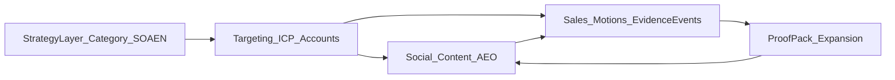

# Dealix — Sales & GTM Sovereign Master

**الغرض:** مرجع **استراتيجي + تكتيكي واحد** للمبيعات، الاستهداف، السوشال، المحتوى، الشركاء، والتوسع — يربط كل الحزم الموجودة في المستودع دون تكرارها.  
**الجمهور:** المؤسس (Sales + Delivery + Approval) والوكلاء الداخليون (dealix-sales، dealix-content).  
**القرار الحالي:** لا بناء مزايا جديدة قبل **أول Diagnostic مدفوع + Proof Pack مسلّم**. استخدم ما بُني.

**فهرس علوي (تنقل):** [DEALIX_UNIFIED_REVENUE_ATLAS_AR.md](DEALIX_UNIFIED_REVENUE_ATLAS_AR.md) — ابدأ هناك لربط القنوات والتسعير SoT.  
**هذا الملف** = المحتوى الاستراتيجي/التكتيكي **الكامل** (سوشال، استهداف، Motions، فهرس).  
**تشغيل يومي (5 دقائق):** [MASTER_COMMERCIAL_OPERATING_PLAN_AR.md](MASTER_COMMERCIAL_OPERATING_PLAN_AR.md).  
**تشغيل يومي موحّد:** [FOUNDER_REVENUE_DAY_ONE_AR.md](../ops/FOUNDER_REVENUE_DAY_ONE_AR.md) · `bash scripts/run_founder_revenue_day.sh`

---

## 0) خريطة النظام



| طبقة | ماذا تفعل | مرجع سريع |
|------|-----------|-----------|
| استراتيجية | تعلّم السوق المشكلة والفئة | [§2](#2-الطبقة-الاستراتيجية-لماذا) |
| استهداف | من تلمس ومن لا تلمس | [§3](#3-نظام-الاستهداف-من-لمن) |
| سوشال/محتوى | طلب + ثقة + نية شراء | [§4](#4-السوشال-والمحتوى-كقناة-مبيعات) |
| مبيعات/تكتيك | لمسات، ديمو، إغلاق، أحداث | [§5](#5-التكتيك-اليومي--الأسبوعي--الشهري) |
| توسع | شركاء، أفلييت، CS | [§6](#6-حركات-البيع-والشركاء-والتوسع) |
| فهرس | كل الملفات حسب الحاجة | [§7](#7-فهرس-الروابط-الشامل) |

---

## 1) حاكمية ووعد تشغيلي

### الجملة الحاكمة

> **نظامي بالكامل — لكن ليس spam.**  
> Dealix يُؤتمت **التخطيط، المسودات، القوائم، التتبع، والأدلة** — ويبقى **الإرسال الخارجي** بشرياً وبموافقة.

### ما يُؤتمت (داخلياً — مسموح)

| مجال | أمثلة |
|------|--------|
| استهداف | قوائم ICP، تقسيم حسابات، أولويات War Room |
| محتوى | تقويم AEO، قوالب منشورات، حلقة اعتراض → LinkedIn |
| مبيعات | مسودات رسائل، Discovery، scope، تذكير متابعة |
| أدلة | `evidence_events_tracker.csv`، scorecard أسبوعي |
| حوكمة | `anti-waste/check` قبل مسودة خارجية |
| تسليم | قوالب Proof Pack، checklists تسليم |

### ما لا يُؤتمت (خارجياً — ممنوع أو موافقة إلزامية)

| ممنوع / مقيد | السبب |
|--------------|--------|
| **Cold WhatsApp** | سياسة المنتج + الثقة |
| **LinkedIn / Gmail إرسال جماعي** | لا DMs آلية |
| **Scraping إنتاجي** | امتثال + سمعة |
| **إرسال حي** بدون `founder_confirmed` / موافقة | حوكمة |
| **وعود ROI مضمون** | لا fake proof |
| **أرقام CRM مخترعة** | KPI من استيراد حقيقي فقط |

**مراجع:** [../empire/TRUST_LAYER.md](../empire/TRUST_LAYER.md) · [../empire/COMMERCIAL_GATES.md](../empire/COMMERCIAL_GATES.md) · [operations/COMMERCIAL_GOVERNANCE_GATES_AR.md](operations/COMMERCIAL_GOVERNANCE_GATES_AR.md) · [../ops/FOUNDER_SELL_MOTION_AR.md](../ops/FOUNDER_SELL_MOTION_AR.md)

### حلقة الإثبات التجارية (Commercial Proof Loop)

```text
~10 لمسات بشرية موافَق عليها/مخططة يومياً
  → ~5 متابعات
  → ~1 محادثة شريك
  → ~1 ديمو
  → ~1 pilot صغير مدفوع
  → Proof Pack ≤ ~48h (pilots)
  → insight مجهّل
  → referral / sprint / retainer
```

---

## 2) الطبقة الاستراتيجية (لماذا)

### الفئة (Category)

**Post-Lead Revenue Operations** — تشغيل الإيراد والذكاء الاصطناعي **بعد** وصول الـ lead.

| الطرف | Dealix |
|-------|--------|
| CRM يخزن | Dealix يحرّك (مالك، موافقة، دليل، خطوة) |
| الوكالة تجيب الاهتمام | Dealix يثبت ماذا حدث **بعد** الاهتمام |
| Dashboard يعرض | Dealix يجهّز **قراراً وخطوة تالية** |

**تفصيل:** [../empire/DEALIX_CATEGORY.md](../empire/DEALIX_CATEGORY.md) · [DEALIX_COMMERCIAL_SCALE_SYSTEM_AR.md](DEALIX_COMMERCIAL_SCALE_SYSTEM_AR.md)

### المعيار: SOAEN

```text
Source → Owner → Approval → Evidence → Next Action
```

| جملة | معنى |
|------|------|
| Lead بلا owner | ليس pipeline |
| Follow-up بلا evidence | ليس تشغيلاً |
| AI action بلا approval | خطر |
| Dashboard بلا next action | تقرير فقط |

**تفصيل:** [../empire/SOAEN_STANDARD.md](../empire/SOAEN_STANDARD.md)

### سلم العروض (داخلي — 3 على الموقع)

| طبقة | عرض | سعر مؤشر |
|------|-----|-----------|
| Free | Risk Score، Sample Proof، قوالب سياسة | 0 |
| Entry | 10-Lead Audit | 499–990 SAR |
| Agency | Agency Proof Pack | 990–4,999 SAR |
| Core | Governed Revenue Diagnostic | 4,999–15,000 SAR |
| Expansion | Revenue Intelligence Sprint | 25,000+ SAR |
| Recurring | Governed Ops Retainer | 4,999–35,000 SAR/شهر |

**قاعدة:** لا تخفض السعر — **خفّض النطاق** (10 leads، عميل واحد، Proof واحد).

**تسعير العقود والفواتير (مصدر الحقيقة الوحيد):** [DEALIX_REVOPS_PACKAGES_AR.md](DEALIX_REVOPS_PACKAGES_AR.md) — جدول الأسعار أعلاه + Offer Matrix في Scale System = **توجيه داخلي / routing** فقط؛ لا تدمج أرقام 499 vs 3,500 صامتاً في عرض موقّع.

**تفصيل:** [../empire/OFFER_LADDER.md](../empire/OFFER_LADDER.md) · [Offer Matrix في Scale System](DEALIX_COMMERCIAL_SCALE_SYSTEM_AR.md#3-offer-matrix-حسب-ألم-العميل-توجيه-داخلي) · [الأطلس §8](DEALIX_UNIFIED_REVENUE_ATLAS_AR.md#8-مصدر-الحقيقة-للأسعار-والعروض)

### اقتصاد Proof

العميل يشتري: **وضوح، دليل، قرار، تقليل هدر، خطوة تالية** — وليس «AI».

**معيار التسليم:** [../empire/PROOF_PACK_STANDARD.md](../empire/PROOF_PACK_STANDARD.md) · [../delivery/PROOF_PACK_TEMPLATE.md](../delivery/PROOF_PACK_TEMPLATE.md)

### المنهجية (8 خطوات)

Detect → Diagnose → Decide → Draft → Approve → Deliver → Prove → Expand

**تفصيل:** [../empire/DEALIX_METHOD.md](../empire/DEALIX_METHOD.md)

---

## 3) نظام الاستهداف (من لمن)

**الوتد الحالي:** Motion **A — Agency** أولاً. ثم B/C/D حسب الإشارة.

### مصفّفات ICP (اختصار)

#### Motion A — Agency Wedge (P0)

| نعم | لا |
|-----|-----|
| وكالة تسويق/إعلان/محتوى/أداء | بائع أدوات SaaS فقط |
| تدير حملات لعملاء متعددين | لا leads حقيقية بعد الحملة |
| تحتاج proof لعميلها | تطلب cold blast / scraping |
| تقبل pilot على **عميل واحد** | ترفض أي موافقة بشرية |

**إشارات شراء:** «العميل يسأل ماذا حصل بعد الحملة» · CRM/جدول مليء بلا متابعة · فريق مبيعات العميل غير واضح المالك.

**مسار:** Agency → 10-Lead Audit → Agency Proof Pack → Co-selling → Partner

**مرجع:** [../empire/AGENCY_WEDGE.md](../empire/AGENCY_WEDGE.md) · [operations/motion_a_agency/](operations/motion_a_agency/)

#### Motion B — Direct Company

| نعم | لا |
|-----|-----|
| عيادات، عقار، تعليم، B2B خدمات | لا عمليات مبيعات |
| leads شهرية + فريق متابعة | يبحثون عن chatbot فقط |
| ألم: «من يتابع الآن؟» | يريدون استبدال CRM |

**مسار:** Risk Score → Audit → Diagnostic → Sprint → Retainer

#### Motion C — Consultant / CRM Partner

| نعم | لا |
|-----|-----|
| منفّذ HubSpot/Zoho/automation | يريد white-label قبل 3 pilots |
| يحتاج طبقة diagnostic/proof قبل التنفيذ | يعد العميل بنتائج مضمونة |

**مسار:** Diagnostic layer → Handoff → Recurring Proof layer

#### Motion D — Executive / Governance

| نعم | لا |
|-----|-----|
| CEO/COO/مجلس — توسع AI | يطلبون enterprise قبل pilot |
| حوكمة، موافقات، مساءلة | لا بيانات للمراجعة |

**مسار:** RevOps Diagnostic → Executive OS → Control Tower Retainer

**تفصيل Motions:** [DEALIX_COMMERCIAL_SCALE_SYSTEM_AR.md §2](DEALIX_COMMERCIAL_SCALE_SYSTEM_AR.md#2-أربعة-motions-للبيع--وليس-قمعاً-واحداً)

### Warm vs لا نمسه

| التصنيف | إجراء |
|---------|--------|
| **Warm** (معرفة، إحالة، inbound، شريك) | أولوية War Room — مسودة بعد `anti-waste/check` |
| **Cold مسموح** | LinkedIn/Email **يدوي**، تخصيص، لا blast |
| **لا نمسه** | wrong_segment، طلب spam، ROI مضمون، رفض opt-in WA |
| **Inbound** | Form/wa.me → Operating Board → Mini Diagnostic ≤24h |

**قوائم:** [../sales-kit/WARM_LIST_WORKFLOW.md](../sales-kit/WARM_LIST_WORKFLOW.md) · [../ops/lead_machine/](../ops/lead_machine/) (CSV شركاء استراتيجيون)

### أهداف يومية (P0 — مرجع Market Penetration)

| هدف | كم |
|-----|-----|
| لمسات بشرية | ~10 |
| متابعات | ~5 |
| محادثة شريك | ~1 |
| قنوات (مؤشر) | warm / email / LinkedIn / partner — حسب السياسة |

**غرفة تصريف:** [../ops/DEALIX_REVENUE_WAR_ROOM_AR.md](../ops/DEALIX_REVENUE_WAR_ROOM_AR.md)

---

## 4) السوشال والمحتوى كقناة مبيعات

المحتوى **ليس ماركتينغ منفصلاً** — هو **جذب نية + إثبات ثقة + تغذية مبيعات**.

### Marketing Factory (أربع آلات)

1. **Founder Media** — عمود أسبوعي (درس، خطأ حوكمة، CRM، proof snippet، شريك، رؤية CEO، قالب)  
2. **Lead Magnets** — Risk Score، Sample Proof، قوالب سياسة/جواز قرار  
3. **Newsletter** — «GCC AI & Revenue Ops Notes»  
4. **Webinar شهري** — Before AI Agents: Govern Your Revenue Workflows  

**مرجع:** [../marketing/MARKETING_FACTORY.md](../marketing/MARKETING_FACTORY.md) · [../MARKETING_AND_CONTENT_SYSTEM.md](../MARKETING_AND_CONTENT_SYSTEM.md)

### حلقة المحتوى → مبيعات

```text
اعتراض مبيعات (من call أو CRM)
  → منشور LinkedIn (مجهّل)
  → فيديو قصير (اختياري)
  → قسم نشرة
  → مقال FAQ / AEO
  → بريد مبيعات / أصل شريك
```

**سجل الاعتراض:** [operations/objection_engine_registry.yaml](operations/objection_engine_registry.yaml)

### Social Operating Checklist (كل منشور)

| # | حقل SOAEN | سؤال |
|---|-----------|------|
| S | Source | من أين الفكرة؟ (call، Proof، اعتراض، benchmark) |
| O | Owner | من ينشر ويرد على التعليقات؟ |
| A | Approval | هل راجعت المسودة قبل النشر؟ |
| E | Evidence | أي رقم؟ ما **Truth Label**؟ (Estimate/Observed فقط) |
| N | Next Action | CTA واحد: Risk Score / Sample Proof / ديمو 10 دقائق |

**ممنوع في المنشور:** اسم عميل بلا إذن · إيراد غير Payment-confirmed · «Dealix يرسل تلقائياً» · ROI مضمون.

### AEO — استهداف نية البحث

**الهدف:** عند سؤال «كيف أثبت ماذا حدث بعد الحملة؟» — Dealix مرجع.

| أسبوع | موضوع (مثال) |
|-------|----------------|
| 1 | Post-Lead Revenue Ops |
| 2 | ما هو Proof Pack |
| 3 | مراجعة متابعة leads |
| … | [جدول 12 أسبوعاً كامل](operations/AEO_CONTENT_CALENDAR_AR.md) |

**CTA موحّد:** Risk Score · [Sample Proof Pack](operations/sample_proof_pack/SAMPLE_PROOF_PACK_AGENCY_AR.md)

### الإعلان المدفوع — متى؟

**لا تبدأ بقوة قبل:**

- 3–5 اجتماعات نوعية  
- اعتراضان متكرران  
- طلبات Sample Proof  
- ICP ورسالة فائزة واضحة  

**حملات مرجعية (بعد ذلك):** Cold Risk Score · Warm Proof Pack · Hot Diagnostic · شريك · retargeting سلوكي.

**مرجع:** [../marketing/MARKETING_FACTORY.md](../marketing/MARKETING_FACTORY.md) (§ الإعلان)

### KPI محتوى (مرجع)

5 منشورات/أسبوع · نشرة/أسبوع · webinar/شهر · طلبات proof pack · اجتماعات مؤهلة من المحتوى.

### Authority Engine (من Proof إلى محتوى)

Proof Pack → insight مجهّل → LinkedIn → newsletter → شريك → webinar → إجابة اعتراض.

**مرجع:** [../empire/AUTHORITY_ENGINE.md](../empire/AUTHORITY_ENGINE.md)

---

## 5) التكتيك اليومي / الأسبوعي / الشهري

### صباحاً (5 دقائق) — استخدم [MASTER_COMMERCIAL_OPERATING_PLAN_AR.md](MASTER_COMMERCIAL_OPERATING_PLAN_AR.md)

1. **Control Tower** — أفضل شريحة؟ رسالة؟ Proof؟ اعتراض؟ توقف funnel؟ شريك quality؟ waste؟ **no-build؟**  
2. **War Room** — أعلى 10 targets + متابعات اليوم  
3. **Evidence** — حدث واحد على الأقل في [evidence_events_tracker.csv](operations/evidence_events_tracker.csv)

### أحداث أدلة (Commercial Evidence Events)

| الحدث | معنى |
|--------|------|
| `message_sent_manual` | إرسال/مسودة بموافقة |
| `reply_received` | رد مسجّل |
| `demo_booked` | ديمو |
| `scope_requested` | طلب نطاق |
| `invoice_sent` | فاتورة |
| `payment_received` | دفع |
| `proof_pack_delivered` | Proof مسلّم |
| `partner_intro_created` | مقدّمة شريك |
| `referral_requested` | طلب إحالة |

**مسار الإغلاق:** [operations/EVIDENCE_EVENTS_CLOSE_PATH_AR.md](operations/EVIDENCE_EVENTS_CLOSE_PATH_AR.md)

### يومياً (تكتيك مبيعات)

| بند | مرجع |
|-----|------|
| لمسات + متابعات | War Room |
| قبل مسودة خارجية | `POST /api/v1/revenue-os/anti-waste/check` |
| تصنيف الردود | interested / objection / wrong_segment / referral / silence |
| ديمو 12 دقيقة | [FOUNDER_SELL_MOTION_AR.md](../ops/FOUNDER_SELL_MOTION_AR.md) |

### أسبوعياً

| بند | مرجع |
|-----|------|
| Scorecard | [COMMERCIAL_WEEKLY_SCORECARD_AR.md](operations/COMMERCIAL_WEEKLY_SCORECARD_AR.md) |
| مؤشر واحد | Pilots نشطة + Proof Packs مسلّمة |
| تعلّم | أفضل شريحة/رسالة/عرض/قناة — ماذا نضاعف/نوقف/لا نبنيه |
| محتوى | صفحة AEO من التقويم + 1–2 منشورات من اعتراض |

### شهرياً (Board Pack تجاري)

Revenue · Pipeline · Delivery · Support · Partners · Governance · Learning · **Next strategic bet**

**مرجع:** [../empire/COMMERCIAL_CONTROL_TOWER.md](../empire/COMMERCIAL_CONTROL_TOWER.md)

### ديمو 12 دقيقة (ملخّص)

1. المشكلة: leads بعد الحملات  
2. Dealix لا يستبدل وكالة/CRM  
3. طبقة بعد الـ lead + SOAEN  
4. `/ar/business-now#strategy` → simulate → focus → GTM → Sales Script  
5. اختم: **Diagnostic** على عميل واحد — ~10 فرص — Proof Pack واحد  

**سكريبتات:** [../sales-kit/dealix_demo_script_30min.md](../sales-kit/dealix_demo_script_30min.md) · [FULL_OPS_CLOSE_ENGINE_AR.md](FULL_OPS_CLOSE_ENGINE_AR.md)

### هندسة قرار الشراء (لا تخلط الترتيب)

```text
Pain → Cost of inaction → One-workflow solution → Proof Pack → Low-risk pilot → Expansion
```

**Champion Pack:** ملخص صفحة · Sample Proof · before/after · سعر/نطاق · ماذا نحتاج · ماذا لا نفعل · لماذا لا نستبدل CRM/وكالة.

---

## 6) حركات البيع والشركاء والتوسع

### Motions — توجيه سريع

| Motion | متى | مسار |
|--------|-----|------|
| **A** | وكالة | Audit → Agency Proof → Co-sell → Partner |
| **B** | شركة مباشرة | Risk → Audit → Diagnostic → Sprint |
| **C** | مستشار CRM | Diagnostic → Handoff → Proof layer |
| **D** | CEO/حوكمة | Diagnostic → Executive OS → Retainer |

### Partner Economy

| نوع | مكسب مقترح |
|-----|-------------|
| Referral | 15–25% أول دفعة أو 3 أشهر |
| Implementation | شريك تنفيذ — Dealix diagnostic/proof |
| Co-selling | تقسيم pilot / referral |
| Service exchange | 30 يوم — محدود |
| White-label | بعد 3 paid pilots |

**مراجع:** [../empire/PARTNER_ECONOMY.md](../empire/PARTNER_ECONOMY.md) · [operations/PARTNER_ONBOARDING_KIT_AR.md](operations/PARTNER_ONBOARDING_KIT_AR.md)

### Affiliate (مغلق)

5–10 موثوقين · scripts معتمدة · commission بعد `invoice_paid` فقط.

**مرجع:** [../empire/AFFILIATE_NETWORK.md](../empire/AFFILIATE_NETWORK.md) · [../affiliates/AFFILIATE_PROGRAM.md](../affiliates/AFFILIATE_PROGRAM.md)

### Customer Success بعد Proof

```text
Day 0: Delivery call
Day 2: Value confirmation
Day 5: Sprint recommendation
Day 10: Referral ask
Day 21: Retainer proposal
Day 30: Executive memo
```

**أسئلة:** هل كشف Proof شيئاً جديداً؟ workflow ثانٍ؟ إحالة وكالة/شركة؟ insight مجهّل؟

**مرجع:** [../empire/CUSTOMER_SUCCESS_EXPANSION.md](../empire/CUSTOMER_SUCCESS_EXPANSION.md)

### رأس المال لكل مشروع

> **1 Trust Asset** + **1 Knowledge أو Product Asset** على الأقل.

**مرجع:** [../empire/CAPITAL_MODEL.md](../empire/CAPITAL_MODEL.md) · [../empire/UNIT_ECONOMICS.md](../empire/UNIT_ECONOMICS.md)

### Productization (لا SaaS مبكراً)

Internal tools → client reports → workspace → partner portal → self-serve → SaaS (بعد 3 retainers أو workflows مكررة).

**مرجع:** [../empire/PRODUCTIZATION_PATH.md](../empire/PRODUCTIZATION_PATH.md)

---

## 7) فهرس الروابط الشامل

**كيف تستخدم الجدول:** `الموضوع` → `متى` → افتح `الملف`.

### commercial/ — التصريف والإغلاق

| الموضوع | متى | الملف |
|---------|-----|-------|
| خطة 5 دقائق صباحاً | كل يوم | [MASTER_COMMERCIAL_OPERATING_PLAN_AR.md](MASTER_COMMERCIAL_OPERATING_PLAN_AR.md) |
| **هذا الماستر** | استراتيجية + سوشال + تكتيك كامل | [DEALIX_SALES_GTM_SOVEREIGN_MASTER_AR.md](DEALIX_SALES_GTM_SOVEREIGN_MASTER_AR.md) |
| Control Tower + Motions + AEO | أسبوعي / تخطيط | [DEALIX_COMMERCIAL_SCALE_SYSTEM_AR.md](DEALIX_COMMERCIAL_SCALE_SYSTEM_AR.md) |
| زوايا إغلاق + Champion | قبل صفقة كبيرة | [FULL_OPS_CLOSE_ENGINE_AR.md](FULL_OPS_CLOSE_ENGINE_AR.md) |
| أسعار وحزم | عرض سعر / scope | [DEALIX_REVOPS_PACKAGES_AR.md](DEALIX_REVOPS_PACKAGES_AR.md) |
| شركة تشغيلية (9 أنظمة) | رؤية تشغيل | [DEALIX_AI_OPERATING_COMPANY_AR.md](DEALIX_AI_OPERATING_COMPANY_AR.md) |

### commercial/operations/ — تنفيذ

| الموضوع | متى | الملف |
|---------|-----|-------|
| فهرس operations | بداية مرحلة | [operations/README.md](operations/README.md) |
| مسار إغلاق + أحداث | يومي | [operations/EVIDENCE_EVENTS_CLOSE_PATH_AR.md](operations/EVIDENCE_EVENTS_CLOSE_PATH_AR.md) |
| تتبع أحداث CSV | بعد كل لمسة مهمة | [operations/evidence_events_tracker.csv](operations/evidence_events_tracker.csv) |
| DoD أول دفع | مرحلة 1 | [operations/FIRST_PAID_DIAGNOSTIC_DOD_AR.md](operations/FIRST_PAID_DIAGNOSTIC_DOD_AR.md) |
| Motion A وكالة | P0 wedge | [operations/motion_a_agency/README.md](operations/motion_a_agency/README.md) |
| Sample Proof وكالة | CTA محتوى/مبيعات | [operations/sample_proof_pack/SAMPLE_PROOF_PACK_AGENCY_AR.md](operations/sample_proof_pack/SAMPLE_PROOF_PACK_AGENCY_AR.md) |
| تقويم AEO 12 أسبوع | محتوى/SEO نية | [operations/AEO_CONTENT_CALENDAR_AR.md](operations/AEO_CONTENT_CALENDAR_AR.md) |
| اعتراضات YAML | بعد call | [operations/objection_engine_registry.yaml](operations/objection_engine_registry.yaml) |
| Scorecard أسبوعي | جمعة | [operations/COMMERCIAL_WEEKLY_SCORECARD_AR.md](operations/COMMERCIAL_WEEKLY_SCORECARD_AR.md) |
| حوكمة قنوات | قبل قناة جديدة | [operations/COMMERCIAL_GOVERNANCE_GATES_AR.md](operations/COMMERCIAL_GOVERNANCE_GATES_AR.md) |
| onboarding شريك | مرحلة 3 | [operations/PARTNER_ONBOARDING_KIT_AR.md](operations/PARTNER_ONBOARDING_KIT_AR.md) |

### empire/ — استراتيجية الشركة

| الموضوع | متى | الملف |
|---------|-----|-------|
| Category | تموضع / موقع | [../empire/DEALIX_CATEGORY.md](../empire/DEALIX_CATEGORY.md) |
| Method | منهجية بيع | [../empire/DEALIX_METHOD.md](../empire/DEALIX_METHOD.md) |
| SOAEN | كل touchpoint | [../empire/SOAEN_STANDARD.md](../empire/SOAEN_STANDARD.md) |
| Offer ladder | تسعير داخلي | [../empire/OFFER_LADDER.md](../empire/OFFER_LADDER.md) |
| Agency wedge | P0 | [../empire/AGENCY_WEDGE.md](../empire/AGENCY_WEDGE.md) |
| Proof standard | تسليم | [../empire/PROOF_PACK_STANDARD.md](../empire/PROOF_PACK_STANDARD.md) |
| Trust | مبيعات + موقع | [../empire/TRUST_LAYER.md](../empire/TRUST_LAYER.md) |
| Gates | قرارات ممنوعة | [../empire/COMMERCIAL_GATES.md](../empire/COMMERCIAL_GATES.md) |
| Control tower | شهري | [../empire/COMMERCIAL_CONTROL_TOWER.md](../empire/COMMERCIAL_CONTROL_TOWER.md) |
| Partners / Affiliate / CS | توسع | [../empire/PARTNER_ECONOMY.md](../empire/PARTNER_ECONOMY.md) · [../empire/AFFILIATE_NETWORK.md](../empire/AFFILIATE_NETWORK.md) · [../empire/CUSTOMER_SUCCESS_EXPANSION.md](../empire/CUSTOMER_SUCCESS_EXPANSION.md) |
| Authority / Benchmark | محتوى + تقرير سوق | [../empire/AUTHORITY_ENGINE.md](../empire/AUTHORITY_ENGINE.md) · [../empire/BENCHMARK_ENGINE.md](../empire/BENCHMARK_ENGINE.md) |
| Capital / Unit econ / Hiring | قرار استثمار | [../empire/CAPITAL_MODEL.md](../empire/CAPITAL_MODEL.md) · [../empire/UNIT_ECONOMICS.md](../empire/UNIT_ECONOMICS.md) · [../empire/HIRING_GATES.md](../empire/HIRING_GATES.md) |
| Enterprise لاحقاً | Motion D كبير | [../empire/ENTERPRISE_MOTION.md](../empire/ENTERPRISE_MOTION.md) |

### marketing/ + محتوى

| الموضوع | متى | الملف |
|---------|-----|-------|
| Marketing Factory | تخطيط أسبوعي محتوى | [../marketing/MARKETING_FACTORY.md](../marketing/MARKETING_FACTORY.md) |
| رسائل صفحات + anti-claim | موقع / launch | [../MARKETING_AND_CONTENT_SYSTEM.md](../MARKETING_AND_CONTENT_SYSTEM.md) |
| استراتيجية تجارية (Business NOW) | قرار قطاع | [../business/DEALIX_COMMERCIAL_STRATEGY_AR.md](../business/DEALIX_COMMERCIAL_STRATEGY_AR.md) |
| خطة Full Ops | رؤية 90 يوم | [../strategy/DEALIX_FULL_OPS_MASTER_PLAN_AR.md](../strategy/DEALIX_FULL_OPS_MASTER_PLAN_AR.md) |

### sales/ + sales-kit/

| الموضوع | متى | الملف |
|---------|-----|-------|
| Sales Kit — ابدأ | أول عميل | [../sales-kit/START_HERE.md](../sales-kit/START_HERE.md) |
| Master playbook موحّد | فهرس الأصول | [../sales-kit/DEALIX_MASTER_PLAYBOOK.md](../sales-kit/DEALIX_MASTER_PLAYBOOK.md) |
| ديمو 30 دقيقة | اجتماع | [../sales-kit/dealix_demo_script_30min.md](../sales-kit/dealix_demo_script_30min.md) |
| اعتراضات | ردود | [../sales-kit/dealix_objection_handler.md](../sales-kit/dealix_objection_handler.md) |
| رسائل warm | قائمة دافئة | [../sales-kit/WARM_LIST_WORKFLOW.md](../sales-kit/WARM_LIST_WORKFLOW.md) |
| متابعة 21 يوم | cadence | [../sales-kit/dealix_followup_cadence.md](../sales-kit/dealix_followup_cadence.md) |
| One-pager | إرسال سريع | [../sales-kit/dealix_onepager.md](../sales-kit/dealix_onepager.md) |
| مبيعات بالأدلة | منهجية | [../sales/PROOF_BASED_SALES.md](../sales/PROOF_BASED_SALES.md) |
| Sales autopilot (وثيقة) | مرجع نظام | [../sales/SALES_AUTOPILOT.md](../sales/SALES_AUTOPILOT.md) |

### ops/ + delivery/

| الموضوع | متى | الملف |
|---------|-----|-------|
| War Room يومي | تصريف | [../ops/DEALIX_REVENUE_WAR_ROOM_AR.md](../ops/DEALIX_REVENUE_WAR_ROOM_AR.md) |
| حلقة تجارية | مراحل إطلاق | [../ops/DAILY_COMMERCIAL_LOOP_AR.md](../ops/DAILY_COMMERCIAL_LOOP_AR.md) |
| آلة بيع يوم 1–3 | go-live | [../ops/FOUNDER_SELL_MOTION_AR.md](../ops/FOUNDER_SELL_MOTION_AR.md) |
| وكلاء مؤسس | Cursor agents | [../ops/FOUNDER_AGENT_PLAYBOOK_AR.md](../ops/FOUNDER_AGENT_PLAYBOOK_AR.md) |
| Proof template تسليم | بعد الدفع | [../delivery/PROOF_PACK_TEMPLATE.md](../delivery/PROOF_PACK_TEMPLATE.md) |
| Ops client pack | عميل AR | [ops_client_pack/README_AR.md](ops_client_pack/README_AR.md) |

### governance + wiring

| الموضوع | متى | الملف |
|---------|-----|-------|
| سياسة موافقة | قبل إرسال | [../governance/APPROVAL_POLICY.md](../governance/APPROVAL_POLICY.md) |
| ربط تجاري تقني | تكامل | [../COMMERCIAL_WIRING_MAP.md](../COMMERCIAL_WIRING_MAP.md) |

---

## ملحق: قرار نهائي

Dealix تُبنى كـ:

**Category + Method + Standard + Productized Services + Proof Engine + Trust Layer + Partner Economy + Customer Success + Authority + Benchmark + Productization**

**الخطوة التشغيلية الآن:** 10 leads أو workflow واحد → Proof Pack → توسعة — لا feature قبل الدفع.

---

*آخر تحديث: 2026-05-17 — مرجع استراتيجي/تكتيكي؛ لا يستبدل العقود أو [DEALIX_REVOPS_PACKAGES_AR.md](DEALIX_REVOPS_PACKAGES_AR.md).*
