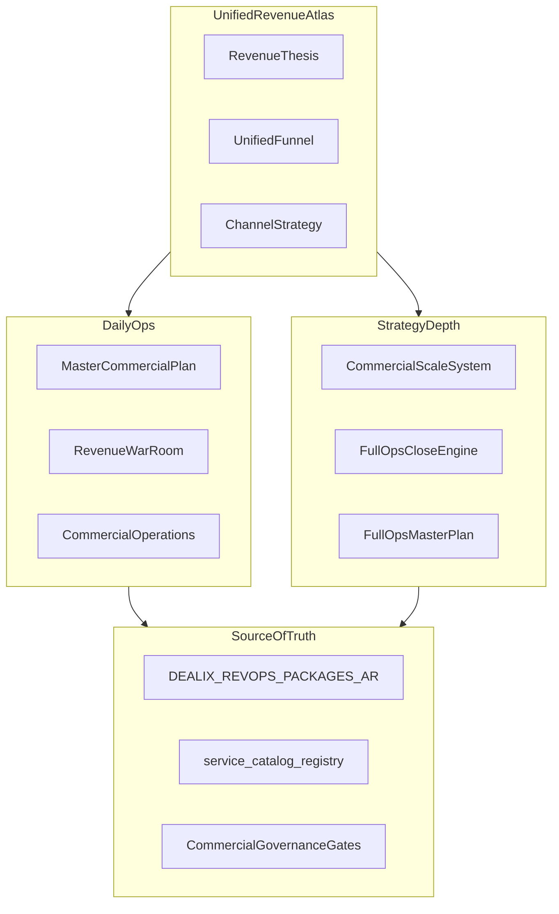
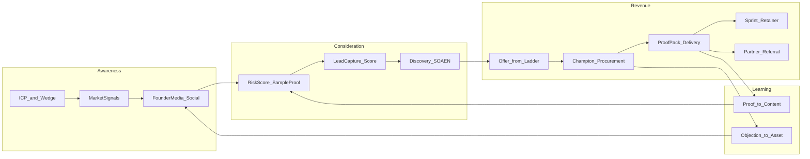
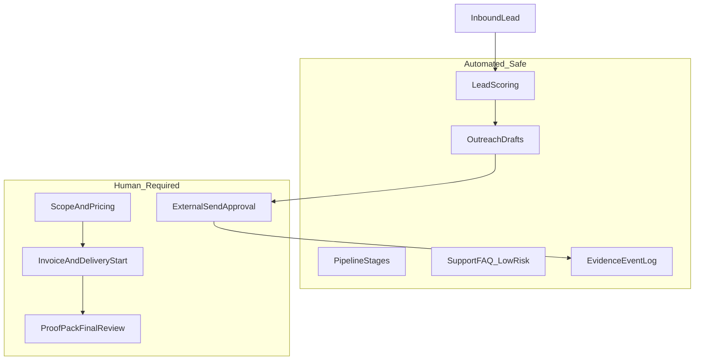

# أطلس الإيراد الموحّد — Dealix

**الغرض:** محور تنقل **واحد** يربط الاستراتيجية، التكتيك، القنوات (بما فيها السوشال)، التصريف الآلي **المسموح**، والشراكات — دون دمج آلاف الأسطر من `sales-kit` في ملف واحد (يصبح قديماً فوراً).

**القرار التنفيذي:** لا بناء مزايا جديدة قبل **أول Diagnostic مدفوع + Proof Pack مسلّم**. استخدم ما بُني لإغلاق وتكرار الإيراد.

**تكتيك مبيعات + سوشال + استهداف (عميق):** [DEALIX_SALES_GTM_SOVEREIGN_MASTER_AR.md](DEALIX_SALES_GTM_SOVEREIGN_MASTER_AR.md) — هذا الأطلس = **thesis + قمع + اقتصاد**؛ السيادي = **تنفيذ يومي/أسبوعي**.

**محور الشركة الجاهزة (أوامر + CI + 9 أنظمة + UI):** [DEALIX_COMPANY_READY_MASTER_AR.md](../company/DEALIX_COMPANY_READY_MASTER_AR.md)

**كيف تقرأ هذا الملف:**

| الطبقة | الوقت | ماذا تفعل |
|--------|-------|-----------|
| **5 دقائق** | صباحاً | [§2 Thesis](#2-thesis-إيراد-للمؤسس) + [§6 تكتيك يومي](#6-التكتيك-اليومي--الأسبوعي--الشهري) → ثم [MASTER_COMMERCIAL_OPERATING_PLAN_AR.md](MASTER_COMMERCIAL_OPERATING_PLAN_AR.md) |
| **عميق** | أسبوع/تخطيط | [§3 القمع](#3-خريطة-القمع-الموحّدة) · [§4 القنوات](#4-استراتيجية-القنوات) · [§5 الاستهداف](#5-الاستهداف-والتقسيم) · [§7 تعظيم القيمة](#7-تعظيم-القيمة-والهامش) |
| **تشغيل يومي** | طوال اليوم | [operations/README.md](operations/README.md) · [DEALIX_REVENUE_WAR_ROOM_AR.md](../ops/DEALIX_REVENUE_WAR_ROOM_AR.md) · `evidence_events_tracker.csv` |

**ترتيب القراءة:** أطلس (تنقل) → [الماستر السيادي](DEALIX_SALES_GTM_SOVEREIGN_MASTER_AR.md) (عمق) → [Master 5 دقائق](MASTER_COMMERCIAL_OPERATING_PLAN_AR.md) → [التشغيل اليومي الآلي](DEALIX_COMPANY_DAILY_AUTOPILOT_AR.md) → [operations/](operations/).

**أمر صباحي واحد:** `bash scripts/run_founder_commercial_day.sh` (Windows: `scripts/run_founder_commercial_day.ps1`).

---

## 1) خريطة الطبقات (أين يعيش ماذا)



| الطبقة | المرجع | متى |
|--------|--------|-----|
| **أطلس (هذا الملف)** | `DEALIX_UNIFIED_REVENUE_ATLAS_AR.md` | قرار استراتيجي، ربط القنوات، تعظيم القيمة |
| **الماستر السيادي** | [DEALIX_SALES_GTM_SOVEREIGN_MASTER_AR.md](DEALIX_SALES_GTM_SOVEREIGN_MASTER_AR.md) | عمق كامل: استراتيجية، استهداف، سوشال، تكتيك، فهرس |
| **تشغيل الشركة اليومي** | [DEALIX_COMPANY_DAILY_AUTOPILOT_AR.md](DEALIX_COMPANY_DAILY_AUTOPILOT_AR.md) | جدول 24 ساعة، CI، موافقات، سكربت صباحي |
| **تشغيل يومي (5 دقائق)** | [MASTER_COMMERCIAL_OPERATING_PLAN_AR.md](MASTER_COMMERCIAL_OPERATING_PLAN_AR.md) | كل صباح بعد الموجز |
| **تصريف + Control Tower** | [DEALIX_COMMERCIAL_SCALE_SYSTEM_AR.md](DEALIX_COMMERCIAL_SCALE_SYSTEM_AR.md) | Motions، SOAEN، AEO، اعتراضات |
| **إغلاق Full Ops** | [FULL_OPS_CLOSE_ENGINE_AR.md](FULL_OPS_CLOSE_ENGINE_AR.md) | Champion، Procurement، 10 زوايا شراء |
| **12 ماكينة شركة** | [DEALIX_FULL_OPS_MASTER_PLAN_AR.md](../strategy/DEALIX_FULL_OPS_MASTER_PLAN_AR.md) | Market Signal، Media، Sales Autopilot مفاهيمياً |
| **سوشال + مصنع محتوى** | [MARKETING_FACTORY.md](../marketing/MARKETING_FACTORY.md) | Founder media، lead magnets، إعلان متى |
| **غرفة تصريف** | [DEALIX_REVENUE_WAR_ROOM_AR.md](../ops/DEALIX_REVENUE_WAR_ROOM_AR.md) | أعلى 10 targets، مسودات، متابعات |
| **حزم تنفيذ** | [operations/](operations/) | أحداث أدلة، Motion A، scorecard |

---

## 2) Thesis إيراد للمؤسس

**الموقف:** Dealix = **Governed Revenue & AI Operations** — تحويل الفوضى **بعد الـ lead** إلى قرارات موثّقة قابلة للبيع، وليس chatbot أو وكالة AI عامة.

**ما يُعظَّم (بالترتيب):**

1. **سرعة أول دفع بجودة** — Diagnostic أو Sprint مدفوع على workflow واحد أو عيّنة 10 leads (لا «ديمو طويل» قبل Discovery).
2. **هامش التسليم** — نطاق مكتوب يطابق [DEALIX_REVOPS_PACKAGES_AR.md](DEALIX_REVOPS_PACKAGES_AR.md)؛ لا scope creep بدون SOW.
3. **تكرار Motion A** — الوكالات ومزودو التسويق (يشترون، يحيلون، يعيدون البيع، يربطون الخدمة).
4. **توسعة بعد Proof** — لا upsell لريتينر قبل `proof_pack_delivered` (انظر [`.cursor/rules/dealix-founder-sales.mdc`](../../.cursor/rules/dealix-founder-sales.mdc)).
5. **شركاء عالي الجودة** — إحالات بمعدل إغلاق أفضل من قنوات عشوائية.
6. **حلقة تعلّم** — اعتراض → محتوى → أصل مبيعات → FAQ (Objection Engine).

**ما لا يُعدّ نجاحاً:**

- نشاط بدون **Commercial Evidence Event** (رسائل كثيرة بلا `payment_received` أو `proof_pack_delivered`).
- حملات إعلانية مبكرة قبل ICP واعتراضين متكررين.
- أرقام CRM أو إيراد **مخترعة** في الأتمتة — KPI من `kpi_founder_commercial_import.yaml` فقط.

---

## 3) خريطة القمع الموحّدة



**تسلسل البيع داخل المحادثة (لا تخلط):**

```text
Pain → Cost of inaction → One-workflow solution → Proof Pack → Low-risk pilot → Expansion path
```

تفصيل: [FULL_OPS_CLOSE_ENGINE_AR.md](FULL_OPS_CLOSE_ENGINE_AR.md) §1.

**أحداث أدلة إلزامية (تتبع):**

| الحدث | معنى |
|--------|------|
| `message_sent_manual` | مسودة/إرسال بموافقة |
| `reply_received` | رد مسجّل |
| `demo_booked` | ديمو بعد Discovery |
| `scope_requested` | طلب نطاق |
| `invoice_sent` | فاتورة |
| `payment_received` | دفع |
| `proof_pack_delivered` | Proof مسلّم |
| `partner_intro_created` | مسار شريك |

مسار كامل: [operations/EVIDENCE_EVENTS_CLOSE_PATH_AR.md](operations/EVIDENCE_EVENTS_CLOSE_PATH_AR.md) · CSV: [operations/evidence_events_tracker.csv](operations/evidence_events_tracker.csv).

---

## 4) استراتيجية القنوات

**المبدأ:** `target → personalize → send (draft/approval) → track → convert` — **يدوياً بموافقة** حتى تثبت الأدلة.

| القناة | الدور | أتمتة مسموحة | ممنوع |
|--------|------|--------------|--------|
| **LinkedIn (مؤسس)** | بناء فئة، B2B، وكالات | مسودات، جدولة منشورات داخلية | auto-DM بارد |
| **WhatsApp / Email** | متابعة دافئة، عملاء حاليين | مسودات + موافقة صريحة | واتساب بارد جماعي |
| **محتوى / نشرة / ويبينار** | مغناطيس، ثقة، AEO | تسلسل بريد بعد opt-in | ادّعاءات إيراد مضمونة |
| **شريك / إحالة** | رافعة ARPU، Motion A | تتبع إحالة، حزمة Co-sell | عمولة بلا إفصاح |
| **إعلان مدفوع** | لاحقاً | retargeting بعد أدلة | إنفاق قبل 3–5 اجتماعات مؤهلة |
| **API / نماذج عامة** | Risk Score، طلب Proof | تسجيل lead، scoring داخلي | إرسال خارجي من الـ API |

**بوابات الحوكمة:** [operations/COMMERCIAL_GOVERNANCE_GATES_AR.md](operations/COMMERCIAL_GOVERNANCE_GATES_AR.md) · [../governance/APPROVAL_POLICY.md](../governance/APPROVAL_POLICY.md).

**مصنع المحتوى والسوشال:** [MARKETING_FACTORY.md](../marketing/MARKETING_FACTORY.md) — حلقة: اعتراض → LinkedIn → فيديو قصير → نشرة → FAQ → بريد مبيعات → أصل شريك.

**KPI مرجعية (محتوى):** 5 منشورات/أسبوع · نشرة/أسبوع · webinar/شهر · طلبات proof pack · اجتماعات مؤهلة من المحتوى.

---

## 5) الاستهداف والتقسيم

**Primary Wedge:** وكالات تسويق/إعلان/محتوى ومن يدير حملات لعملاء — لأنهم يشترون، يحيلون، يعيدون البيع، أو يربطون Dealix بعرضهم.

**أربعة Motions (توجيه عرض، لا قمعاً واحداً):**

| Motion | الشريحة | مسار مختصر | رسالة جوهرية |
|--------|---------|------------|----------------|
| **A** Agency | وكالة | Audit → Agency Proof → Co-sell → Partner | «تجيبون الاهتمام؛ Dealix يثبت ما بعد الاهتمام» |
| **B** Direct | عيادة، عقار، B2B | Risk Score → Audit → Diagnostic → Sprint | «من يحتاج متابعة الآن؟ وما الدليل؟» |
| **C** Consultant | CRM/automation | Diagnostic layer → Handoff → Proof | «طبقة تشخيص/إثبات قبل التنفيذ» |
| **D** Executive | CEO/حوكمة | RevOps Diagnostic → Executive OS → Retainer | «قرارات أسبوعية موثّقة لا تجارب متفرقة» |

**الوتد الحالي:** Motion **A** أولاً — تفاصيل: [operations/motion_a_agency/](operations/motion_a_agency/) · [DEALIX_REVENUE_WAR_ROOM_AR.md](../ops/DEALIX_REVENUE_WAR_ROOM_AR.md).

**معيار SOAEN في كل touchpoint:**

```text
Source → Owner → Approval → Evidence → Next Action
```

---

## 6) التكتيك اليومي / الأسبوعي / الشهري

### يومي (~90 دقيقة موزّعة — مرجع Full Ops)

| كتلة | الإجراء | المرجع |
|------|---------|--------|
| **5 دقائق** | Control Tower + War Room + حدث أدلة واحد | [MASTER_COMMERCIAL_OPERATING_PLAN_AR.md](MASTER_COMMERCIAL_OPERATING_PLAN_AR.md) |
| **مبيعات** | أعلى 10 targets، متابعات، Discovery قبل ديمو | War Room · [operations/EVIDENCE_EVENTS_CLOSE_PATH_AR.md](operations/EVIDENCE_EVENTS_CLOSE_PATH_AR.md) |
| **محتوى** | منشور/مسودة واحدة من حلقة الاعتراض | [MARKETING_FACTORY.md](../marketing/MARKETING_FACTORY.md) |
| **موافقات** | مسودات خارجية عالية المخاطر | [APPROVAL_POLICY.md](../governance/APPROVAL_POLICY.md) |

### أسبوعي

- [COMMERCIAL_WEEKLY_SCORECARD_AR.md](operations/COMMERCIAL_WEEKLY_SCORECARD_AR.md) — **Pilots نشطة** + **Proof Packs مسلّمة**.
- مراجعة pipeline، waste بالقناة، أعلى اعتراض (Objection Engine).
- [DAILY_COMMERCIAL_LOOP_AR.md](../ops/DAILY_COMMERCIAL_LOOP_AR.md) كحلقة موسّعة.

### شهري

- Webinar: *Before AI Agents: Govern Your Revenue Workflows*.
- تحديث AEO calendar · شريك واحد على الأقل في مسار Co-sell.
- KPI مؤسس من import حقيقي: `scripts/apply_kpi_founder_commercial.py` (لا أرقام وهمية).

---

## 7) تعظيم القيمة والهامش

| أسلوب | كيف |
|-------|-----|
| **تسعير حسب الألم** | استخدم Offer Matrix كـ **routing** فقط؛ العقد من RevOps Packages (§8). |
| **مدخل صغير** | Diagnostic / Audit قبل Sprint — يقلل مخاطرة القرار. |
| **Champion Pack** | يختصر دورة الموافقة الداخلية — [FULL_OPS_CLOSE_ENGINE_AR.md](FULL_OPS_CLOSE_ENGINE_AR.md) §2. |
| **Procurement Pack** | Scope/Timeline/Inputs/Outputs/Not included — يزيل احتكاك المالية حتى للمبالغ «الصغيرة». |
| **CS = مبيعات** | تسليم Proof قوي يفرض قرار التالي (Sprint/Retainer) بوضوح. |
| **إحالة بعد النجاح** | طلب `referral_requested` بعد `proof_pack_delivered`. |
| **شريك** | Dealix تشخيص + شريك تنفيذ = ARPU أعلى دون تضخيم تكلفة تسليمك. |
| **AEO + Objection** | أصول طويلة العمر — هامش تسويق يتحسن مع الوقت. |
| **Unit economics** | تتبع CAC، هامش التسليم، معدل Diagnostic→Sprint — [NORTH_STAR_METRICS_AR.md](NORTH_STAR_METRICS_AR.md). |
| **No-build** | لا ميزة قبل إيراد مكرر — Control Tower سؤال «ماذا لا نبني؟». |

**ممنوعات تعظيم قصير الأمد (تدمر الثقة):** ضمان إيراد · proof مزيف · cold WhatsApp · scraping إنتاجي · upsell قبل Proof.

---

## 8) مصدر الحقيقة للأسعار والعروض

> **مهم — لا تدمج الأرقام صامتاً بين الجداول.**

| المصدر | الاستخدام |
|--------|-----------|
| **[DEALIX_REVOPS_PACKAGES_AR.md](DEALIX_REVOPS_PACKAGES_AR.md)** | **مصدر الحقيقة الوحيد** للأسعار والنطاق في العقود، العروض الرسمية، والفواتير (مثال: Diagnostic 3,500 · Sprint 9,500 · Pilot 22,000 · RevOps 15k–25k شهرياً). |
| **Offer Matrix** في [DEALIX_COMMERCIAL_SCALE_SYSTEM_AR.md](DEALIX_COMMERCIAL_SCALE_SYSTEM_AR.md) §3 | **توجيه داخلي / routing حسب الألم** (مؤشرات مثل 499 / 990 / 4,999–15,000) — قد لا تطابق جدول RevOps حتى يُوحَّد بقرار مؤسس صريح. |
| **`dealix/config/offers.yaml`** | ربط تقني حيث يُطبَّق في المنتج. |
| **`GET /api/v1/services/catalog`** | سلّم `service_id` (499 Sprint، 1500 Data Pack، 2999 Growth، إلخ) — [GTM_PLAYBOOK_SERVICE_LADDER_AR.md](../strategic/GTM_PLAYBOOK_SERVICE_LADDER_AR.md). |

**إجراء عند التعارض:** اعتمد **RevOps Packages** للعرض الموقّع؛ حدّث Offer Matrix أو `offers.yaml` في PR منفصل بعد قرار تسعير — لا تُظهر للعميل جدولين مختلفين.

**سلم بيع مقترح (RevOps):**

```text
Diagnostic (3,500) → Lead Intelligence Sprint (9,500) → Pilot (22,000) → RevOps OS (15k–25k/شهر)
```

**سلم منتج (catalog) — موازٍ للواجهة:**

```text
free_mini_diagnostic → revenue_proof_sprint_499 → data_to_revenue_pack_1500 → growth_ops_monthly_2999 → …
```

واءم الرسالة بين السلمين عند الحديث مع العميل؛ لا تخلط `service_id` مع اسم حزمة RevOps في نفس الجملة دون توضيح.

---

## 9) التصريف الآلي — ما يُؤتمت وما لا يُؤتمت



| قدرة | مرجع |
|------|------|
| Sales Autopilot (حالات، نقاط، وكلاء مسودات) | [SALES_AUTOPILOT.md](../sales/SALES_AUTOPILOT.md) · [DEALIX_FULL_OPS_MASTER_PLAN_AR.md](../strategy/DEALIX_FULL_OPS_MASTER_PLAN_AR.md) §7 |
| Marketing Factory | [MARKETING_FACTORY.md](../marketing/MARKETING_FACTORY.md) |
| Support (طبقات تصعيد) | [SUPPORT_AUTOPILOT.md](../support/SUPPORT_AUTOPILOT.md) |
| Revenue OS API (catalog، anti-waste) | [COMMERCIAL_WIRING_MAP.md](../COMMERCIAL_WIRING_MAP.md) · `AGENTS.md` |
| Business Now / Strategy simulate | `/ar/business-now` · API `business-now` |

**قاعدة ذهبية:** أي إجراء **خارجي** = مسودة + موافقة + حدث أدلة.

---

## 10) فهرس شامل — متى تقرأ ماذا

### `docs/commercial/`

| الملف | متى |
|------|-----|
| **DEALIX_UNIFIED_REVENUE_ATLAS_AR.md** (هذا) | استراتيجية شاملة، ربط قنوات، تسعير SoT |
| MASTER_COMMERCIAL_OPERATING_PLAN_AR.md | كل صباح |
| DEALIX_COMMERCIAL_SCALE_SYSTEM_AR.md | Motions، Control Tower، AEO |
| FULL_OPS_CLOSE_ENGINE_AR.md | إغلاق صفقة، Champion، Procurement |
| DEALIX_REVOPS_PACKAGES_AR.md | عرض سعر، SOW، فاتورة |
| DEALIX_AI_OPERATING_COMPANY_AR.md | 9 أنظمة، QA، تسليم |
| operations/* | تنفيذ، CSV، Motion A، scorecard |
| ops_client_pack/ | Runbook + deck للعميل |

### `docs/sales/` و `docs/sales-kit/`

| المجلد | متى |
|--------|-----|
| sales/ | Discovery، اعتراضات، قوالب عروض، pipeline |
| sales-kit/ | نصوص جاهزة، ديمو 30 دقيقة، battlecards، START_HERE |
| sales-kit/v5/ | تقييم تنفيذي، multi-stakeholder |

### `docs/marketing/` · `docs/strategy/` · `docs/ops/`

| الملف | متى |
|------|-----|
| MARKETING_FACTORY.md | خطة سوشال ومحتوى |
| DEALIX_FULL_OPS_MASTER_PLAN_AR.md | 12 ماكينة، roadmap 14/30/90 |
| DEALIX_CATEGORY_STRATEGY_AR.md | تموضع الفئة |
| GTM_PLAYBOOK_SERVICE_LADDER_AR.md | كل service_id |
| DEALIX_REVENUE_WAR_ROOM_AR.md | يومي — targets ورسائل |
| DAILY_COMMERCIAL_LOOP_AR.md | حلقة تجارية موسّعة |

### `docs/partners/` · `docs/affiliates/` · `docs/governance/` · `docs/delivery/`

| الملف | متى |
|------|-----|
| PARTNER_PROGRAM.md · PARTNER_PACKAGES.md | شراكة وإحالة |
| AFFILIATE_PROGRAM.md | عمولة وإفصاح |
| APPROVAL_POLICY.md · EVIDENCE_LEDGER.md | حوكمة |
| PROOF_PACK_TEMPLATE.md | تسليم |

### `docs/transformation/` · `docs/business/` (KPI وتشغيل CEO)

| الملف | متى |
|------|-----|
| BUSINESS_NOW / commercial strategy | لقطة مؤسس، محاكاة استراتيجية |
| kpi_founder_commercial_* | أرقام حقيقية من CRM |
| CTO / global AI transformation | أسبوعي — لا يستبدل إغلاق أول دفع |

### `docs/` تقنية تدشين

| الملف | متى |
|------|-----|
| COMMERCIAL_LAUNCH_MASTER_PLAN.md | staging، billing، beta gates |
| COMMERCIAL_WIRING_MAP.md | ربط كود ↔ عروض |

---

## 11) تشغيل الشركة اليومي (ملخص)

النظام يُولّد يومياً (مسودات، War Room، تقارير)؛ المؤسس يوافق ويلمس (~10 لمسات). **التفصيل الكامل:** [DEALIX_COMPANY_DAILY_AUTOPILOT_AR.md](DEALIX_COMPANY_DAILY_AUTOPILOT_AR.md).

| وقت (مرجع) | ماذا |
|------------|------|
| 04:00 UTC | GitHub `daily-revenue-machine` — مسودات Gmail/LinkedIn (`draft_only`) |
| صباح KSA | `run_founder_commercial_day` — موجز + War Room |
| نهار | موافقات + لمسات + `evidence_events_tracker.csv` |
| مساء | `founder_daily_scorecard.py` |

---

## 12) مراحل التنفيذ (من الأطلس إلى المال)

| مرحلة | الهدف | مرجع |
|-------|--------|------|
| 0 | آلة إغلاق + Discovery | [operations/EVIDENCE_EVENTS_CLOSE_PATH_AR.md](operations/EVIDENCE_EVENTS_CLOSE_PATH_AR.md) |
| 1 | أول `payment_received` + `proof_pack_delivered` | [operations/FIRST_PAID_DIAGNOSTIC_DOD_AR.md](operations/FIRST_PAID_DIAGNOSTIC_DOD_AR.md) |
| 2 | تكرار Motion A | [operations/motion_a_agency/](operations/motion_a_agency/) |
| 3 | شريك | [operations/PARTNER_ONBOARDING_KIT_AR.md](operations/PARTNER_ONBOARDING_KIT_AR.md) |
| 4 | AEO + Objection | [operations/AEO_CONTENT_CALENDAR_AR.md](operations/AEO_CONTENT_CALENDAR_AR.md) |
| 5 | منصة/توسع منتج | بعد تكرار الأدلة فقط |

---

*آخر تحديث: 2026-05-17 — أطلس تنقل؛ العقود والأسعار: [DEALIX_REVOPS_PACKAGES_AR.md](DEALIX_REVOPS_PACKAGES_AR.md) فقط.*
