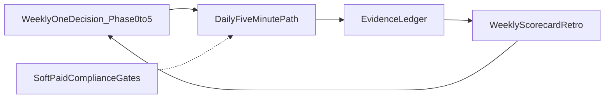

# أقوى خطة للمؤسس × Dealix

**الغرض:** نظام تشغيل موسّع يربط استراتيجية → إيقاع يومي/أسبوعي → سجل أدلة → بوابات Soft/Paid والامتثال — **بدون** استبدال [MASTER_COMMERCIAL_OPERATING_PLAN_AR.md](MASTER_COMMERCIAL_OPERATING_PLAN_AR.md) أو [FOUNDER_OPERATING_SYSTEM_AR.md](../ops/FOUNDER_OPERATING_SYSTEM_AR.md).

**قائمة آلية (138 مهمة):** [`dealix/config/founder_strongest_plan_checklist.yaml`](../../dealix/config/founder_strongest_plan_checklist.yaml) · **حالة:** `python scripts/founder_strongest_plan_status.py` · **طباعة المراجع:** `python scripts/print_founder_strongest_plan_tasks.py` · **Ops API:** `GET /api/v1/ops-autopilot/founder/strongest-plan` · **تشغيل ذاتي:** `python scripts/run_founder_strongest_ops.py` · `GET /api/v1/ops-autopilot/founder/strongest-ops` · مدمج في [FULL_AUTONOMOUS_COMMERCIAL_OPS_AR.md](FULL_AUTONOMOUS_COMMERCIAL_OPS_AR.md)

**قرار أسبوعي واحد:** [`dealix/config/founder_weekly_one_decision.yaml`](../../dealix/config/founder_weekly_one_decision.yaml)

---

## ماذا تعني «أقوى خطة» فعليًا؟

ليست مستندًا طويلًا للقراءة، بل **حلقة مغلقة أسبوعيًا**:

| عنصر | التنفيذ في Dealix |
|------|-------------------|
| قرار واحد / أسبوع | مرحلة نشطة **واحدة** (0–5) + ملف `founder_weekly_one_decision.yaml` |
| إيقاع يومي | [MASTER § مسار اليوم](MASTER_COMMERCIAL_OPERATING_PLAN_AR.md) + `run_founder_commercial_day.sh` |
| أدلة | [evidence_events_tracker.csv](operations/evidence_events_tracker.csv) يوميًا |
| ريترو | [COMMERCIAL_WEEKLY_SCORECARD_AR.md](operations/COMMERCIAL_WEEKLY_SCORECARD_AR.md) + 30 دقيقة (§ أدناه) |
| Soft vs Paid | [MASTER § Soft vs Paid](MASTER_COMMERCIAL_OPERATING_PLAN_AR.md) — لا ادعاء «إطلاق كامل» مبكرًا |
| no-build | لا مزايا جديدة قبل **أول Diagnostic مدفوع + Proof Pack مسلّم** |



---

## المحور 1 — قرار أسبوعي واحد (مراحل 0–5)

| مرحلة | السؤال التوجيهي | مرجع |
|-------|-----------------|------|
| 0 | مسار إغلاق موحّد قبل الديمو؟ | [EVIDENCE_EVENTS_CLOSE_PATH_AR.md](operations/EVIDENCE_EVENTS_CLOSE_PATH_AR.md) |
| 1 | خطوة واحدة نحو أول دفع + Proof؟ | [FIRST_PAID_DIAGNOSTIC_DOD_AR.md](operations/FIRST_PAID_DIAGNOSTIC_DOD_AR.md) |
| 2 | أي قناة Motion A نكرّر؟ | [motion_a_agency/](operations/motion_a_agency/) |
| 3 | شريك تجريبي واحد؟ | [PARTNER_ONBOARDING_KIT_AR.md](operations/PARTNER_ONBOARDING_KIT_AR.md) |
| 4 | اعتراض/AEO نثبت؟ | [objection_engine_registry.yaml](operations/objection_engine_registry.yaml) |
| 5 | أصل منصّة يخدم أدلة مكررة فقط؟ | [MASTER](MASTER_COMMERCIAL_OPERATING_PLAN_AR.md) § مرحلة 5 |

**إجراء:** املأ `founder_weekly_one_decision.yaml` كل أحد (أو قبل أول لمسة أسبوعية). **مهمة #1** في القائمة أدناه.

**SOAEN** في كل touchpoint: [DEALIX_COMMERCIAL_SCALE_SYSTEM_AR.md](DEALIX_COMMERCIAL_SCALE_SYSTEM_AR.md) §4.

---

## المحور 2 — المنتج والقيمة (قبل توسيع القنوات)

- نتيجة عميل **30–90 يومًا** + [PROOF_PACK_TEMPLATE.md](../delivery/PROOF_PACK_TEMPLATE.md) — ليس قائمة ميزات.
- **ترميز 10–20 محادثة:** [founder_meeting_debrief_template.yaml](operations/founder_meeting_debrief_template.yaml) · [FOUNDER_SALES_LOOP_AR.md](operations/FOUNDER_SALES_LOOP_AR.md).
- **PLS لاحقًا:** فقط عند Enterprise + حجم صفقة + PQL — لا يُخلط مع Motion A المبكر.

---

## المحور 3 — GTM حسب مرحلة العميل

| عملاء | تركيز المؤسس | Dealix |
|-------|---------------|--------|
| 1–10 | لمس يدوي، سرعة رد، تعلّم | War Room · Evidence · موافقات فقط |
| 10–40 | تكرار القناة الفائزة | Motion A · [agency_accounts_seed.csv](operations/targeting/agency_accounts_seed.csv) |
| 40+ | مركبات حسب الأدلة | Motions B–D عند النضج — [MASTER § Motions](MASTER_COMMERCIAL_OPERATING_PLAN_AR.md) |

---

## المحور 4 — التشغيل اليومي والأسبوعي

### صباحًا (يوميًا)

1. `bash scripts/run_founder_commercial_day.sh` (Windows: `.ps1`) — [FOUNDER OS](../ops/FOUNDER_OPERATING_SYSTEM_AR.md).
2. مسار **5 دقائق:** Control Tower → War Room → Evidence → (جمعة: Scorecard).
3. `/ar/ops/war-room` أو `data/war_room_today.json`.
4. **حد أدنى:** سطر واحد في [evidence_events_tracker.csv](operations/evidence_events_tracker.csv).
5. **3–5 لمسات** بشرية بعد الموجز — لا توسّع دون سجل.

### أسبوعيًا

- **Scorecard:** [COMMERCIAL_WEEKLY_SCORECARD_AR.md](operations/COMMERCIAL_WEEKLY_SCORECARD_AR.md) · `python scripts/founder_weekly_scorecard.py`
- **ريترو 30 دقيقة (قالب):**
  1. اقرأ آخر 7 أيام من السجل — ما زاد التحويل؟
  2. ما أخر؟ (اعتراض، توقيت، proof gap)
  3. هل `active_phase` في `founder_weekly_one_decision.yaml` ما زالت صحيحة؟
  4. اكتب `one_decision_ar` للأسبوع القادم **فقط**.
- **مرجعان:** [DEALIX_COMMERCIAL_SCALE_SYSTEM_AR.md](DEALIX_COMMERCIAL_SCALE_SYSTEM_AR.md) + [FULL_OPS_CLOSE_ENGINE_AR.md](FULL_OPS_CLOSE_ENGINE_AR.md).

### تحقق النظام (أسبوع 0 / دوري)

```bash
bash scripts/verify_founder_operating_system.sh
python scripts/verify_commercial_launch_ready.py
python scripts/founder_strongest_plan_status.py
python scripts/founder_comprehensive_plan_status.py
```

---

## المحور 5 — الامتثال والثقة (السياق السعودي)

- **PDPL:** مراجعة مع محامٍ — [MARKET_INTELLIGENCE_PDPL_LEGAL_REVIEW_AR.md](MARKET_INTELLIGENCE_PDPL_LEGAL_REVIEW_AR.md) · اعتراضات: [MARKET_INTELLIGENCE_OBJECTIONS_PDPL_AR.md](MARKET_INTELLIGENCE_OBJECTIONS_PDPL_AR.md).
- **قبل لمسة خارجية:** `POST /api/v1/revenue-os/anti-waste/check`.
- **حزمة امتثال:** `bash scripts/run_compliance_gtm_gate_bundle.sh`.
- **تموضع:** Revenue OS بحوكمة — أدلة L0–L5 · Decision Passport ([AGENTS.md](../../AGENTS.md)).

> لا تستبدل هذه الخطة محاميًا أو محاسبًا أو دعمًا نفسيًا مهنيًا.

---

## المحور 6 — الطاقة والمالية

- ميزانية انتباه: **3–5 لمسات** بعد الموجز (يتوافق مع وعد ~10 في Founder OS).
- **KPI من CRM فقط:** انسخ `kpi_founder_commercial_import.example.yaml` → `kpi_founder_commercial_import.yaml` (gitignored) ثم `python scripts/apply_kpi_founder_commercial.py`.
- لا توظيف مبيعات كلاسيكية قبل ترميز 10–20 صفقة.

---

## المحور 7 — خريطة 90 يومًا (مرنة)

| أسابيع | تركيز | مخرجة قابلة للتحقق |
|--------|--------|---------------------|
| 1–4 | مرحلة 0–1 | Evidence + `payment_received` عند الجاهزية |
| 5–8 | Motion A + محتوى مسودات | War room + مسودات approval queue |
| 9–12 | شريك/قناة ثانية · PLS readiness | لا توظيف مبيعات قبل الترميز |

---

## قائمة تنفيذية — 138 مهمة

**مصدر الحقيقة الكامل:** [`founder_strongest_plan_checklist.yaml`](../../dealix/config/founder_strongest_plan_checklist.yaml) (حقول `docs` · `commands` · `ui` · `api` لكل مهمة).

| أمر | الغرض |
|-----|--------|
| `python scripts/founder_strongest_plan_status.py` | `FOUNDER_STRONGEST_PLAN_VERDICT=PASS\|FAIL` |
| `python scripts/print_founder_strongest_plan_tasks.py` | مراجعة بشرية لكل القائمة |
| `python scripts/print_founder_strongest_plan_tasks.py --section daily` | فلترة قسم واحد |
| `python scripts/run_founder_strongest_ops.py --full --run-checks` | **فل أوبس ذاتي** — موجز + تحقق + صباح نواة |
| `GET .../founder/full-autonomous-ops` | لقطة أتمتة + مقارنة بحث 2026 |
| `POST .../founder/cockpit/run-unified-day` | **يوم موحّد كامل** من الواجهة (بدون إرسال خارجي) |

### تتبّع الإنجاز (آلي)

`GET .../strongest-plan` يُرجع لكل مهمة `completion`: **منجز** (أدلة/موجز/War Room حقيقي) · **اليوم** (إيقاع يومي) · **مفتوح**.  
«منجز» لا يعني إرسالاً خارجياً أو إغلاق صفقة — فقط إشارة تشغيل صادقة.

### ملخص الأقسام

| قسم | مهام (تقريبي) | تركيز |
|-----|---------------|--------|
| week0 | 1–4, 51–54 | قرار · بوابات · KPI بذرة |
| daily | 5–9, 55–59 | صباح/مساء · SOAEN · أدلة · موجز |
| weekly | 10–12, 60–62 | Scorecard · GTM review · MI |
| motion_a | 13–15, 63–67 | ICP · pipelines · استهداف |
| content | 16–17, 68–70 | مسودات · طابور · مزامنة |
| phase_01 | 18–20, 71–74 | إغلاق · دفع · Proof · soft meetings |
| phase_24 | 21–23, 75–78 | Motions · توسعة · قنوات |
| governance | 24–25, 79–82 | anti-waste · PDPL · Revenue OS |
| kpi | 26, 83–84 | CRM · منصة · API snapshot |
| optional | 27–28 | Value Plan · Business NOW |
| presentations | 29–34, 85–90 | حزم MI · ROI · SOP عميل |
| public_gtm | 35–37, 91–93 | Soft/Paid · أطلس · تحقق انتقال |
| dogfood | 38–41, 94–96 | الشركة كعميل صفر |
| engineering_fe | 42–45, 97–100 | Ops UI كامل |
| engineering_be | 46–49 | launch · cadence · MI |
| value_delivery | 101–107 | Proof stack · تسليم · ترميز |
| autonomous_ops | 109–122 | Full Ops · CI · APIs · unified run |
| research | 50, 108 | benchmarks · codification |
| autonomous_ops | 109–122, 134 | Full Ops · CI · يوم ذاتي موحّد |
| integrations | 123–125 | Truth Matrix · HubSpot/Calendly · smoke |
| finance_unit | 126–128 | قيمة · KPI · Paid/Moyasar |
| customer_success | 129–131 | MI CS · Proof · QBR/debrief |
| trust_security | 132–133 | ثقة · PDPL bundle |

**يوم ذاتي كامل (أقصى أتمتة):**

```bash
py -3 scripts/run_dealix_complete_autonomous_day.py
powershell -File scripts/founder_cadence.ps1 -Complete
```

يشغّل: governed morning → strongest ops → commercial day → full ops core → تحقق 134 مهمة (+ مساء/أسبوع اختياري). **لا إرسال خارجي.**

---

## ربط المهام بالوكلاء (مراجعة فقط — لا إرسال خارجي)

| أقسام القائمة | وكيل Cursor | ملاحظة |
|---------------|-------------|--------|
| week0 · phase_01 · presentations · public_gtm | **dealix-sales** | قرار أسبوعي · عروض · بوابات إطلاق |
| motion_a · content · phase_24 | **dealix-sales** + **dealix-content** | استهداف · مسودات · Motions |
| value_delivery · optional | **dealix-delivery** | Proof Pack · تسليم · Value Plan |
| governance · kpi | **dealix-engineer** + محامٍ بشري | PDPL · anti-waste · KPI من CRM |
| dogfood · engineering_fe · engineering_be | **dealix-engineer** | Ops UI · تحققات · cadence |
| autonomous_ops | **dealix-engineer** + **dealix-pm** | Full Ops · CI · digest (لا إرسال خارجي) |
| research · weekly | **dealix-pm** | ريترو · GTM debt · أولويات الأسبوع |

**حلقة أسبوعية واحدة (محلي/CI):** `bash scripts/founder_weekly_loop.sh` (Windows: `scripts/founder_weekly_loop.ps1`) — يشمل `founder_strongest_plan_status.py`.

مرجع Prompts: [FOUNDER_AGENT_PLAYBOOK_AR.md](../ops/FOUNDER_AGENT_PLAYBOOK_AR.md).

---

## حدود الصلاحية

- «أقوى خطة» تُقاس بـ **أحداث أدلة + مؤشرات أسبوعية**، لا بعدد الصفحات.
- البحث الخارجي يخدم الفرضيات؛ **السجل الأسبوعي** يقرر التعديل.

---

*آخر تحديث: 2026-05-18 — 134 مهمة (v2 YAML) · يكمّل MASTER و Founder OS؛ لا يستبدلهما.*
