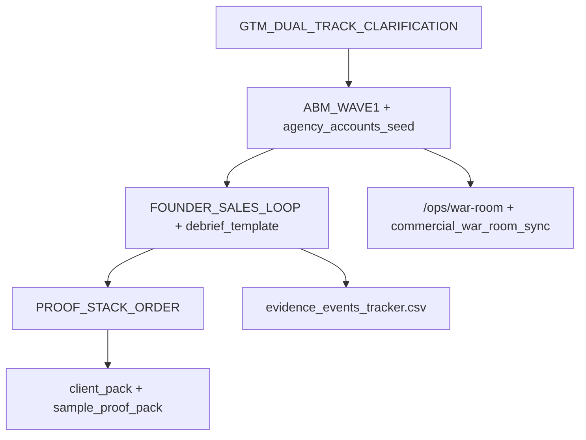

# GTM السعودية — ما يفيد فعلاً (بحث ويب + إطار عملي Dealix)

**الغرض:** تجميع ما يثبت فائدته في أسواق B2B/SaaS السعودية والخليج، وربطه بتشغيل Dealix الحالي — **بدون** تعديل ملف الخطة في `.cursor/plans/`.

**ابدأ من:** [operations/GTM_DUAL_TRACK_CLARIFICATION_AR.md](operations/GTM_DUAL_TRACK_CLARIFICATION_AR.md) ثم نفّذ الموجات بالترتيب أدناه.

---

## مصادر خارجية (ملخّص موثوق)

| مبدأ | لماذا يفيد في السعودية | مرجع |
|------|------------------------|------|
| الثقة والامتثال قبل الميزات | المشتري يخفّض مخاطر القرار قبل «التكامل» | [ClearTax e-invoicing KSA](https://bringitback.substack.com/p/how-we-launched-e-invoicing-in-saudi) |
| مبيعات المؤسس إلزامية مبكراً | تصحيح رسالة/سعر/ICP من المحادثة | [Founder-led sales](https://en.sharikatmubasher.com/media-hub/experts-thoughts/18052%3Flang%3Den) |
| توطين وسمعة قبل الإعلان | عربي + أدلة + قصص محلية | [SaaS KSA founders](https://hapy.co/journal/saas-market-in-ksa-what-founders-should-know) · [Rewaa pattern](https://mo-yf.me/en/case-studies-mdx/rewaa-retail-saas-saudi) |
| إطلاق MENA: نتيجة + onboarding هجين | ذاتي + بشري؛ ROI للمشتريات | [Falak MENA playbook](https://www.falakcompany.com/insights/saas-mena-launch-playbook) |
| ABM بموجات | beta خاص → إطلاق → توسعة | [ABM launch guide](https://abmatic.ai/blog/abm-product-launch-strategy-guide-2026) |

**ممنوع في Dealix (ثابت):** cold WhatsApp · LinkedIn تلقائي · Gmail خارجي بلا موافقة — انظر [COMMERCIAL_GOVERNANCE_GATES_AR.md](operations/COMMERCIAL_GOVERNANCE_GATES_AR.md).

---

## إطار عملي داخل المستودع (أربع طبقات)



| # | المخرج | ملف |
|---|--------|-----|
| 1 | توضيح: ترويج للعملاء vs ops داخلي | [GTM_DUAL_TRACK_CLARIFICATION_AR.md](operations/GTM_DUAL_TRACK_CLARIFICATION_AR.md) |
| 2 | موجة ABM 1 (30–50) + معايير ICP | [ABM_WAVE1_ICP_AR.md](operations/targeting/ABM_WAVE1_ICP_AR.md) · `dealix/config/gtm_abm_wave1.yaml` |
| 3 | لوب المؤسس + time-to-value | [FOUNDER_SALES_LOOP_AR.md](operations/FOUNDER_SALES_LOOP_AR.md) · [founder_meeting_debrief_template.yaml](operations/founder_meeting_debrief_template.yaml) |
| 4 | ترتيب طبقة الأدلة | [PROOF_STACK_ORDER_AR.md](operations/PROOF_STACK_ORDER_AR.md) |

---

## جدول استراتيجيات تنفيذ (5 دقائق)

| الاتجاه | ماذا تفعل في Dealix |
|---------|---------------------|
| التموضع | [POSITIONING_WHY_NOW_SAUDI_ONEPAGER_AR.md](POSITIONING_WHY_NOW_SAUDI_ONEPAGER_AR.md) — امتثال + Decision Passport |
| القنوات | warm فقط · ABM موجة 1 · لا إعلان قبل 3 اجتماعات discovery |
| الإثبات | [PROOF_STACK_ORDER_AR.md](operations/PROOF_STACK_ORDER_AR.md) قبل ديمو 30 دقيقة |
| العمليات | `run_founder_commercial_day` + [MASTER_COMMERCIAL_OPERATING_PLAN_AR.md](MASTER_COMMERCIAL_OPERATING_PLAN_AR.md) |
| القياس | activation · TTV · retained revenue — [FOUNDER_SALES_LOOP_AR.md](operations/FOUNDER_SALES_LOOP_AR.md) §مقاييس |

---

## أوامر سريعة

```powershell
powershell -File scripts/run_founder_commercial_day.ps1
py -3 scripts/import_war_room_targets.py --dry-run
```

**UI:** `/ar/ops/founder` · `/ar/ops/war-room` · `/ar/ops/evidence`

---

## توسيع التشغيل (كود + وثائق)

| بعد | ملف / أمر |
|-----|-----------|
| لقطة GTM JSON | `GET /api/v1/ops-autopilot/founder/gtm-stack` · `py -3 scripts/founder_gtm_status.py` |
| قناة + تسلسل | [GTM_CHANNELS_PLAYBOOK_AR.md](operations/GTM_CHANNELS_PLAYBOOK_AR.md) |
| اعتراضات حية | [GTM_OBJECTION_MATRIX_AR.md](operations/GTM_OBJECTION_MATRIX_AR.md) |
| ROI للمشتريات | [GTM_ROI_ONEPAGER_TEMPLATE_AR.md](operations/GTM_ROI_ONEPAGER_TEMPLATE_AR.md) |
| مراجعة جمعة | [GTM_WEEKLY_REVIEW_CHECKLIST_AR.md](operations/GTM_WEEKLY_REVIEW_CHECKLIST_AR.md) |
| debrief بعد مكالمة | `py -3 scripts/founder_meeting_debrief_init.py --company "..."` → `data/founder_debriefs/` |
| Value Plan / Daily Pack | يتضمنان `gtm_stack` تلقائياً |

### وحدة Python

`dealix/commercial_ops/gtm_stack.py` — ABM scoring · dual track · TTV · proof tier لكل status.

### Full Ops Autonomous (أقصى أتمتة بحوكمة)

| ماذا | أين |
|------|-----|
| مقارنة 2026 vs Dealix | [FULL_AUTONOMOUS_COMMERCIAL_OPS_AR.md](FULL_AUTONOMOUS_COMMERCIAL_OPS_AR.md) |
| لقطة موحّدة | `py -3 scripts/run_full_commercial_ops_autopilot.py --json` |
| تشغيل نواة صباح | `--execute` |
| API | `GET/POST .../founder/full-autonomous-ops` |

### اختبار سريع

```powershell
py -3 -m pytest tests/test_gtm_stack.py tests/test_full_ops_autopilot.py -q --no-cov
```
