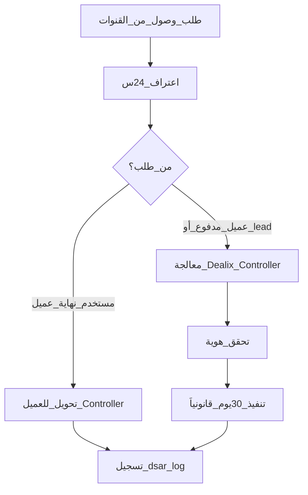
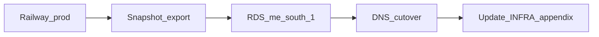

# جدول قرار الاستضافة — Region · النسخ الاحتياطي · المعالجون · DSAR

**الغرض:** قرار موحّد قبل كل عقد مؤسسي أو إجابة RFP عن «أين تُخزَّن البيانات؟»  
**الجمهور:** المؤسس، DevOps، المبيعات (ملحق تقني)  
**آخر تحديث:** 2026-05-18  
**مرتبط:** [`MARKET_INTELLIGENCE_PDPL_LEGAL_REVIEW_AR.md`](MARKET_INTELLIGENCE_PDPL_LEGAL_REVIEW_AR.md) · [`DEPLOYMENT.md`](../../DEPLOYMENT.md)

> **قاعدة:** املأ عمود «القيمة الفعلية» من لوحة المزود (Railway / Render / AWS) قبل التوقيع — لا تنسخ افتراضات هذا الجدول كحقائق.

---

## 1) مصفوفة الخيارات

| الخيار | Region نموذجي | ملاءمة PDPL / إقامة (توجيهي) | Postgres | نسخ احتياطي | ملاحظات Dealix |
|--------|---------------|-------------------------------|----------|-------------|----------------|
| **A — Railway (افتراضي حالياً)** | US/EU حسب مشروع Railway | نقل عبر الحدود محتمل؛ يتطلب DPA + إفصاح معالجين | Postgres مُدار Railway | حسب مزود المنصة | موصى في [`DEPLOYMENT.md`](../../DEPLOYMENT.md)؛ تحقق region في Dashboard |
| **B — Render + Postgres** | US/EU | مثل A | Render Postgres | Render backups | بديل عند تعذّر Railway |
| **C — AWS RDS + ECS (KSA/GCC)** | `me-south-1` (البحرين) أو مستقبلاً KSA عند التوفر | أقوى لطلبات «إقامة GCC»؛ لا يعني تلقائياً «100% KSA» | RDS | S3 `me-south-1` مشفّر | يتطلب هندسة إضافية؛ مرجع sub-processor في COMPLIANCE_CERTIFICATIONS |
| **D — Self-hosted Docker (VPS محلي)** | VPS داخل المملكة إن وُفر | مناسب لعقود حكومية/مالية صارمة | Postgres على VPS | نسخ محلي + اختبار استعادة | تكلفة تشغيل أعلى؛ تحكم كامل |
| **E — Supabase (إن استُخدم)** | حسب مشروع Supabase | راجع DPA Supabase + region | Supabase Postgres | Supabase backups | متوافق مع اتجاه pgvector في المنتج |

**توصية تشغيلية حالياً:** A أو B للـ MVP/soft launch؛ انتقل إلى C أو D عند أول عميل يشترط إقامة GCC/محلية **كتابياً** في RFP.

---

## 2) المعالجون الفرعيون (Sub-processors) — لا تُخفِ في العقد

انسخ القائمة الحية من [`docs/legal/COMPLIANCE_CERTIFICATIONS.md`](../legal/COMPLIANCE_CERTIFICATIONS.md) و`landing/sub-processors.html`. عند التوقيع:

| فئة | أمثلة | بيانات | نقل خارج المملكة؟ |
|-----|--------|--------|-------------------|
| LLM | Anthropic, OpenAI | موجهات/مخرجات (قلّل PII) | نعم — US |
| دفع | Moyasar | بيانات دفع (PCI عند Moyasar) | KSA |
| بريد | Resend/SendGrid | بريد، اسم | غالباً US |
| واتساب سحابي | Meta | رقم، محتوى | US/EU |
| إثراء | Google CSE, Hunter, Firecrawl | بيانات عامة/نطاق | متفرق |
| نسخ | AWS S3 me-south-1 | snapshots مشفّرة | GCC (البحرين) |

**في الملحق التقني للعميل:** أرفق جدولاً مُحدَّثاً بتاريخ التوقيع + رابط قائمة المعالجين العامة.

---

## 3) النسخ الاحتياطي والاستعادة

| بند | سياسة مقترحة | تحقق |
|-----|--------------|--------|
| تكرار النسخ | يومي للإنتاج (مزود DB) | ✅/❌ |
| تشفير | at-rest + in-transit (TLS) | ✅/❌ |
| منطقة النسخ | [املأ: مثلاً me-south-1] | من لوحة AWS/Railway |
| RTO / RPO | RPO ≤ 24h · RTO ≤ 4h (هدف داخلي — عدّل حسب SLA العقد) | وثّق في عقد Enterprise |
| اختبار استعادة | ربع سنوي | سجّل التاريخ في سجل المراجعة أدناه |

---

## 4) مسار طلبات أصحاب البيانات (DSAR)



| خطوة | إجراء | مرجع |
|------|--------|------|
| استقبال | privacy@dealix.me (أساسي)؛ واتساب → توثيق بريد | [`PDPL_DATA_SUBJECT_REQUEST_SOP.md`](../PDPL_DATA_SUBJECT_REQUEST_SOP.md) |
| اعتراف | ≤ 24 ساعة | SOP §4 Step 1 |
| توجيه Processor | مستخدم نهية لعميل → إحالة Controller خلال 5 أيام | SOP §2 |
| تنفيذ | وصول/تصحيح/محو/نقل — هدف 30 يوماً | SOP §1 |
| أدوات تقنية | `integrations/pdpl.py` (export/erasure) | COMPLIANCE_CERTIFICATIONS |
| سجل | `docs/wave6/live/dsar_log.jsonl` (gitignored) | SOP §4 |

---

## 5) شجرة قرار سريعة (للمؤسس)

```
هل العقد يشترط "بيانات داخل المملكة فقط"؟
  ├─ نعم → D (VPS KSA) أو C (RDS GCC) + مراجعة كل sub-processor
  ├─ "GCC مقبول" → C + S3 me-south-1 + إفصاح LLM US
  └─ لا → A/B مع DPA كامل + قائمة معالجين محدثة
```

---

## 6) ملحق تقني — قالب يُملأ لكل عميل

```yaml
customer: "<اسم العميل>"
effective_date: "YYYY-MM-DD"
production:
  provider: "Railway | Render | AWS | VPS"
  region: "<e.g. us-west1 | eu-west | me-south-1>"
  database_url_host: "<hostname فقط — لا تضع secrets في git>"
backup:
  provider: "<AWS S3 | Railway | ...>"
  region: "<>"
  encryption: "AES-256 at rest"
subprocessors_version: "<تاريخ قائمة landing/sub-processors.html>"
dsar_contact: "privacy@dealix.me"
cross_border_llm: true  # false فقط إذا عُطّل LLM خارجي تعاقدياً
notes: ""
```

احفظ نسخ العملاء في مجلد خاص **خارج git** (مثلاً Drive) — لا تُلتزم secrets في الريبو.

---

## 7) ربط بنشر Railway (تحقق سريع)

```bash
# بعد النشر — من جهاز المؤسس
curl -s https://<YOUR_APP>/health
# ثم: Railway Dashboard → Postgres service → Region / Connection
# وثّق النتيجة في ملحق العميل أعلاه
```

---

## 8) مقارنة تكلفة/جهد (توجيهي)

| خيار | CAPEX/OPEX نسبي | وقت هجرة | ملاءمة RFP |
|------|-----------------|----------|------------|
| A Railway | منخفض | 0 (حالي) | SaaS صغير · إفصاح نقل |
| B Render | منخفض | أيام | بديل A |
| C AWS GCC | متوسط | أسابيع | «GCC مقبول» |
| D VPS KSA | أعلى تشغيل | أسابيع | «KSA only» |
| E Supabase | منخفض–متوسط | أيام | منتج vector |

---

## 9) مسار هجرة (A → C مثال)



| خطوة | إجراء |
|------|--------|
| 1 | تصدير DB + اختبار استعادة على RDS |
| 2 | نشر API على ECS/EC2 في نفس VPC |
| 3 | تحديث `DATABASE_URL` + smoke `curl /health` |
| 4 | إخطار العملاء الحاليين 30 يوماً إن تغيّر region |
| 5 | تحديث sub-processors إن تغيّر مزود |

---

## 10) إجابات RFP جاهزة (نسخ)

**أين تُخزَّن البيانات؟**  
> منطقة الإنتاج والنسخ الاحتياطي مُحدَّدة في الملحق التقني [تاريخ العقد]. قائمة المعالجين الفرعيين منشورة على sub-processors.

**هل تُنقل البيانات خارج المملكة؟**  
> قد تُعالَج بعض العمليات (مثل استدلال LLM) خارج المملكة عبر معالجين مدرجين وبموجب DPA وضمانات نقل. تفاصيل per contract.

**النسخ الاحتياطي؟**  
> نسخ دورية مشفّرة؛ RPO/RTO حسب SLA Enterprise.

---

## 11) سجل المراجعة

| التاريخ | Region إنتاج مؤكد | Region نسخ | ملاحظة |
|---------|------------------|------------|--------|
| 2026-05-18 | _يملأ المؤسس_ | _يملأ المؤسس_ | إنشاء rubric من خطة استخبارات السوق |
| 2026-05-18 | _يملأ المؤسس_ | _يملأ المؤسس_ | توسع: تكلفة، هجرة، RFP |
