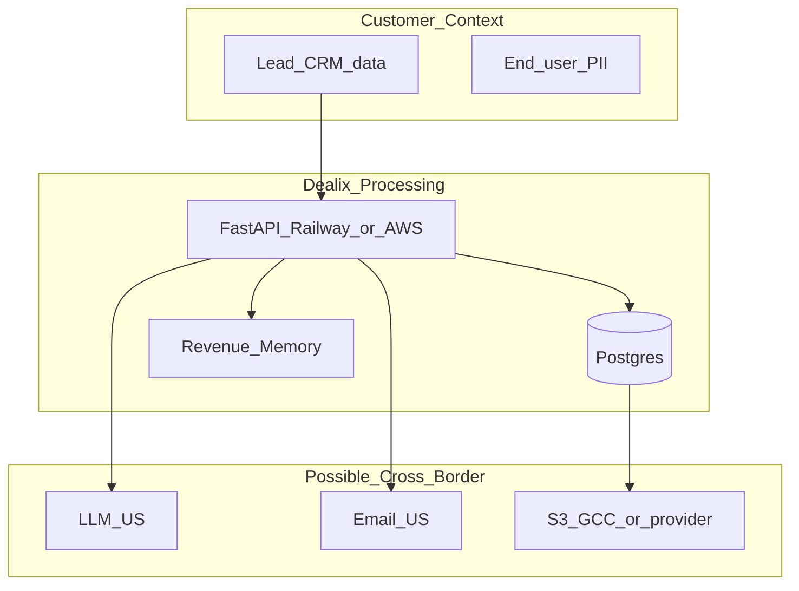

# السحابة · الإقامة · النقل عبر الحدود — دليل Dealix

**آخر تحديث:** 2026-05-18 · **مرتبط:** [INFRA_HOSTING_REGION_RUBRIC_AR.md](INFRA_HOSTING_REGION_RUBRIC_AR.md) · [MARKET_INTELLIGENCE_PDPL_LEGAL_REVIEW_AR.md](MARKET_INTELLIGENCE_PDPL_LEGAL_REVIEW_AR.md)

---

## 1) إطار تنظيمي متعدد الجهات (توجيهي)

| جهة / إطار | موضوع | أثر على Dealix |
|------------|-------|----------------|
| **PDPL** (SDAIA) | حماية بيانات شخصية، حقوق، خرق | DPA · DSAR · لغة عقود |
| **CCRF / CCC** (اتصالات/سحابة) | تسجيل CSP، تصنيف خدمة | عند بيع «سحابة» للعملاء — مستقبلي |
| **قطاعي** (SAMA، صحة، حكومة) | إقامة صارمة | مسار VPS KSA أو RDS GCC + DPIA |
| **نقل ICT عبر الحدود** | تطبيق قواعد نقل | إفصاح في DPA — لا وعد صمت |

**مراجع خارجية:**
- [U.S. Trade — cross-border enforcement](https://www.trade.gov/market-intelligence/saudi-arabia-ict-cross-border-data-transfer-rules-now-under-enforcement)
- [Lexology — Saudi cloud compliance](https://www.lexology.com/library/detail.aspx?g=e2d06e03-461d-4a8c-a45b-d8ed68fb2e83)

---

## 2) توقعات المشتري B2B (عقود ومناقصات)

| توقع | رد Dealix |
|------|-----------|
| عقد ثنائي اللغة | MSA/DPA AR+EN عند الطلب |
| التزامات بالريال | Moyasar · فواتير ZATCA |
| دعم محلي | founder-led + مسار شريك |
| إقامة بيانات | **ملحق تقني** — region مؤكد |
| قائمة subprocessors | `landing/sub-processors.html` |
| عدم نقل دون موافقة | بنود DPA + إفصاح LLM |

---

## 3) طبقات البيانات ومسارها

| طبقة | إقامة نموذجية | يُذكر في العقد |
|------|---------------|----------------|
| Postgres إنتاج | حسب مزود (A/B/C) | نعم — ملحق |
| نسخ احتياطي | GCC أو مزود DB | نعم |
| LLM inference | US غالباً | نعم + تقليل PII |
| بريد transactional | US غالباً | sub-processors |
| دفع Moyasar | KSA | خارج نطاق تخزين البطاقة |
| تحليلات PostHog | US (إن فُعّل) | إفصاح |

---

## 4) مصفوفة قرار النقل

| سيناريو عميل | DB region | LLM | بريد | توصية |
|--------------|-----------|-----|------|--------|
| وكالة SME | Railway US/EU | US + redaction | US | DPA قياسي + إفصاح |
| شركة تطلب GCC | me-south-1 | US أو تعطيل | US | ملحق C |
| حكومي/مالي KSA only | VPS KSA | off أو محلي لاحقاً | محلي إن وُجد | مسار D + محامٍ |
| شريك دولي | حسب عقد | SCC | SCC | محامٍ |

---

## 5) بنود عقدية — مسودات (محامٍ يعتمد)

**إفصاح نقل (AR):**
> قد تُعالَج البيانات الشخصية خارج المملكة العربية السعودية من قِبل معالجين فرعيين مدرجين في قائمة المعالجين، وذلك لأغراض [تقديم الخدمة/استدلال LLM/بريد تشغيلي] وبموجب ضمانات تعاقدية مناسبة.

**عدم ادعاء إقامة كاملة:**
> منطقة استضافة قاعدة البيانات الأساسية: [X]. قد تختلف مناطق النسخ الاحتياطي والمعالجة كما هو مفصّل في الملحق التقني.

---

## 6) قائمة تحقق قبل RFP حكومي/مالي

- [ ] تأكيد region إنتاج + نسخ (INFRA rubric §11)
- [ ] DPIA مسودة
- [ ] مراجعة محامٍ لنقل البيانات
- [ ] تعطيل أو تقييد LLM إن لزم
- [ ] دعم عربي في العقد والتشغيل
- [ ] مسار DSAR موثّق
- [ ] تأمين cyber 1M+ SAR (enterprise checklist)

---

## 7) ربط تشغيل

| مهمة | وثيقة/أمر |
|------|-----------|
| ملحق عميل | INFRA §6 YAML |
| أسئلة RFP | [PROCUREMENT_FAQ](MARKET_INTELLIGENCE_PROCUREMENT_FAQ_AR.md) § D |
| هجرة GCC | INFRA §9 |
