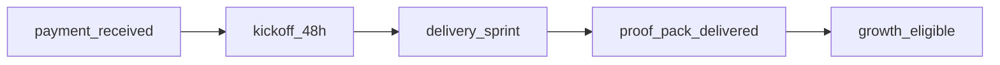

# نجاح العميل بعد البيع — من Diagnostic إلى Retainer

**آخر تحديث:** 2026-05-18

---

## مراحل الرحلة

| مرحلة | SLA داخلي | مخرج | حدث evidence |
|-------|-----------|------|--------------|
| Kickoff | 48h من الدفع | نطاق موقّع | `scope_requested` |
| Sprint/Data Pack | حسب SOW | خريطة + passport | `delivery_milestone` |
| Proof Pack | ≤48h post-pay هدف | PDF/حزمة | `proof_pack_delivered` |
| Growth | بعد Proof فقط | retainer | `invoice_paid` recurring |

---

## أسبوع 1 — checklist

- [ ] DPA موقّع · ملحق INFRA
- [ ] Controller/Processor واضح
- [ ] Truth Matrix للتكاملات
- [ ] KPI baseline من CRM العميل (لا اختراع)
- [ ] جلسة تدريب approvals (30 دقيقة)
- [ ] أول Decision Passport live على صفقة حقيقية

---

## قياس النجاح (من نظام العميل)

| مقياس | مصدر |
|-------|------|
| time_to_first_approved_outbound | evidence |
| meetings booked | Calendly |
| pipeline hygiene | CRM import |
| proof satisfaction | debrief qual |

**ممنوع:** وعد ROI % في العقد بدون case موقّع

---

## تصعيد

| إشارة | إجراء |
|-------|--------|
| طلب إرسال بارد | رفض مهذب + بديل warm |
| شكوى PDPL | DSAR SOP + محامٍ |
| طلب region KSA | INFRA migration plan |
| churn قبل Proof | debrief · لا growth |

---

## ربط تسليم

- [CLIENT_PACK_SOP](operations/CLIENT_PACK_SOP_AR.md)
- [PROOF_PACK_TEMPLATE](../delivery/PROOF_PACK_TEMPLATE.md)
- [FIRST_PAID_DIAGNOSTIC_DOD](operations/FIRST_PAID_DIAGNOSTIC_DOD_AR.md)
