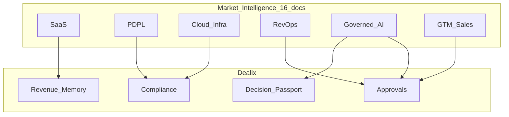

# فهرس استخبارات السوق والتشغيل — Dealix (2025–2026)

**الغرض:** نقطة دخول واحدة لكل محاور خطة «مختصر استخبارات سوق وتشغيل» — **21 وثيقة** + config آلي + موجز صباحي.  
**آخر تحديث:** 2026-05-18 · **Config:** [`dealix/config/market_intelligence_refs.yaml`](../../dealix/config/market_intelligence_refs.yaml) · **تقويم:** [`market_intelligence_content_calendar.yaml`](../../dealix/config/market_intelligence_content_calendar.yaml)  
**أمر الحالة:** `py -3 scripts/market_intelligence_status.py` · يظهر أيضاً في **Commercial Digest** صباحاً  
**خريطة القيمة:** [COMMERCIAL_VALUE_MAP_AR.md](COMMERCIAL_VALUE_MAP_AR.md) · `commercial_value_map_status.py --write-md`

---

## خريطة الوثائق الكاملة

### نواة الخطة (7 محاور أصلية)

| # | المحور | الوثيقة | الاستخدام |
|---|--------|---------|-----------|
| 1 | سوق SaaS B2B | [MARKET_INTELLIGENCE_SAUDI_SAAS_MARKET_AR.md](MARKET_INTELLIGENCE_SAUDI_SAAS_MARKET_AR.md) | ICP · JTBD · Why Now |
| 2 | PDPL · DPA | [MARKET_INTELLIGENCE_PDPL_LEGAL_REVIEW_AR.md](MARKET_INTELLIGENCE_PDPL_LEGAL_REVIEW_AR.md) | عقود · موقع |
| 3 | سحابة · نقل حدود | [MARKET_INTELLIGENCE_CLOUD_CROSS_BORDER_AR.md](MARKET_INTELLIGENCE_CLOUD_CROSS_BORDER_AR.md) | RFP · مناقصات |
| 3b | استضافة · DSAR | [INFRA_HOSTING_REGION_RUBRIC_AR.md](INFRA_HOSTING_REGION_RUBRIC_AR.md) | ملحق تقني |
| 4 | مؤسس · RevOps | [MARKET_INTELLIGENCE_FOUNDER_REVOPS_GTM_AR.md](MARKET_INTELLIGENCE_FOUNDER_REVOPS_GTM_AR.md) | يومية · War Room |
| 5 | AI محكوم | [MARKET_INTELLIGENCE_GOVERNED_AI_CATEGORY_AR.md](MARKET_INTELLIGENCE_GOVERNED_AI_CATEGORY_AR.md) | Trust Plane |
| 6 | تموضع | [POSITIONING_WHY_NOW_SAUDI_ONEPAGER_AR.md](POSITIONING_WHY_NOW_SAUDI_ONEPAGER_AR.md) | اكتشاف · لينكد إن |
| 7 | تنفيذ | [MARKET_INTELLIGENCE_IMPLEMENTATION_PLAYBOOK_AR.md](MARKET_INTELLIGENCE_IMPLEMENTATION_PLAYBOOK_AR.md) | صباح/مساء |

### توسعة تشغيلية (8 وثائق)

| # | المحور | الوثيقة |
|---|--------|---------|
| 8 | اعتراضات | [MARKET_INTELLIGENCE_OBJECTIONS_PDPL_AR.md](MARKET_INTELLIGENCE_OBJECTIONS_PDPL_AR.md) |
| 9 | RFP / أمن | [MARKET_INTELLIGENCE_PROCUREMENT_FAQ_AR.md](MARKET_INTELLIGENCE_PROCUREMENT_FAQ_AR.md) |
| 10 | محتوى 12 أسبوع | [MARKET_INTELLIGENCE_CONTENT_GTM_AR.md](MARKET_INTELLIGENCE_CONTENT_GTM_AR.md) |
| 11 | مستثمر · شريك | [MARKET_INTELLIGENCE_INVESTOR_PARTNER_AR.md](MARKET_INTELLIGENCE_INVESTOR_PARTNER_AR.md) |
| 12 | Champion · deck | [MARKET_INTELLIGENCE_SALES_CHAMPION_PACK_AR.md](MARKET_INTELLIGENCE_SALES_CHAMPION_PACK_AR.md) |
| 13 | مراجعة أسبوع/ربع | [MARKET_INTELLIGENCE_WEEKLY_REVIEW_CHECKLIST_AR.md](MARKET_INTELLIGENCE_WEEKLY_REVIEW_CHECKLIST_AR.md) |
| 14 | TAM/SAM · مصداقية | [MARKET_INTELLIGENCE_METRICS_CREDIBILITY_AR.md](MARKET_INTELLIGENCE_METRICS_CREDIBILITY_AR.md) |
| 15 | EN executive | [MARKET_INTELLIGENCE_EN_EXECUTIVE_SUMMARY.md](MARKET_INTELLIGENCE_EN_EXECUTIVE_SUMMARY.md) |
| 16 | بريد · واتساب warm | [MARKET_INTELLIGENCE_EMAIL_TEMPLATES_AR.md](MARKET_INTELLIGENCE_EMAIL_TEMPLATES_AR.md) |
| 17 | ديمو 10 دقائق | [MARKET_INTELLIGENCE_DEMO_SCRIPT_AR.md](MARKET_INTELLIGENCE_DEMO_SCRIPT_AR.md) |
| 18 | بطاقة فئة | [MARKET_INTELLIGENCE_CATEGORY_BATTLECARD_AR.md](MARKET_INTELLIGENCE_CATEGORY_BATTLECARD_AR.md) |
| 19 | ثقة وأمن | [MARKET_INTELLIGENCE_TRUST_SECURITY_MATRIX_AR.md](MARKET_INTELLIGENCE_TRUST_SECURITY_MATRIX_AR.md) |
| 20 | نجاح عميل | [MARKET_INTELLIGENCE_CUSTOMER_SUCCESS_AR.md](MARKET_INTELLIGENCE_CUSTOMER_SUCCESS_AR.md) |

### ربط بالقيمة المادية

| وثيقة | دور |
|--------|-----|
| [COMMERCIAL_VALUE_MAP_AR.md](COMMERCIAL_VALUE_MAP_AR.md) | خريطة إيراد ↔ استخبارات §10–14 |
| [COMMERCIAL_OPS_QUICK_REFERENCE_AR.md](COMMERCIAL_OPS_QUICK_REFERENCE_AR.md) | سكربتات يومية |

---

## مسار حسب الدور

| أنت | ابدأ | ثم |
|-----|------|-----|
| مؤسس صباحاً | PLAYBOOK | FOUNDER_REVOPS |
| قبل مكالمة | POSITIONING | OBJECTIONS |
| بعد مكالمة | SALES_CHAMPION §3 | evidence evening |
| قانوني/RFP | PDPL_LEGAL | CLOUD · INFRA · PROCUREMENT |
| محتوى | CONTENT_GTM | governance gates |
| مستثمر | INVESTOR_PARTNER | METRICS · EN summary |
| جمعة | WEEKLY_REVIEW | scorecard script |

---

## ربط بالمنتج

| API | وثيقة |
|-----|--------|
| `decision-passport/*` | GOVERNED_AI · POSITIONING |
| `revenue-os/anti-waste/check` | GOVERNED_AI |
| `business-now/snapshot` | SAAS_MARKET |
| `integrations/pdpl.py` | PDPL_LEGAL |

---

## حدود الاستخدام

- أرقام السوق = اتجاه · [METRICS_CREDIBILITY](MARKET_INTELLIGENCE_METRICS_CREDIBILITY_AR.md)
- PDPL = محامٍ قبل عقود
- لا منافسين بالاسم للعملاء

---

## إيقاع تحديث

| تكرار | وثيقة |
|-------|--------|
| أسبوعي | WEEKLY_REVIEW · OBJECTIONS |
| شهري | CONTENT_GTM · PROCUREMENT |
| ربع سنوي | SAAS_MARKET · PDPL · INFRA سجل |
