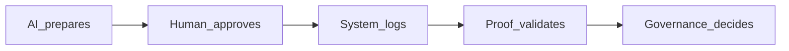

# Institutional-Grade Governance — مقدمة

**الفكرة:** قوة AI داخل Dealix تُقابل **بقوة حوكمة، تدقيق، إثبات، وتحكم**. التشغيل بدون control ينهار عند أول حادث بيانات أو claim غير مثبت.

**القاعدة التشغيلية:**

```text
AI prepares. Human approves. System logs. Proof validates. Governance decides.
```

بالعربي: **AI يجهز · الإنسان يوافق · النظام يسجل · الـProof يثبت · والحوكمة تقرر.**



**ثقة السوق:** مخاوف أمن البيانات والخصوصية والامتثال عالية لدى القيادات — [TechRadar — KPMG](https://www.techradar.com/pro/ai-is-no-longer-a-future-concept-but-an-operational-reality-new-kpmg-report-claims-firms-are-racing-to-deploy-ai-but-need-to-ensure-they-have-the-right-security-protections).

**الملفات:**

| موضوع | مسار |
|--------|------|
| طبقات الحوكمة السبع | [`GOVERNANCE_STACK.md`](GOVERNANCE_STACK.md) |
| Runtime | [`RUNTIME_GOVERNANCE.md`](RUNTIME_GOVERNANCE.md) |
| Agent Control Plane | [`AGENT_CONTROL_PLANE.md`](AGENT_CONTROL_PLANE.md) |
| Audit | [`AUDIT_TRAIL_STANDARD.md`](AUDIT_TRAIL_STANDARD.md) |
| Source Passport | [`SOURCE_PASSPORT_STANDARD.md`](SOURCE_PASSPORT_STANDARD.md) |
| طبقة الثقة السعودية | [`SAUDI_TRUST_LAYER.md`](SAUDI_TRUST_LAYER.md) |
| سلم المؤسسة | [`ENTERPRISE_READINESS_LADDER.md`](ENTERPRISE_READINESS_LADDER.md) |
| Proof كأداة حوكمة | [`PROOF_AS_GOVERNANCE_ARTIFACT.md`](PROOF_AS_GOVERNANCE_ARTIFACT.md) |
| مؤشرات التحكم | [`CONTROL_METRICS.md`](CONTROL_METRICS.md) |
| الحوادث | [`INCIDENT_RESPONSE.md`](INCIDENT_RESPONSE.md) |

**حزمة الثقة للمؤسسات (موجودة):** [`../trust/ENTERPRISE_TRUST_PACK.md`](../trust/ENTERPRISE_TRUST_PACK.md)

**الكود:** `auto_client_acquisition/institutional_control_os/`

**التوسع المؤسسي:** [`../institutional_scaling/INSTITUTIONAL_SCALING_DOCTRINE.md`](../institutional_scaling/INSTITUTIONAL_SCALING_DOCTRINE.md)

**جاهزية المجلس:** [`../board_ready/BOARD_LEVEL_THESIS.md`](../board_ready/BOARD_LEVEL_THESIS.md)

**صعود:** [`../ultimate_manual/ULTIMATE_OPERATING_MANUAL.md`](../ultimate_manual/ULTIMATE_OPERATING_MANUAL.md) · [`../sovereignty/OPERATING_SOVEREIGNTY.md`](../sovereignty/OPERATING_SOVEREIGNTY.md) · [`../global_grade/ENTERPRISE_TRUST_ARCHITECTURE.md`](../global_grade/ENTERPRISE_TRUST_ARCHITECTURE.md)

---

## الخلاصة

Dealix تصبح **institutional-grade** عندما يكون كل مسار قابلًا للشرح والتدقيق: **مصدر بجواز · تشغيل AI بسجل · وكيل ببطاقة · مخرج بحالة حوكمة · إجراء خارجي بموافقة · ادعاء بدليل · مشروع بأصل رأس مال · حادث يولّد قاعدة/اختبار/playbook.**

> لا تصبح Dealix **enterprise-ready** لأنها تضيف ميزات كثيرة فحسب، بل لأنها تستطيع أن تثبت: **ماذا حدث، لماذا، من وافق، ما الدليل، وما الذي تم منعه من مخاطر.**
