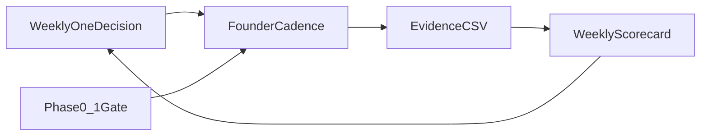

# تنفيذ خطة المؤسس الشاملة — بحث خارجي + Dealix

**الغرض:** تحويل الخطة الاستراتيجية إلى مسار تشغيلي مربوط بالمستودع — ليس نظرية منفصلة.

**مرساة اليوم:** [FOUNDER_DAILY_ANCHOR_AR.md](FOUNDER_DAILY_ANCHOR_AR.md)

**Backlog موسّع (50+):** [FOUNDER_MAX_OPS_BACKLOG_AR.md](FOUNDER_MAX_OPS_BACKLOG_AR.md) · **Dogfooding:** [DEALIX_DOGFOODING_WAR_ROOM_AR.md](DEALIX_DOGFOODING_WAR_ROOM_AR.md)

---

## المحاور السبعة → مراجع التنفيذ

| محور | مرجع Dealix | تحقق آلي |
|------|-------------|----------|
| 1 رؤية + قرار أسبوعي | [FOUNDER_WEEKLY_ONE_DECISION_AR.md](FOUNDER_WEEKLY_ONE_DECISION_AR.md) | `founder_comprehensive_plan_status.py` |
| 2 منتج + قيمة | [FIRST_PAID_DIAGNOSTIC_DOD_AR.md](../commercial/operations/FIRST_PAID_DIAGNOSTIC_DOD_AR.md) | `first_paid_tracker` |
| 3 GTM 0→100 | [FOUNDER_GTM_CODIFICATION_AR.md](../commercial/operations/FOUNDER_GTM_CODIFICATION_AR.md) | debriefs + registry |
| 4 إيقاع يومي | [FOUNDER_OPERATING_SYSTEM_AR.md](FOUNDER_OPERATING_SYSTEM_AR.md) | `founder_cadence` |
| 5 PDPL/ثقة | [FOUNDER_PDPL_COMPLIANCE_PASS_AR.md](../commercial/FOUNDER_PDPL_COMPLIANCE_PASS_AR.md) | checklist YAML |
| 6 طاقة/مالية | [FOUNDER_REVENUE_DAY_ONE_AR.md](FOUNDER_REVENUE_DAY_ONE_AR.md) | يدوي |
| 7 مخرجات 90 يوم | [MASTER_COMMERCIAL_OPERATING_PLAN_AR.md](../commercial/MASTER_COMMERCIAL_OPERATING_PLAN_AR.md) § المراحل | phase gate |

---

## قاعدة no-build

لا ميزات جديدة ولا توظيف مبيعات تقليدية قبل:

- `payment_received` + `proof_pack_delivered` (أدلة حقيقية)
- KPI من `kpi_founder_commercial_import.yaml` (ليس placeholder)

تفاصيل: [FOUNDER_PHASE_0_1_GATE_AR.md](FOUNDER_PHASE_0_1_GATE_AR.md)

---

## أوامر سريعة

```bash
# Full Ops ذاتي كامل (صباح — War Room + packs + موجز)
py -3 scripts/run_full_commercial_ops_autopilot.py --execute
# أو الغلاف الشامل (صباح + مساء + brief)
py -3 scripts/run_founder_full_autopilot.py

# صباح خفيف (commercial day فقط)
bash scripts/founder_cadence.sh
# مساء
bash scripts/founder_cadence.sh --evening
# أسبوع (جمعة)
bash scripts/founder_cadence.sh --weekly

# لقطة الخطة الشاملة
py -3 scripts/founder_comprehensive_plan_status.py

# API (لوحة /ops/founder)
# GET /api/v1/ops-autopilot/founder/full-autonomous-ops
# POST /api/v1/ops-autopilot/founder/full-autonomous-ops/run

# قرار أسبوعي جديد
py -3 scripts/founder_weekly_decision_init.py

# debrief بعد اجتماع
py -3 scripts/founder_meeting_debrief_init.py --company "اسم الشركة"
```

**مقارنة بالسوق (2025–2026):** أنظمة مثل Management OS وZealos تقدّم موجزاً صباحياً آليّاً؛ Dealix يطابق ذلك مع **حوكمة أشد** (لا إرسال بارد، أدلة CSV، بوابة 0–1، موافقة يدوية). التفاصيل: [FULL_AUTONOMOUS_COMMERCIAL_OPS_AR.md](../commercial/FULL_AUTONOMOUS_COMMERCIAL_OPS_AR.md).

---

## حلقة القياس (مخطط)



---

*آخر تحديث: 2026-05-18*
