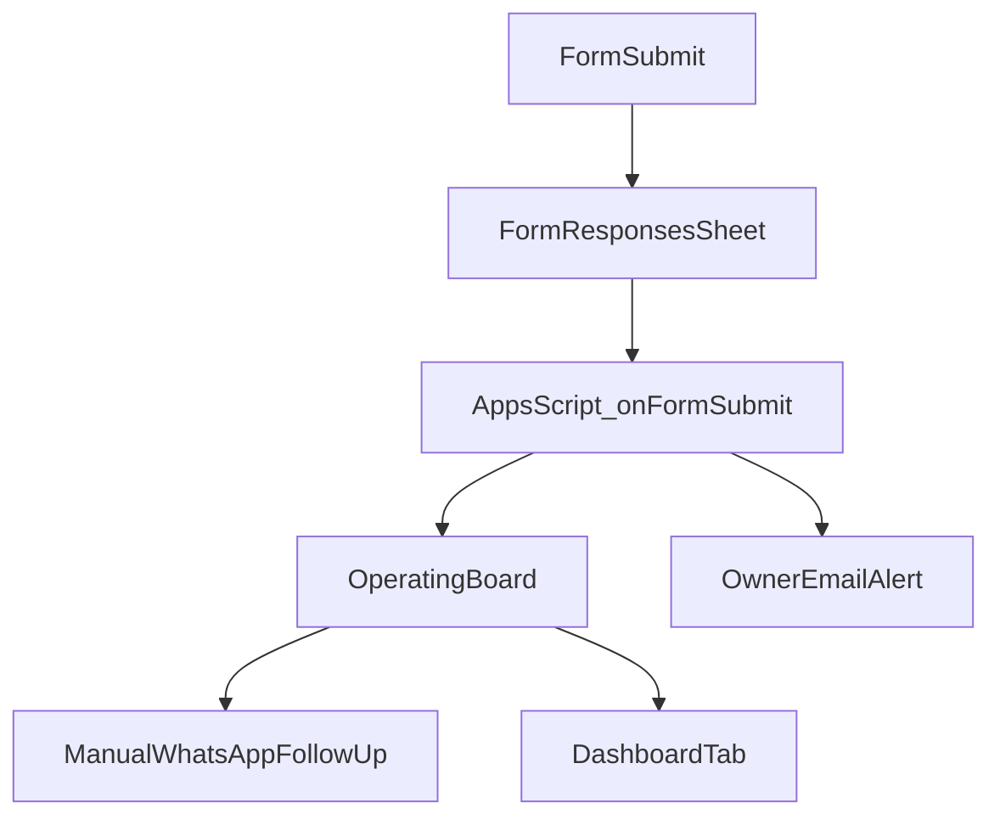

# Dealix Level 1 — Full Ops Setup (single entry)

This document is the **English/technical hub** for standing up Level 1: Google Sheet + Form + Apps Script + manual WhatsApp + staging API checks. Arabic execution order: [EXECUTE_NOW_AR.md](../EXECUTE_NOW_AR.md).

---

## Overview

---

## Required files (in this repo)

| Path | Role |
|------|------|
| [GOOGLE_SHEET_MODEL_AR.md](GOOGLE_SHEET_MODEL_AR.md) | Tab names, column headers, enums, form fields |
| [dealix_google_apps_script.gs](dealix_google_apps_script.gs) | Copy-paste into Apps Script editor |
| [LEVEL_1_ACCEPTANCE_CHECKLIST_AR.md](LEVEL_1_ACCEPTANCE_CHECKLIST_AR.md) | Tests + evidence table |
| [TURN_ON_FULL_OPS_AR.md](../TURN_ON_FULL_OPS_AR.md) | Arabic step-by-step |
| [scripts/smoke_staging.py](../../../scripts/smoke_staging.py) | HTTP smoke against staging |
| [scripts/launch_readiness_check.py](../../../scripts/launch_readiness_check.py) | Health + smoke + optional launch-readiness JSON |

---

## Google Sheet tabs

Nine tabs as defined in [GOOGLE_SHEET_MODEL_AR.md](GOOGLE_SHEET_MODEL_AR.md): `01_Lead_Intake` (optional), `Form Responses 1`, `02_Operating_Board`, `03_Diagnostic_Cards`, `04_Proof_Pack`, `05_Outreach_Copy`, `06_Service_Mapping`, `07_Dashboard`, `99_Dropdowns`.

**Critical:** Row 1 of `02_Operating_Board` must match `BOARD_COLUMN_ORDER` in `dealix_google_apps_script.gs`.

---

## Google Form setup

- Link form responses to the spreadsheet ([Google Help — form destination](https://support.google.com/docs/answer/2917686)).
- Include a **required consent** field.
- Align question titles with the script’s `buildOperatingPayload_` keys (Arabic titles in the sample `testInsertRow`), or edit the script to match your titles.

---

## Apps Script setup

1. Open the spreadsheet → Extensions → Apps Script.
2. Paste [dealix_google_apps_script.gs](dealix_google_apps_script.gs).
3. Set `OWNER_EMAIL` and `WHATSAPP_LINK` (no secrets).
4. Run `setupDealixTrigger()` once (authorize).
5. Run `testInsertRow()` and verify a new row on `02_Operating_Board`.

Installable triggers run as the user who created them ([Apps Script installable triggers](https://developers.google.com/apps-script/guides/triggers/installable)).

---

## Test lead

Use the checklist sample in [LEVEL_1_ACCEPTANCE_CHECKLIST_AR.md](LEVEL_1_ACCEPTANCE_CHECKLIST_AR.md).

---

## Operating Board usage

- One row per lead; update `meeting_status`, `diagnostic_status`, `pilot_status`, `proof_pack_status` as the deal progresses.
- `next_step` must always be one concrete action.

---

## Dashboard usage

- Point formulas at `02_Operating_Board` (see model doc for metric list).
- If numbers do not move when statuses change, fix ranges or header names.

---

## WhatsApp link

- Use inbound `wa.me` with a prefilled first message (e.g. `Diagnostic`).
- Level 1 stays **manual / session-based**; no cold WhatsApp, no broadcast. See [WHATSAPP_OPERATOR_FLOW.md](../../WHATSAPP_OPERATOR_FLOW.md).

---

## Outreach copy

- Templates live in Sheet tab `05_Outreach_Copy` and [FIRST_10_AGENCIES_OUTREACH_AR.md](FIRST_10_AGENCIES_OUTREACH_AR.md).

---

## Pilot 499

- Offer text in outreach tab; track `pilot_status` on the board.
- Manual invoice: [MANUAL_PAYMENT_SOP.md](../MANUAL_PAYMENT_SOP.md), [BILLING_MOYASAR_RUNBOOK.md](../../BILLING_MOYASAR_RUNBOOK.md). Moyasar amounts in API are in smallest currency units ([Moyasar create invoice](https://docs.moyasar.com/api/invoices/01-create-invoice/)).

---

## Proof Pack

- Fields in [GOOGLE_SHEET_MODEL_AR.md](GOOGLE_SHEET_MODEL_AR.md) under `04_Proof_Pack`.

---

## Definition of Done

- All rows in the evidence table in [LEVEL_1_ACCEPTANCE_CHECKLIST_AR.md](LEVEL_1_ACCEPTANCE_CHECKLIST_AR.md) have evidence attached.

---

## External references

- Railway deploy (Arabic): [RAILWAY_DEPLOY_GUIDE_AR.md](../../RAILWAY_DEPLOY_GUIDE_AR.md) — public service listens on `0.0.0.0:$PORT`; healthcheck expects HTTP 200 ([Railway healthchecks](https://docs.railway.com/reference/healthchecks)).
- GitHub Actions secrets: [GitHub REST — actions secrets](https://docs.github.com/en/rest/actions/secrets).

---

## Ops index

- [docs/ops/README.md](../README.md)
