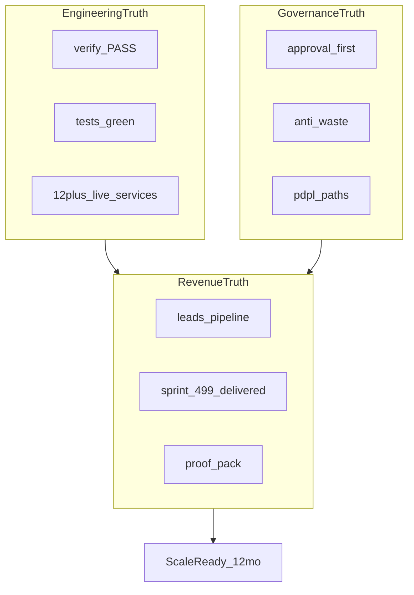

# Dealix — خطة التطوير الشاملة الأعظم (مرجع تنفيذي واحد)

> **هذه الوثيقة هي الخطة التي تريدها:** تطوير شامل من كل الزوايا — منتج، هندسة، بيانات، AI، أمان، تجاري، تسليم — **بدون أفق 2040**.  
> الأفق الأقصى هنا: **12 شهراً** لشركة قابلة للبيع والتوسع والتدقيق.  
> كل ما بعد ذلك = قرار مؤسس عندما تتحقق الأرقام، لا خيال على ورق.

---

## 0. الجملة الواحدة (ماذا نبني؟)

**Dealix = Personal Strategic Operator + Revenue Memory** لسوق B2B السعودي:  
كل إيراد يمر بسلسلة ذهبية محكومة، كل ريال AI مربوط بقيمة مقاسة، كل إجراء خارجي بموافقة.

```text
إشارة → Lead → Decision Passport → إجراء معتمد → تسليم → Proof → توسعة → تعلّم
```

**ليس الهدف:** CRM عام، وكيل ذكاء لكل شيء، لوحة تنبؤات بدون إثبات.  
**الهدف:** شركة **محكومة بالأدلة** تربح من Sprint → Retainer بإثبات حقيقي.

---

## 1. معادلة النجاح (ثلاث طبقات حقيقة)

| الطبقة | السؤال | متى «نجحنا» |
|--------|--------|-------------|
| **هندسة** | هل الريبو يمر التحقق؟ | `bash scripts/run_master_strategy_verify.sh` → PASS |
| **تجارة** | هل يدفع عميل ويستلم Sprint؟ | 3+ بايلوت موثّقة + Proof Pack L3+ |
| **مؤسسة** | هل الأرقام من مصدر؟ | KPIs في `kpi_baselines.yaml` بـ `source_ref` حقيقي |



---

## 2. المحاور الثمانية للتطوير (كل شيء بكل أشكاله)

### المحور 1 — المنتج والتجربة (Product & UX)

**الغرض:** مؤسس وعميل يريان نفس الحقيقة — لا demo وهمي.

| مسار | ماذا نطوّر | مرجع الكود | أولوية |
|------|-----------|------------|--------|
| **واجهة موحّدة** | Next.js dashboard يقرأ Revenue OS + Readiness وليس v3 | `frontend/src/lib/api.ts`, `DashboardContent.tsx` | P0 |
| **Personal Operator** | brief يومي عربي + مسودات بموافقة | `personal_operator/`, `/api/v1/personal-operator/*` | P0 |
| **Customer Portal** | فارغات عربية + Proof بعد موافقة | `customer_company_portal`, portal routes | P1 |
| **Command Center واحد** | دمج 5 مفاهيم CC في مسار مؤسس واحد | `command_center`, `executive_command_center`, readiness | P1 |
| **Service Matrix UI** | landing/status يعكس 32 خدمة من YAML | `SERVICE_READINESS_MATRIX.yaml` → JSON | P1 |
| **onboarding** | مسار من Diagnostic → Sprint بدون احتكاك | leads + commercial_map | P0 |

**قواعد منتج:**
- لا ميزة خارج السلسلة الذهبية ([`DEALIX_MASTER_OPERATING_MODEL_AR.md`](DEALIX_MASTER_OPERATING_MODEL_AR.md)).
- لا نص تسويقي فوق L4 بدون موافقة ([`proof_engine/evidence.py`](../../auto_client_acquisition/proof_engine/evidence.py)).
- واجهة عربية أولاً للمؤسس والعميل السعودي.

---

### المحور 2 — الهندسة والمنصة (Platform Engineering)

**الغرض:** منصة لا تنهار تحت بايلوت ولا تسرّب بيانات.

| مسار | ماذا نطوّر | مرجع | أولوية |
|------|-----------|------|--------|
| **P0 Workflow** | idempotency + checkpoint + استئناف بعد restart | `workflow_os_v10/` | P0 |
| **P0 AI Workforce** | reviewer قبل compliance + حدود ذاكرة عميل | `ai_workforce_v10/` | P0 |
| **P0 Platform** | عقود tenant/RLS → اختبارات إلزامية | `platform_v10/`, `tenant_isolation.py` | P0 |
| **P0 CRM** | حسابات ومراحل بعد ثبات workflow | `crm_v10/` | P1 |
| **API Domains** | ≥60% routers تحت `api/routers/domains/` | initiatives 187–188 | P1 |
| **إزالة Wave sprawl** | sunset `/api/v1/v3/*` بعد ترحيل frontend | `domains/deprecated/` | P2 |
| **Postgres واحد** | Revenue Memory + proof + value + compliance | `revenue_memory/`, Alembic `009` | P0 |
| **عزل pool** | ميزانية اتصالات (main + isolated worker) | `isolated_pg_event_store.py` | P1 |

**طبقات OS (لا 75 حزمة متساوية):**

| Tier | سياسة | ملف |
|------|--------|-----|
| **T1** | golden chain — أي تغيير = pytest | [`os_tier_registry.yaml`](../../dealix/transformation/os_tier_registry.yaml) |
| **T2** | enterprise + v10 — P0 backlog | نفس الملف |
| **T3** | doctrine فقط — لا HTTP جديد | نفس الملف |

---

### المحور 3 — البيانات والذاكرة (Data & Revenue Memory)

**الغرض:** مصدر حقيقة واحد للإيراد والقرار.

| مسار | ماذا نطوّر | مرجع | أولوية |
|------|-----------|------|--------|
| **Source Passport** | كل استيراد بجواز مصدر | `data_os/source_passport.py` | P0 |
| **Enrichment waterfall** | provenance لكل حقل | `revenue_os/enrichment_waterfall.py` | P0 |
| **Dedupe** | بصمة + قرار تخزين | `revenue_os/dedupe.py` | P1 |
| **Event store** | Postgres production path | `revenue_memory/`, cutover policy | P0 |
| **JSONL cutover** | tier-1 بإشارة خارجية فقط | `jsonl_migration_catalog.yaml` | P1 |
| **Embeddings** | فهرسة مشروع + pgvector | `embeddings_pipeline.py`, docs embeddings | P1 |
| **LTV/CAC من أحداث** | لا جداول منفصلة وهمية | `ltv_from_events.py`, `unit_economics` router | P0 |

---

### المحور 4 — الذكاء الاصطناعي والوكلاء (AI & Agents)

**الغرض:** AI يخدم workflow عالي الأثر — لا «ذكاء عام» يأكل الهامش.

| مسار | ماذا نطوّر | مرجع | أولوية |
|------|-----------|------|--------|
| **LLM Gateway** | budget per tenant + تسجيل spend | `llm_gateway_v10/budget_policy.yaml` | P0 |
| **AI unit economics** | ريال AI / ريال إيراد مقاس | `ai_unit_economics.yaml` | P0 |
| **Model router** | routing آمن + fallback | `model_router`, tests | P0 |
| **Grounding** | درجة grounding للمسودات العربية | `grounding_score` API | P1 |
| **Prompt registry** | إصدارات prompts محكومة | `governance_os/prompt_registry.yaml` | P1 |
| **Red team** | حالات synthetic للحوكمة | `test_governance_red_team.py` | P1 |
| **Agent runtime** | approval-first + kill switch | `secure_agent_runtime_os/` | P1 |
| **RAG / Knowledge** | freshness + chunk quality | `knowledge_v10/` | P2 |

**محظورات دستورية (لا تفاوض):**
- لا واتساب/LinkedIn بارد.
- لا Gmail/تقويم خارجي بدون موافقة.
- لا scraping لقوائم مشتراة.

---

### المحور 5 — الحوكمة والامتثال (Governance & Trust)

**الغرض:** تفتح صفقات enterprise لأن التدقيق سهل.

| مسار | ماذا نطوّر | مرجع | أولوية |
|------|-----------|------|--------|
| **Decision Passport** | مع كل lead | `decision_passport/`, `POST /leads` | P0 |
| **Anti-waste** | قبل أي إجراء خارجي | `revenue_os/anti_waste.py` | P0 |
| **Approval Center** | مسودات فقط | `approval_center` | P0 |
| **PDPL** | consent, DSAR, retention, breach runbook | `compliance_os/`, ops checklists | P0 |
| **Tenant evidence** | pack للـ due diligence | `TENANT_ISOLATION_EVIDENCE.md` | P1 |
| **SOC2 map** | mapping لا شهادة | `SOC2_CONTROL_MAP.md` | P2 |
| **Audit export** | قراءة عميل للتدقيق | `customer_audit_view` | P1 |

---

### المحور 6 — التجاري والنمو (Commercial & GTM)

**الغرض:** سلّم خدمات يُباع ويُسلَّم آلياً.

**سلّم الإيراد (مصدر الحقيقة):**

```text
Diagnostic (0) → Sprint 499 → Data Pack 1500 → Growth Ops 2999/mo
→ Support 1500/mo → ECC 7500/mo → Agency Partner
```

| مسار | ماذا نطوّر | مرجع | أولوية |
|------|-----------|------|--------|
| **Hello world أسبوعي** | `POST /api/v1/leads` | `AGENTS.md` | P0 |
| **Sprint delivery** | 10 خطوات + retainer gate | `delivery_factory/delivery_sprint.py` | P0 |
| **Win/loss** | سجل بعد كل صفقة | `win_loss.yaml`, `record_win_loss_entry.py` | P0 |
| **Battlecards** | مكتبة مقارنة فئة | `docs/sales-kit/battlecards/` | P1 |
| **Deal Desk** | تسعير محكوم | `deal_desk` routers | P1 |
| **Attribution** | مسارات إسناد | `attribution_paths` | P1 |
| **Private Beta** | 3–5 بايلوت | `private_beta_tracker.yaml` | P0 |
| **CEO Signal** | أحداث خارجية موثّقة | `ceo_signal_os.yaml` | P1 |

**GTM للمؤسس (90 يوم):**
1. قائمة 10 حسابات ICP — [`GTM_PLAYBOOK_SERVICE_LADDER_AR.md`](GTM_PLAYBOOK_SERVICE_LADDER_AR.md)  
2. Diagnostic مجاني → Sprint مدفوع  
3. Proof Pack → عرض Retainer  
4. لا توسع قطاعي قبل `run_pre_scale_gate_bundle.sh`

---

### المحور 7 — التسليم ونجاح العميل (Delivery & CS)

**الغرض:** صفر churn قابل للمنع — صحة من أحداث حقيقية.

| مسار | ماذا نطوّر | مرجع | أولوية |
|------|-----------|------|--------|
| **Control tower** | مراحل + مخاطر تسليم | `delivery_os/control_tower.py` | P0 |
| **Health 2.0** | من revenue_events | `customer_success/health_v2.py` | P1 |
| **Adoption score** | جاهزية retainer | `adoption_os/retainer_readiness.py` | P0 |
| **QBR** | قالب عربي + تعبئة | `qbr_template_ar.md` | P1 |
| **Detractor playbooks** | مسودات محكومة | `detractor_playbooks.yaml` | P2 |
| **Renewal 90-day** | تنبيه في weekly proof | weekly proof scripts | P1 |

---

### المحور 8 — الجودة والتشغيل (Quality & DevOps)

**الغرض:** CI أخضر = ثقة؛ drift = خطر.

| مسار | ماذا نطوّر | مرجع | أولوية |
|------|-----------|------|--------|
| **Master verify** | حزمة واحدة للمؤسس | `run_master_strategy_verify.sh` | P0 |
| **Quick regression** | حزمة AGENTS.md في CI | `.github/workflows/ci.yml` | P0 |
| **Revenue OS verify** | `revenue_os_master_verify.sh` | scripts | P0 |
| **Alembic single head** | `009` | `check_alembic_single_head.py` | P0 |
| **Reliability drills** | آلية وليس YAML فقط | `reliability_drills.yaml` | P1 |
| **SLO by domain** | latency budgets | `slo_by_domain.yaml` | P2 |
| **Initiative coverage** | % deliverables + pytest حقيقي | `report_initiative_coverage.py` | P1 |

---

## 3. مصفوفة الأولويات (ماذا أولاً؟)

### P0 — بدونها لا تُباع (الآن → 30 يوم)

1. دمج فروع Dealix 100/200/Master على `main` + CI أخضر  
2. `POST /leads` + Sprint 499 end-to-end  
3. Workflow v10 idempotency + AI reviewer + tenant contracts  
4. Approval-first على كل قناة خارجية  
5. 12 خدمة `live` في Matrix (تم رفعها — ثبّت باختبارات)  
6. KPI founder: استيراد CRM بـ `import_kpi_baselines_export.py`  
7. 3 بايلوت في `private_beta_tracker.yaml`  

### P1 — تمييز السوق (30 → 90 يوم)

1. Frontend كامل على unified readiness + catalog  
2. LTV/CAC APIs من events  
3. Win/loss + battlecards تشغيل أسبوعي  
4. Partner sandbox + webhooks SLO  
5. JSONL tier-1 cutover **بإشارة عقد/بايلوت**  
6. PDPL DSAR path في إنتاج  
7. API domain migration batch 2–3  

### P2 — رافعة 12 شهر (بعد إيراد متكرر)

1. ECC 7500 كمنتج مستقل  
2. Marketplace / ISV  
3. OTEL production  
4. Sunset v3 APIs  
5. توسيع موجات 15–20 من stub إلى إنتاج عميق (هدف coverage ≥90% **مع pytest**)

---

## 4. برنامج المبادرات (كيف تستخدم 12 + 200 بدون فوضى)

| البرنامج | العدد | الإيقاع | الاستخدام |
|----------|-------|---------|-----------|
| **12 initiative** | تشغيل أسبوعي | أسبوع | PERB، gaps، enterprise pack |
| **Dealix 200** | 101–200 | ربع سنوي | قدرة: AI economics، enterprise moat، category |
| **ربط** | — | — | [`program_unified.yaml`](../../dealix/transformation/program_unified.yaml) |

**لا تخلط:** الـ 200 ليست قائمة مهام يومية — هي خارطة قدرة. اليومي = Personal Operator + leads + approvals.

---

## 5. بوابات النجاح (Definition of Done)

| بوابة | معيار | أمر تحقق |
|-------|--------|----------|
| **Repo Ready** | هيكل + تحقق | `run_master_strategy_verify.sh` |
| **Sell Ready** | بايلوت + Sprint | pilot runbook + payment stub |
| **Scale Ready** | KPIs + 12 live + gates | `run_pre_scale_gate_bundle.sh` |
| **Enterprise Ready** | P0-1..3 + evidence packs | P0 backlog + tenant doc |

---

## 6. الإيقاع التشغيلي (بدون تعقيد)

| متى | ماذا | أمر |
|-----|------|-----|
| **يومياً** | Operator brief | `/api/v1/personal-operator/*` |
| **أحداثاً** | Lead جديد | `curl POST /api/v1/leads` |
| **أسبوعياً** | PERB + تحقق | `run_executive_weekly_checklist.sh` |
| **أسبوعياً** | Revenue OS | `revenue_os_master_verify.sh` |
| **بعد صفقة** | Win/loss | `record_win_loss_entry.py` |
| **شهرياً** | CEO Signal | `run_ceo_signal_weekly_loop.sh` |
| **ربع سنوياً** | مراجعة 200 | `run_quarterly_strategy_review.sh` |

---

## 7. قائمة «لا تبني» (أقوى قرار تنفيذي)

| لا تفعل | لماذا |
|---------|--------|
| CRM كامل قبل Sprint يعمل | تشتيت |
| وكيل autonomous خارج approval | مخالف للدستور |
| 40 حزمة OS جديدة | استخدم T1/T2/T3 |
| تسويق عام تحت L4 | anti-waste |
| Cutover JSONL بدون إشارة خارجية | `engineering_cutover_policy` |
| ادّعاء SOC2/ZATCA «معتمد» | `no_overclaim.yaml` |
| خطة 2040 على ورق | بنِ إيراد أولاً |

---

## 8. خريطة الملفات المرجعية (فهرس تنفيذ)

| الموضوع | الملف |
|---------|--------|
| نموذج تشغيل | [`DEALIX_MASTER_OPERATING_MODEL_AR.md`](DEALIX_MASTER_OPERATING_MODEL_AR.md) |
| خطة موحّدة 12+200 | [`MASTER_STRATEGY_UNIFIED_AR.md`](../transformation/MASTER_STRATEGY_UNIFIED_AR.md) |
| North Star | [`north_star_manifest.yaml`](../../dealix/transformation/north_star_manifest.yaml) |
| 200 مبادرة | [`strategic_initiatives_registry.yaml`](../../dealix/transformation/strategic_initiatives_registry.yaml) |
| خدمات 32 | [`SERVICE_READINESS_MATRIX.yaml`](../registry/SERVICE_READINESS_MATRIX.yaml) |
| P0 Enterprise | [`ENTERPRISE_P0_GAP_BACKLOG_AR.md`](ENTERPRISE_P0_GAP_BACKLOG_AR.md) |
| GTM | [`GTM_PLAYBOOK_SERVICE_LADDER_AR.md`](GTM_PLAYBOOK_SERVICE_LADDER_AR.md) |
| إطلاق 100% | [`DEALIX_100_PERCENT_LAUNCH_PLAN.md`](../DEALIX_100_PERCENT_LAUNCH_PLAN.md) |
| تشغيل سحابي | [`AGENTS.md`](../../AGENTS.md) |

---

## 9. مسار الدمج التقني (فوري)

```text
main ← #290 Dealix 100 ← #291 Dealix 200 ← #292 Master Strategy
```

بعد الدمج على `main`:

```bash
export DEALIX_INITIATIVE_TARGET=200
bash scripts/run_master_strategy_verify.sh
bash scripts/revenue_os_master_verify.sh
```

---

## 10. الحكم التنفيذي

| بعد | الحالة اليوم | الهدف 12 شهر |
|-----|--------------|--------------|
| هندسة | قوي — Revenue OS + تحقق | CI دائم + domains + Postgres |
| تجارة | ضعيف — KPIs null | 10+ عملاء مدفوعين + retainer |
| حوكمة | قوي نظرياً | إثبات يومي في production |
| تمييز | واضح على الورق | 3 case studies L4+ |

**الخلاصة:** أفضل خطة تطوير ليست المزيد من المبادرات — بل **إغلاق الحلقة الذهبية بإيراد حقيقي** تحت الحوكمة الموجودة، مع P0 منصة وواجهة واحدة. كل سطر كود جديد يُسأل: هل يزيد `measured_customer_value_sar` أو `governance_integrity_rate` بمرجع مصدر؟ إن لا — لا يُبنى.

---

*آخر تحديث: يتزامن مع فرع `cursor/dealix-master-strategy-0d8b` وبرنامج `dealix_unified_transformation`.*
