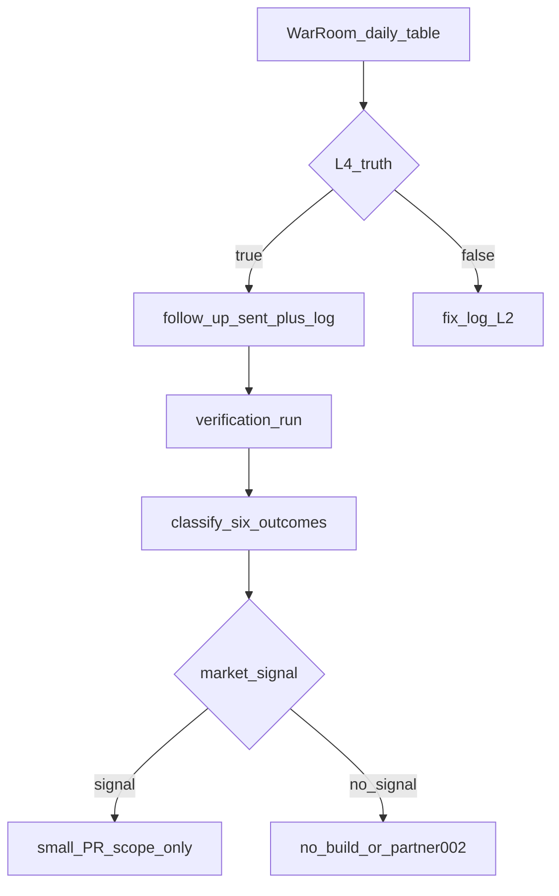

# Full Market Proof Run — تشغيل سوق واحد (نسخ ولصق)

**الغرض:** حلقة سوق كاملة في جلسة تشغيل — **بدون اختلاق أحداث**. القوالب والعناوين جاهزة؛ السجل الفعلي يُضاف في [`data/docs_asset_usage_log.json`](../../data/docs_asset_usage_log.json) **فقط بعد حدوث الشيء**.

**مراجع:** [MARKET_SIGNAL_OPERATING_LOOP_AR.md](MARKET_SIGNAL_OPERATING_LOOP_AR.md)، [ASSET_USAGE_GOVERNANCE_AR.md](ASSET_USAGE_GOVERNANCE_AR.md)، [ASSET_EVIDENCE_LEVELS_AR.md](ASSET_EVIDENCE_LEVELS_AR.md)، [MONTHLY_ASSET_COUNCIL_AR.md](MONTHLY_ASSET_COUNCIL_AR.md).

## Signal Execution Command Mode — وضع آلة القرار

**لا نوسّع النظام؛ نشغّله.** الحزمة موجودة؛ السجل لا يكتب قبل حدث حقيقي؛ **لا بناء منتج قبل إشارة سوق.**

| فحص | الحالة المقترحة |
|-----|----------------|
| Repository / docs gates | تنفَّذ أوامر التحقق أسفله بعد كل تعديل حقيقي في السجل |
| Full Market Proof Run | READY (هذا الملف) |
| L4 lock | ACTIVE — كل L4 مشروط بإرسال خارجي ومؤكد من المؤسس |
| 3 assets @ L4 | **CONDITIONAL على إرسال فعلي** لـ PARTNER-001 |

**مسموح الآن:** إما **فرع A** (L4 حقيقي → متابعة) أو **فرع B** (تصحيح إلى L2 ثم إرسال ثم L4).  
**ممنوع الآن:** ميزات/PR قبل إشارة صريحة (انظر الجدول في الأسفل).

**سلم السجلات والحوكمة:** إدارة السجلات الجادة تضبط **دورة حياة المعلومات** (إنشاء/استلام → تصنيف → تخزين → أمان → استرجاع → تتبع → أثر أو تصرّف نهائي) مع **دليل نشاط تجاري**؛ **ISO 15489** يغطي metadata والأنظمة والسياسات و **records controls** والمراقبة والمسؤوليات والتحليل المتكرر وإنشاء/التقاط السجلات وإدارتها والتدريب؛ **ISO/IEC 42001** يدعم نظام إدارة AI (إنشاء، تنفيذ، صيانة، تحسين) — بروح تناسب Dealix: **لا ادّعاءات AI بلا نظام إدارة وإثبات وتحسين مستمر.** السجل يبقى **evidence register** لا CRM للتجميل.

مراجع تعريفيّة (خارجية): [Records management](https://en.wikipedia.org/wiki/Records_management) · [ISO 15489](https://en.wikipedia.org/wiki/ISO_15489) · [ISO/IEC 23081 — metadata وأصالة السجلات](https://en.wikipedia.org/wiki/ISO_23081) · [ISO/IEC 42001](https://en.wikipedia.org/wiki/ISO/IEC_42001) · [تلاصق حوكمة AI وقت التشغيل (verification / monitoring / escalation)](https://arxiv.org/abs/2604.03262).

**بعد كل حدث حقيقي** (إضافة `entry` واحد في السجل):

```bash
py -3 scripts/generate_holding_value_summary.py
py -3 scripts/validate_docs_governance.py
py -3 -m pytest tests/test_holding_value_deliverables.py tests/test_docs_governance_system.py tests/test_external_packs_registry.py tests/test_motion_packs.py tests/test_external_pack_safety.py -q --no-cov
```

---

## Founder Command Execution — مركز القيادة العملي

**ما هذا؟** ليس مستندًا للقراءة فقط؛ **آلة تنفيذ**: كل نتيجة خارجية ⇒ مسار واحد ⇒ إدخال سجل واحد (أو إيقافًا مدروسًا)، ثم خطوة تالية وحيدة فقط.

**التعريف التشغيلي:** متابعة + تصنيف رد + تحويل اجتماع + تحديث أدلة + **بناء أم لا بناء** + archetype التالي إن لزم.

```text
L4 حقيقة مشروطة
3 أصول أُرسلت (كل إدخال مشروط بإرسال فعلي)
Full Market Proof Run جاهز
L4 Lock شغال
CI / validator / tests PASS عند تنفيذ أوامر التحقق أسفله
```

### أسئلة تمنع تضخيم النجاح والهرب للبناء

| بدل هذا | افعل هذا |
|---------|----------|
| «هل نجحت؟» | أي **حدث خارجي** يدوّن الآن في السجل؟ |
| «ماذا أضيف للمنتج؟» | أي **إشارة سوق** تبيّح PR صغيرًا من الجدول؟ |
| «نشعر بتقدّم كبير» | هل تقدّمك **L4→L5** أو **L4→تعلّم موثّق**؟ |
| الملل من انتظار الردود | لا تعالج بالكود؛ **archetype** أو إعادة صياغة فقط |

### السؤال التشغيلي الرئيسي

لا تسأل **«ماذا أبني؟»**؛ اسأل **«ما الحدث الخارجي التالي؟»**

### قائمة النتائج المعتمدة الآن فقط

(ما عداها غالبًا **تشويش**.)

```text
1. follow_up_sent
2. replied_interested
3. meeting_requested
4. meeting_booked
5. used_in_meeting
6. pilot_intro_requested
7. scope_requested
8. invoice_sent
9. no_response_after_follow_up
10. asks_for_pdf / asks_for_english / asks_for_case_study
```

### مركز قرار حسب النتيجة — متى تسجل؟ متى تبني؟ متى تتوقّف؟

| النتيجة | تسجّل؟ | بناء منتجي؟ | توقّف عندما |
|---------|--------|---------------|--------------|
| `follow_up_sent` | نعم، entry واحد | **لا** | يأتي رد أو تُكمِل مهلة واقعية قبل `no_response` |
| `replied_interested` | نعم | **لا** — رسالة واحدة لجدولة لا «10 ملفات» | قبل الإفراط في الشرح |
| `meeting_requested`/`meeting_booked` | نعم | **لا** | تنفُّذ الجلسة — **لا L5 قبل انعقادها** |
| `used_in_meeting` | نعم؛ الأصول المستخدمة فقط | **لا** ما لم تأتِ إشارة من الجدول | لا intro بعد الاجتماع ⇒ راجع **الرسالة** لا الخريطة الهندسية |
| `pilot_intro_requested` أو `scope_requested` | نعم (L6 تقريبي) | تهيئة **scope** وفق قرار واحد؛ PR فقط بإشارة جدول §10 | بلا طرف عميل/طلب تفاصيل ⇒ لا تُوسّع |
| مع `invoice_sent`… | نعم (مرشّح L7) | **لا** | دفع أو رفض واضح |
| `asks_for_pdf`/`english`/case study | نعم | **فقط** إن كان في §10 وبعد طلب خارجي حقيقي | أي تمديد خارج الطلب ⇒ **وقف** |
| `no_response_after_follow_up` | نعم (تعلّم) | **لا** | لا تتعلّق بـ PARTNER-001؛ انتقل **PARTNER-002** ثم §6b |

### «Response Watch» — عند وصول رد لا ترد قبل التصنيف

1. صنّف الرد ضمن عمود واحد من الجدول أو القائمة.  
2. أرسل ردًا **واحدًا** من §3–§5.  
3. ثبت `outcome` في السجل.

### شجرة قرار مختصرة

```text
مهتم؟ → replied_interested → احجز 30 دقيقة §3 (لا تشبّعهم ملفات)

طلب اجتماع؟ → meeting_requested/meeting_booked → لا L5 حتى الانعقاد

case study؟ → asks_for_case_study → موضّع إثبات §4

PDF؟ / English؟ → جدول §10

لا رد بعد متابعة؟ → لا بناء؛ سجّل تعلّمًا ثم archetype ثانٍ/ثالث §6 و§6b
```

### مجلس الأصول المصغّر (**بعد أول نتيجة من المتابعة** — **لا تعقده «الآن» قبل أول نتيجة**)

**مدخلات فقط:**

```text
data/docs_asset_usage_log.json
docs/strategic/_generated/asset_evidence_summary.json
docs/strategic/_generated/asset_capital_allocation.json
docs/strategic/HOLDING_VALUE_REGISTRY_AR.md
```

**مخرجات مسموحة — خمسة فقط:**

```text
continue
second archetype
revise message
build requested artifact   (جدول الإشارات فقط)
pause asset
```

لا تخرج بعشر قرارات؛ قرار واحد يكفي للأسبوع.

### كيف تعرف أنك تقدمت؟

**التقدّم ليس بعدد الملفات.** التقدّم هو واحد مما يلي، **ومُوثَّق في السجل**:

```text
L4 → L5
أو
L4 → تعلّم حقيقي موثّق
```

أي من:

```text
تم اجتماع
أو اعتراض/رفض واضح مسجّل كتعلّم
أو تم طلب PDF / English / scope
أو no-response موثّق
أو تم اختبار archetype ثاني (أو ثالث عند §6b إن لزم)
```

كلها تقدّم لأنها **تضيّق مساحة الجهل** — دون إلزامك بمشروع منتج.

### ماذا تنفّذ الآن حرفيًا؟

```text
1. إن كان L4 حقيقيًا، أرسل follow-up الآن (§1).
2. أضف follow_up_sent entry واحدًا فقط ثم شغّل التحقق أسفله.
3. جهّز مسبقًا ردّ interested / case study / PDF / English (§3–§5، جدول §10).
4. إذا رد: صنّف أولًا ثم ثبّت outcome في السجل ثم ردّ واحد فقط.
5. إذا اجتماع انعقد فعليًا فقط: ثبّت L5 بالأصول المستخدمة (§7).
6. إذا intro أو scope حقيقيان: L6 (§8).
7. إذا مال أو commitment تجاري: L7 (§9).
8. إذا لا رد بعد المتابعة: سجّل تعلّمًا ثم انتقل PARTNER-002 (§6)؛ إذا استمر الصمت بلا إشارة وبلا بناء ⇒ §6b PARTNER-003 قبل إعادة الزاوية كليًا.
```

---

## Founder Signal Command — حلقة أمر واحد لكل إشارة

**الهدف التشغيلي:** كل حدث خارجي يمرّ بسلسلة ثابتة:

```text
classification  →  evidence update  →  next action  →  build / no-build  →  verification run
```

بمعنى العمل اليومي:

```text
لا انتظار عشوائي — مراقبة نتيجة ثم قرار واحد بعدها.
لا بناء تراكمي بدون طلب السوق — PR صغير فقط عند وجود الإشارة (§10).
```

### لوحة القيادة الحالية (مراجع الحقيقة الرقمية: [`data/docs_asset_usage_log.json`](../../data/docs_asset_usage_log.json))

| البند | الحالة المرجعية |
|-------|----------------|
| هذا الملف + الروابط | جاهز |
| L4 Lock | شغّال؛ كل L4 مشروط بحدث ومؤكد من المؤسس |
| سجل الثلاثة أصول | كما في السجل — **ليست حقيقة خارجية قبل التحقيق**؛ إذا لزم ⇒ §0 |
| مسموح تقريبيًا الآن | **Follow-up Event** ثم تشغيل التحقق بعد أي entry فعل |
| ممنوع تقريبيًا الآن | **PR جديد** خارج إشارات §10؛ الهدف **L5** أو **learning موثَّق** |
| الأصول | `HOLDING_OFFER_MATRIX_AR.md` · `PROOF_DEMO_PACK_5_CLIENTS_AR.md` · `BU4_TRUST_ACTIVATION_GATE_AR.md` |

**قرار واحد لهذا الزمن التشغيلي:**

```text
Activate, not Invest.
```

**بدون طلب خارجي صريح — لا الآن:** PDF · English عميق · deck · UI/pricing أو حزم حوكمة موسّعة.

### Response Classification Command — **أدخل** كل رد في **تصنيف واحد** فقط:

```text
follow_up_sent
replied_interested
meeting_requested
meeting_booked
used_in_meeting
pilot_intro_requested
scope_requested
asks_for_case_study | asks_for_pdf | asks_for_english | asks_for_pricing | asks_for_security
forwarded_internally
no_response_after_follow_up
not_relevant
wrong_timing
invoice_sent   (مسار تجاري ظاهرًا فقط بعد حدث مالي حقيقي)
```

#### من التصنيف إلى القرار (ملخّص)

| Outcome | Evidence تقريبي | قرار تنفيذي فورًا |
|---------|----------------|-------------------|
| `replied_interested` | L4 | احجز 30′ — رسالة واحدة §3 |
| `meeting_requested` / `meeting_booked` | L4 | وقتان / agenda؛ **بدون L5 قبل الحضور** |
| `used_in_meeting` | L5 | intro واحد أو شريحة عميل واحدة |
| `pilot_intro_requested` / `scope_requested` | L6 | تهيئة scope واحد تحت احكام §8 |
| `asks_for_case_study` | L4 + learning | موضّع إثبات §4؛ لا ادّعاء |
| الطلبات `asks_for_*` | L4 + learning | PR صغير **فقط** من §10 + أمثلة النطاق نفس الأسفل |
| `no_response_after_follow_up` | L4 + learning | لا بناء؛ **PARTNER-002** ثم §6b **PARTNER-003** |

> النصوص الكاملة (إيميلات وJSON أمثلة) تبقى في **§1–§11** لتظل نقطة واحدة معروفة.

### مجلس أصول بعد أول «نتيجة» من المتابعة

**أسئلة خمسة فقط قبل التوسعة:**

```text
1. ما النتيجة؟
2. هل Evidence مرفوعة بصدق؟
3. هل market signal يبيّح بناءًا من الجدول؟
4. هل archetype بديل أفضل من إرهاق نفس الزاوية؟
5. هل المراجعة الآن رسالة أم إيقاف؟
```

ثم واحدًا فقط من: `continue` · `second archetype` · `revise message` · `build requested artifact` · `pause asset`.

### التحقق خطّ أحمر

بعد **كل entry حقيقي** — تشغيل أوامر أعلى الملف. **`FAIL`** ⇒ أصلّح السجل والبيانات المولّدة قبل تجارة خارجية؛ السجل جزء من جاهزية المنتج.

---

## Founder Signal War Room — لوحة التشغيل اليومي (بدون ملف جديد)

<span id="founder-signal-war-room"></span>

**التوجيه:** هذا القسم **لوحة تشغيل سريعة** فقط؛ التفاصيل الكاملة والقوالب المطوّلة في **§0 حتى §11** من نفس الملف (قفل L4، متابعة §1، ردود §3–§5، اجتماع §7، L6/L8، فاتورة §9، جدول البناء §10، إلخ). **لا تُكرّر** تلك الأقسام هنا — **وجّه** إليها بعد قرار سريع من الجداول أدناه.

**سطر واحد — لماذا هذه اللوحة:** لوحة اليوم تُشغّل **سجل أدلة** (ISO 15489: metadata، ضوابط، مراقبة، مسؤوليات) وليست CRM؛ ومع **ISO/IEC 42001** لا تُرفع ادّعاءات AI إلا مع إدارة وإثبات وتحسين — نفس روح Dealix: **لا claim بلا evidence، ولا evidence بلا حدث حقيقي.**

### مخطط التدفق (مرجع ذهني)



### الحالة المرجعية (حدّث الخلايا يدويًا كل يوم)

```text
Current state:
L4 = sent / pending   (تحقق من السجل الفعلي)
Assets = 3
Next event = follow_up_sent
Target = L5 or learning
Forbidden = new PR without signal
```

### القرار الأعلى (قبل أي بريد)

- **إذا L4 حقيقي** (الإرسال الأول حصل فعلًا): أرسل **المتابعة الآن** ثم سجّل `follow_up_sent` ثم **verification run**.
- **إذا L4 غير حقيقي:** لا متابعة — **صحّح السجل إلى L2** أولًا (§0 فرع B) ثم أرسل فعليًا ثم ارفع L4.

### 1 — غرفة القيادة اليومية (جدول واحد — لا ملف جديد)

| السؤال | الإجابة الحالية | القرار |
|--------|-----------------|--------|
| هل L4 حقيقي؟ | نعم / لا | نعم: تابع؛ لا: صحّح §0‑B |
| هل أُرسلت المتابعة؟ | نعم / لا | لا: أرسل §2 أدناه |
| هل وصل رد؟ | pending / نعم | انتظر أو صنّف إلى نتيجة واحدة من §3 |
| هل يوجد meeting منعقد؟ | نعم / لا | لا: **لا L5** |
| هل يوجد intro أو scope pull؟ | نعم / لا | لا: **لا L6** |
| هل يوجد invoice أو commitment؟ | نعم / لا | لا: **لا L7** |
| هل طُلب PDF / English؟ | نعم / لا | لا: **لا PR** |
| هل لا رد بعد المتابعة؟ | نعم / لا | لا: لا تنتقل PARTNER‑002 قبل التسجيل §3.6 |

هذه هي **لوحة القيادة الآن** — املأها قبل فتح المحرر أو الريبو.

### 2 — الحدث الوحيد المُفضّل الآن: Follow‑up Event

**لا تبنِ.** أرسل البريد فقط إذا كان L4 حقيقيًا. النص (paste-ready):

```text
Hi [Name],

Following up with one concrete angle:

This is not an AI automation resale motion.

The partner angle is a governed AI operations diagnostic for clients already experimenting with AI but lacking source clarity, approval boundaries, evidence trails, proof of value, and agent identity controls.

Would it be useful to compare this against one client segment you already see asking about AI governance or AI-driven revenue operations?

Best,
Sami
```

**بعد الإرسال فقط** — **entry واحد** (لا تسجّل الثلاثة أصول إلا إذا ذكرتها أو أعدت إرسالها صراحة):

```json
{
  "asset": "HOLDING_OFFER_MATRIX_AR.md",
  "used_for": "partner_follow_up",
  "date": "2026-05-14",
  "audience_id": "PARTNER-001",
  "audience": "Big 4 / Assurance Partner",
  "channel": "email",
  "outcome": "follow_up_sent",
  "outcome_quality": "pending",
  "evidence_level_after_use": "L4",
  "commercial_next_action": "wait for reply or test second archetype",
  "founder_confirmed": true
}
```

**ثم فورًا** أوامر التحقق (نفس كتلة بداية الملف):

```bash
py -3 scripts/generate_holding_value_summary.py
py -3 scripts/validate_docs_governance.py
py -3 -m pytest tests/test_holding_value_deliverables.py tests/test_docs_governance_system.py tests/test_external_packs_registry.py tests/test_motion_packs.py tests/test_external_pack_safety.py -q --no-cov
```

التفاصيل الإضافية للمتابعة الأولى: **§1**.

### 3 — ما بعد المتابعة: ست نتائج فقط (classification → سجل → خطوة)

#### نتيجة 1 — رد مهتم

**القرار:** احجز اجتماعًا. **لا** ترسل عدة ملفات.

```text
Thanks [Name] — glad this is relevant.

A short 30-minute discussion is enough. I'd like to keep it practical:

1. where your clients are already experimenting with AI,
2. where governance / source clarity / approval boundaries are weak,
3. whether a controlled diagnostic or Revenue Intelligence Sprint could be a safe first step.

Would either [Option 1] or [Option 2] work?

Best,
Sami
```

**التسجيل يبقى L4:**

```json
{
  "asset": "HOLDING_OFFER_MATRIX_AR.md",
  "used_for": "partner_reply",
  "date": "2026-05-14",
  "audience_id": "PARTNER-001",
  "audience": "Big 4 / Assurance Partner",
  "channel": "email",
  "outcome": "replied_interested",
  "outcome_quality": "medium",
  "evidence_level_after_use": "L4",
  "commercial_next_action": "book 30-minute partner meeting",
  "founder_confirmed": true
}
```

#### نتيجة 2 — اجتماع حُجز

**القرار:** جهّز agenda؛ **لا L5** بعد.

```text
Great.

Suggested 30-minute agenda:

1. Where your clients are already experimenting with AI.
2. Where governance, source clarity, approval boundaries, and evidence trails are weak.
3. Whether a controlled diagnostic or Revenue Intelligence Sprint is a safe first step.
4. Whether there is one client segment worth testing first.

I can do [Option 1] or [Option 2].

Best,
Sami
```

```json
{
  "asset": "HOLDING_OFFER_MATRIX_AR.md",
  "used_for": "partner_reply",
  "date": "2026-05-14",
  "audience_id": "PARTNER-001",
  "audience": "Big 4 / Assurance Partner",
  "channel": "email",
  "outcome": "meeting_booked",
  "outcome_quality": "high",
  "evidence_level_after_use": "L4",
  "commercial_next_action": "prepare 30-minute partner meeting agenda",
  "founder_confirmed": true
}
```

#### نتيجة 3 — الاجتماع انعقد واستُخدم الأصل

**القرار:** L5 **فقط** إذا وُجد استخدام فعلي للأصل في الجلسة.

```json
{
  "asset": "HOLDING_OFFER_MATRIX_AR.md",
  "used_for": "partner_meeting",
  "date": "2026-05-14",
  "audience_id": "PARTNER-001",
  "audience": "Big 4 / Assurance Partner",
  "channel": "video_call",
  "outcome": "used_in_meeting",
  "outcome_quality": "medium",
  "evidence_level_after_use": "L5",
  "commercial_next_action": "ask for one pilot intro",
  "founder_confirmed": true
}
```

#### نتيجة 4 — intro أو scope (أول pull)

**القرار:** L6 — ابدأ تجهيز **diagnostic scope** بحجم قرار واحد.

```json
{
  "asset": "PROOF_DEMO_PACK_5_CLIENTS_AR.md",
  "used_for": "partner_meeting",
  "date": "2026-05-14",
  "audience_id": "PARTNER-001",
  "audience": "Big 4 / Assurance Partner",
  "channel": "video_call",
  "outcome": "pilot_intro_requested",
  "outcome_quality": "high",
  "evidence_level_after_use": "L6",
  "commercial_next_action": "prepare diagnostic scope for referred client",
  "founder_confirmed": true
}
```

#### نتيجة 5 — طلب PDF / English

**القرار:** PR صغير **فقط** — لا تغيير استراتيجية أو scoring أو حوكمة موسّعة.

| Signal | PR المسموح |
|--------|------------|
| `asks_for_pdf` | Partner Motion Pack PDF Export |
| `asks_for_english` | English Partner One-Pager |

**نطاق PR:** راجع أمثلة النطاق في **§10** (نفس الملف).

#### نتيجة 6 — لا رد بعد المتابعة

**القرار:** سجّل تعلّمًا ثم **PARTNER‑002** — **لا بناء**.

```json
{
  "asset": "HOLDING_OFFER_MATRIX_AR.md",
  "used_for": "partner_follow_up",
  "date": "2026-05-14",
  "audience_id": "PARTNER-001",
  "audience": "Big 4 / Assurance Partner",
  "channel": "email",
  "outcome": "no_response_after_follow_up",
  "outcome_quality": "learning",
  "evidence_level_after_use": "L4",
  "commercial_next_action": "test second partner archetype",
  "founder_confirmed": true
}
```

### 4 — PARTNER‑002 جاهز **فقط** عند الصمت (لا ترسله وأنت تنتظر 001)

```text
Hi [Name],

I'm building Dealix, a governed AI operations company starting in Saudi Arabia.

The angle may be relevant for regulated workflows where AI experimentation is happening, but source clarity, human approval, evidence trails, and proof of value are not yet operationalized.

We are not positioning this as generic AI automation. The first motion is a controlled diagnostic or Revenue Intelligence Sprint that produces a Proof Pack, Value Ledger, and governed decision trail.

Would it be useful to compare this against one regulated client segment you already see exploring AI?

Best,
Sami
```

**بعد إرسال حقيقي:** `audience_id = PARTNER-002` · `audience = Regulated Technology Processor` · `evidence_level_after_use = L4` (مع بقية الحقول حسب القناة والتاريخ الفعلي).

### 5 — الاجتماع: مسار مختصر (cheatsheet — التفاصيل الكاملة §7)

1. We are not generic AI automation.
2. The missing layer is governed AI operations.
3. The first motion is diagnostic or controlled sprint.
4. The proof is Proof Pack + Value Ledger + governed decision trail.
5. Trust is gated, not claimed.
6. Ask: **one client segment** or **one pilot intro**.

**السؤال الأخير:**

```text
Who is one client segment you already see experimenting with AI, but not safe buying a generic automation tool?
```

### 6 — Build Freeze (يبقى شغال)

**ممنوع:**

```text
PDF قبل طلب PDF
English قبل طلب English
scope قبل طلب scope
pricing brief قبل طلب pricing
trust pack قبل طلب security
case study قبل proof
PR قبل signal
```

**المسموح فقط:** follow-up · classification · logging · verification · PARTNER‑002 عند `no_response` الموثّق.

### 7 — Mini Asset Council

**لا تعقده الآن.** اعقده **بعد أول نتيجة حقيقية** (رد، صمت مسجّل، طلب PDF، اجتماع).

| إذا… | قرار المجلس (واحد) |
|------|---------------------|
| الرد مهتم | `continue` → meeting |
| طلب PDF | `build requested artifact` (نطاق §10 فقط) |
| لا رد بعد المتابعة | `second archetype` |
| حصل اجتماع واستُخدم الأصل | تحديث Evidence إلى L5 ثم `continue` نحو intro |

### 8 — مقياس التقدم الحقيقي

التقدّم ليس «ملف جديد». التقدّم هو **أحد** هذه (موثّق في السجل):

```text
follow_up_sent
replied_interested
meeting_booked
used_in_meeting
pilot_intro_requested
no_response_after_follow_up
```

أي واحد منها **يحرّك النظام** لأنه يضيّق عدميقين أو يرفع سلم الأدلة بصدق.

### 9 — الأمر النهائي (نفّذ الآن فقط)

```text
1. تأكد أن L4 حقيقي.
2. أرسل follow-up.
3. أضف entry واحد.
4. شغّل التحقق.
5. انتظر النتيجة ثم طبّق جدول §3 فقط.
```

**الجملة الأخيرة:** Dealix الآن لا يحتاج command center أكبر — **لديه** command center. المطلوب **حدث واحد موثّق**: follow-up. بعده إما **L5**، أو **learning**، أو **PARTNER‑002**.

---

## 0 — قفل الصدق (قبل أي متابعة)

**هل الإرسال الثلاثي لـ PARTNER-001 حصل فعلًا؟**

### فرع A — L4 حقيقي

تابع إلى **§1 متابعة** بعد إعداد الرسالة، ثم **سجل `partner_follow_up` entry واحد** فقط (كما §1)، ثم انتظر ردًا. لا L5 قبل اجتماع.

### فرع B — L4 غير حقيقي

لا تكمّل المتابعة كأن الحدث قد حصل؛ **صحّح كل entry من الثلاثة أصول** أولًا إلى هذا الشكل (غيّر `asset` فقط لكل سطر؛ بقية الحقول كما هي):

```json
{
  "asset": "HOLDING_OFFER_MATRIX_AR.md",
  "used_for": "partner_outreach_template",
  "date": "2026-05-14",
  "audience_id": "PARTNER-001",
  "audience": "Big 4 / Assurance Partner",
  "channel": "none",
  "outcome": "prepared_not_sent",
  "outcome_quality": "none",
  "evidence_level_after_use": "L2",
  "commercial_next_action": "send to real partner before upgrading to L4",
  "founder_confirmed": false
}
```

كرر بالأصول: `PROOF_DEMO_PACK_5_CLIENTS_AR.md` · `BU4_TRUST_ACTIVATION_GATE_AR.md` إن كان السجل احتوى كلًا منها كـ L4 ظالمًا.

ثم أرسل فعلًا، وبعدها فقط أعد حقول `partner_outreach` كـ **L4** مع `founder_confirmed: true` وتاريخ وقناة صحيحة.

> **لا تُسجِّل قبل الحدوث.** هذا يحمي قيمة الشركة لا إجراءًا شكليًا.

---

## 1 — متابعة واحدة (email — لا ملفات جديدة)

**English (paste-ready):**

```text
Hi [Name],

Following up with one concrete angle:

This is not an AI automation resale motion.

The partner angle is a governed AI operations diagnostic for clients already experimenting with AI but lacking source clarity, approval boundaries, evidence trails, proof of value, and agent identity controls.

Would it be useful to compare this against one client segment you already see asking about AI governance or AI-driven revenue operations?

Best,
Sami
```

**بعد الإرسال فقط:** أضف **entry واحدًا** للأصل الذي ذُكر **فعليًا** في المتابعة (إن ذكرت واحدًا فقط، سجّله واحدًا).

```json
{
  "asset": "HOLDING_OFFER_MATRIX_AR.md",
  "used_for": "partner_follow_up",
  "date": "2026-05-14",
  "audience_id": "PARTNER-001",
  "audience": "Big 4 / Assurance Partner",
  "channel": "email",
  "outcome": "follow_up_sent",
  "outcome_quality": "pending",
  "evidence_level_after_use": "L4",
  "commercial_next_action": "wait for reply or test second archetype",
  "founder_confirmed": true
}
```

ملاحظة: `partner_follow_up` لا يرفع L5؛ الاجتماع لم يُنعقد بعد.

---

## 2 — جدول تصنيف الردود (قرار بدون انفعال)

| الرد | outcome | outcome_quality | Evidence تقريبي | قرار تشغيلي |
|------|---------|----------------|-----------------|-------------|
| رد مهتم | replied_interested | medium | L4 | احجز اجتماعًا |
| طلب اجتماع | meeting_requested | high | L4 | اقترح وقتين |
| حُجز اجتماع | meeting_booked | high | L4 | حضِّر agenda |
| تم الاجتماع واستُخدم الأصل فعلًا | used_in_meeting | medium/high | **L5** | اطلب pilot intro واضح |
| طلب intro أو scope | pilot_intro_requested / scope_requested | high | **L6** | جهّز diagnostic scope |
| طلب PDF | asks_for_pdf | learning | L4 | PR صغير: تصدير الحزمة المعتمدة فقط |
| طلب English | asks_for_english | learning | L4 | PR صغير: one-pager إنجليزي فقط |
| طلب case study | asks_for_case_study | learning | L4 | تموضع proof-stage؛ لا ادّعاء غير مسند |
| لا رد بعد المتابعة | no_response_after_follow_up | learning | L4 | archetype ثانٍ؛ لا تعيد رسالة واحدة لا نهائيًا |
| غير مناسب | not_relevant | low/learning | L4 | غيّر الجمهور؛ لا تبني ميزات |

---

## 3 — رد إذا مهتمًا (booking)

إذا كان الرد بمستوى «interesting» أو «tell me more» — **لا ترسل عشرة ملفات**؛ أرسل **دعوة اجتماع قصيرة واحدة** أدناه.

```text
Thanks [Name] — glad this is relevant.

A short 30-minute discussion is enough. I'd like to keep it practical:

1. where your clients are already experimenting with AI,
2. where governance / source clarity / approval boundaries are weak,
3. whether a controlled diagnostic or Revenue Intelligence Sprint could be a safe first step.

Would either [Option 1] or [Option 2] work?

Best,
Sami
```

 JSON بعد الرد الفعلي (ما زال L4 حتى ينعقد اجتماع):

```json
{
  "asset": "HOLDING_OFFER_MATRIX_AR.md",
  "used_for": "partner_reply",
  "date": "2026-05-14",
  "audience_id": "PARTNER-001",
  "audience": "Big 4 / Assurance Partner",
  "channel": "email",
  "outcome": "replied_interested",
  "outcome_quality": "medium",
  "evidence_level_after_use": "L4",
  "commercial_next_action": "book 30-minute partner meeting",
  "founder_confirmed": true
}
```

### طلب اجتماع (ما زالت L4)

```text
Great.

Suggested 30-minute agenda:

1. Where your clients are already experimenting with AI.
2. Where governance, source clarity, approval boundaries, and evidence trails are weak.
3. Whether a controlled diagnostic or Revenue Intelligence Sprint is a safe first step.
4. Whether there is one client segment worth testing first.

I can do [Option 1] or [Option 2].

Best,
Sami
```

سجل `meeting_requested` أو `meeting_booked` كـ **L4** فقط. لا L5 قبل انعقاد الجلسة.

```json
{
  "asset": "HOLDING_OFFER_MATRIX_AR.md",
  "used_for": "partner_reply",
  "date": "2026-05-14",
  "audience_id": "PARTNER-001",
  "audience": "Big 4 / Assurance Partner",
  "channel": "email",
  "outcome": "meeting_booked",
  "outcome_quality": "high",
  "evidence_level_after_use": "L4",
  "commercial_next_action": "prepare 30-minute partner meeting agenda",
  "founder_confirmed": true
}
```

---

## 4 — إذا طُلبت case study (لا اختراع proof)

```text
You're right to ask for proof.

We are currently at the controlled proof stage rather than claiming mature case studies.

The first engagement is designed to produce:

* a Proof Pack,
* a Value Ledger entry,
* a governed decision trail,
* and a reusable capital asset,

without unsafe automation, unsupported claims, or external action without approval.

That is exactly why the first motion is a diagnostic or controlled Revenue Intelligence Sprint rather than a broad AI automation deployment.

Best,
Sami
```

JSON:

```json
{
  "asset": "PROOF_DEMO_PACK_5_CLIENTS_AR.md",
  "used_for": "partner_reply",
  "date": "2026-05-14",
  "audience_id": "PARTNER-001",
  "audience": "Big 4 / Assurance Partner",
  "channel": "email",
  "outcome": "asks_for_case_study",
  "outcome_quality": "learning",
  "evidence_level_after_use": "L4",
  "commercial_next_action": "position first engagement as proof-generating diagnostic",
  "founder_confirmed": true
}
```

---

## 5 — إذا طلب PDF أو English — قرار بناء مشروط فقط عند الطلب الحقيقي

### نص موجز للرد على PDF

```text
I can send a compact PDF version of the partner pack. I'll keep it focused on the offer ladder, proof path, and trust gate.
```

**قرار البناء:** PR صغير — `Partner Motion Pack PDF Export` — **scope:** تصدير الحزمة المعتمدة فقط.

### نص موجز للرد على English

```text
I can send a short English one-pager. I'll keep it focused on the partner angle, not a full translation of the documentation set.
```

**قرار البناء:** PR صغير — `English Partner One-Pager` — **scope:** صفحة واحدة.

| الطلب | قرار البناء |
|-------|---------------|
| PDF | PR أعلاه؛ لا registry جديد عشوائي |
| English | PR أعلاه؛ لا ترجمة كاملة |

حتى لا يكون هناك طلب خارجي حقيقي: **تجمّد البناء.**

---

## 6 — لا رد بعد المتابعة

**لا تعلق بـ PARTNER-001** ولا تلمس الريبو لتعويض الصمت — سجّل **تعلّمًا** ثم انتقل لمسار مختلف (§6b عند الحاجة).

بعد مهلة واقعية ومتابعة فعل واحدة؛ إذا **لا استجابة**، أضِف وسجّل:

```json
{
  "asset": "HOLDING_OFFER_MATRIX_AR.md",
  "used_for": "partner_follow_up",
  "date": "2026-05-14",
  "audience_id": "PARTNER-001",
  "audience": "Big 4 / Assurance Partner",
  "channel": "email",
  "outcome": "no_response_after_follow_up",
  "outcome_quality": "learning",
  "evidence_level_after_use": "L4",
  "commercial_next_action": "test second partner archetype",
  "founder_confirmed": true
}
```

لا تكرر نفس النسخة endlessly — انتقل إلى **محاولة 2**؛ عند أي إرسال فعلي سجّل بـ **`audience_id = PARTNER-002`** و**`audience = Regulated Technology Processor`** وقناة الاتصال الفعلية.

### 6a — محاولة 2 — regulated processor (`PARTNER-002`)

**جمهور:** regulated technology processor  
**أصل ثقيل:** BU4 لزاوية الثقة والامتثال التشغيلي

```text
Hi [Name],

I'm building Dealix, a governed AI operations company starting in Saudi Arabia.

The angle may be relevant for regulated workflows where AI experimentation is happening, but source clarity, human approval, evidence trails, and proof of value are not yet operationalized.

We are not positioning this as generic AI automation. The first motion is a controlled diagnostic or Revenue Intelligence Sprint that produces a Proof Pack, Value Ledger, and governed decision trail.

Would it be useful to compare this against one regulated client segment you already see exploring AI?

Best,
Sami
```

سجّل L4 منفصل **فقط بعد إرسال فعلي** (أصل مذكور في النص أو في المرفقات بما يتوافق مع EXTERNAL_PACK_REGISTRY).

### 6b — محاولة 3 — VC platform (`PARTNER-003`)

إذا لم يتحرّك المسار عند **PARTNER-001** أو **PARTNER-002** بإشارة، جرّب زاوية **منصّة أو فريق قرار ضمن شركة رأس مال** — رسالة مختلفة؛ لا تعيد بالضبط pitch المحاسبة/التنظيم.

```text
Hi [Name],

I'm building Dealix, a governed AI operations company starting in Saudi Arabia.

One possible fit for a VC platform team is a lightweight AI readiness and governed revenue operations diagnostic for portfolio companies that are already experimenting with AI but lack source clarity, approval boundaries, evidence trails, and proof of value.

This is not generic AI automation. The first motion is designed to produce a Proof Pack, Value Ledger, and practical next-step recommendation.

Would it be useful to compare this against one portfolio segment where founders are asking about AI adoption or AI-driven revenue operations?

Best,
Sami
```

**سجل بعد إرسال حقيقي فقط:** `audience_id = PARTNER-003`, `audience = Saudi / GCC VC Platform Team` أو ما يكافئه بتعريفك التشغيلي القصير (`channel` وفق الواقع)، و`partner_outreach` أو `partner_follow_up` حسب المرحلة.

---

## 7 — L5: تنفيذ اجتماع (هدف واحد: **intro واحد**) — ثم السجل

الاجتماع **ليس** عرض منتج طويلاً؛ الغرض الأول **اختبار استخدام الأصل + طلب pilot intro واحد**.

**افتتاحية (~60 ثانية):**

```text
Thanks for making the time.

I'll keep this practical. The goal is not to pitch a broad AI platform. The goal is to see whether there is one client segment where governed AI operations is a safer first step than generic AI automation.
```

**ما لا يفعله Dealix:**

```text
Dealix is not a scraping, cold WhatsApp, or generic AI automation shop.

We do not make unsupported sales guarantees.
We do not automate external actions without approval.
We do not treat AI outputs as proof.
```

**المشكلة:**

```text
Most companies are adopting AI faster than they can govern it.

The missing layer is operational:
source clarity,
approval boundaries,
evidence trails,
proof of value,
and agent identity.
```

**العرض:**

```text
The offer ladder is intentionally simple:

Strategic Diagnostic:
identify whether the client has a governed AI operations gap.

Governed Ops Retainer:
monthly operating cadence, proof maintenance, and governance review.

Revenue Intelligence Sprint:
turn approved revenue data into ranked opportunities, draft-only assets, governance decisions, and a Proof Pack.
```

**الإثبات:**

```text
The first engagement is designed to produce:
a Proof Pack,
a Value Ledger entry,
a governed decision trail,
and a reusable capital asset.
```

**الثقة:**

```text
Enterprise trust is gated.
We do not sell trust claims before readiness.
BU4 activates only after evidence and governance conditions are met.
```

**السؤال النهائي:**

```text
Who is one client segment you already see experimenting with AI, but not safe buying a generic automation tool?
```

### ملخص وقتي (جدول مرجع)

| الدقائق | المحتوى |
|--------|---------|
| 0–5 | ما لا يفعله Dealix (`What Dealix refuses`) |
| 5–10 | الطبقة التشغيلية المفقودة |
| 10–15 | Offer ladder قصيرة |
| 15–20 | مسار Proof |
| 20–25 | Trust gate |
| 25–30 | **شريحة عميل واحدة + أو pilot intro واحد** |

### بعد الاجتماع فقط — لقطات L5 (لكل أصل اُستخدم فعليًا)

لسجلات منفصلة؛ لا تكتب كل الثلاثة إن لم يُعرَض كل أصل للشريك خلال الدعوة ذاتها.

```json
{
  "asset": "HOLDING_OFFER_MATRIX_AR.md",
  "used_for": "partner_meeting",
  "date": "2026-05-14",
  "audience_id": "PARTNER-001",
  "audience": "Big 4 / Assurance Partner",
  "channel": "video_call",
  "outcome": "used_in_meeting",
  "outcome_quality": "medium",
  "evidence_level_after_use": "L5",
  "commercial_next_action": "ask for one pilot intro",
  "founder_confirmed": true
}
```

```json
{
  "asset": "PROOF_DEMO_PACK_5_CLIENTS_AR.md",
  "used_for": "partner_meeting",
  "date": "2026-05-14",
  "audience_id": "PARTNER-001",
  "audience": "Big 4 / Assurance Partner",
  "channel": "video_call",
  "outcome": "used_in_meeting",
  "outcome_quality": "medium",
  "evidence_level_after_use": "L5",
  "commercial_next_action": "ask for one pilot intro or client segment",
  "founder_confirmed": true
}
```

```json
{
  "asset": "BU4_TRUST_ACTIVATION_GATE_AR.md",
  "used_for": "partner_meeting",
  "date": "2026-05-14",
  "audience_id": "PARTNER-001",
  "audience": "Big 4 / Assurance Partner",
  "channel": "video_call",
  "outcome": "used_in_meeting",
  "outcome_quality": "medium",
  "evidence_level_after_use": "L5",
  "commercial_next_action": "use as trust gate if enterprise readiness is discussed",
  "founder_confirmed": true
}
```

---

## 8 — L6: لا يحدث إلا بطلب حقيقي (pull)

يرتقي المعنى إلى **L6** مع وجود **pull** صريح — حضوركم في اجتماع وحده لا يكفي. أمثلة:

```text
pilot_intro_requested
scope_requested
client_segment_mapping_requested
forwarded_internally
second_meeting_requested  (بحضور client-facing عميق)
```

**إذا طُلب pilot intro:**

```json
{
  "asset": "PROOF_DEMO_PACK_5_CLIENTS_AR.md",
  "used_for": "partner_meeting",
  "date": "2026-05-14",
  "audience_id": "PARTNER-001",
  "audience": "Big 4 / Assurance Partner",
  "channel": "video_call",
  "outcome": "pilot_intro_requested",
  "outcome_quality": "high",
  "evidence_level_after_use": "L6",
  "commercial_next_action": "prepare diagnostic scope for referred client",
  "founder_confirmed": true
}
```

**إذا طُلب scope (مثلاً لتشخيص محكوم):**

```json
{
  "asset": "HOLDING_OFFER_MATRIX_AR.md",
  "used_for": "partner_meeting",
  "date": "2026-05-14",
  "audience_id": "PARTNER-001",
  "audience": "Big 4 / Assurance Partner",
  "channel": "video_call",
  "outcome": "scope_requested",
  "outcome_quality": "high",
  "evidence_level_after_use": "L6",
  "commercial_next_action": "prepare controlled diagnostic scope",
  "founder_confirmed": true
}
```

*(يمكن أيضًا تمثّل بعض أحداث scope باستخدام الدليل PROOF وفقًا لما عُرض فعلًا في المحادثة — ركّز دائمًا على الأصل المستخدم.)*

---

## 9 — L7: مال أو commitment تجاري حقيقي

يُسجل **L7 مرشّح** فقط عند واحد أو أكثر (حسب حقيقتكم):

```text
invoice_sent
paid_diagnostic_accepted
retainer_signed
sprint_accepted
partner_deal_signed
```

```json
{
  "asset": "PROOF_DEMO_PACK_5_CLIENTS_AR.md",
  "used_for": "invoice_motion",
  "date": "2026-05-14",
  "audience": "Referred Client",
  "channel": "email",
  "outcome": "invoice_sent",
  "outcome_quality": "revenue_candidate",
  "evidence_level_after_use": "L7",
  "commercial_next_action": "wait for payment and schedule kickoff",
  "founder_confirmed": true
}
```

تمييز ذهني: `invoice_sent` = مرشّح L7؛ الدفع الفعلي = **L7 confirmed** في التعليق أو entry لاحقة — **بدون تغيير schema** حتى تقرره صراحة في المنتج later.

---

## 10 — تجمّد البناء ما لم تُحقق إحدى الإشارات

**لا بناء منتج قبل:**

- طلب خارجي حقيقي (PDF / English / scope…)؛ أو  
- bottleneck تشغيلي يمنع تحويل L4 إلى L6 (ويُكتب قرار واحد صغير).

**Mini asset council (فورًا):**

| الأصل | مستوى تقديري في اللوحة التشغيلية | قرار الآن |
|-------|-----------------------------------|-----------|
| HOLDING_OFFER_MATRIX_AR.md | L4 تعريض محتمل | لا بناء — متابعة/تصنيف |
| PROOF_DEMO_PACK_5_CLIENTS_AR.md | L4؛ جاهز للاجتماع | لا بناء — استخدم إذا كان هناك اجتماع |
| BU4_TRUST_ACTIVATION_GATE_AR.md | L4؛ زاوية ثقة | لا بناء — archetype ثانٍ عند تعثر المحاولة 1 |

### إشارات البناء المسموحة فقط — **لا تبنِ إلا إذا السوق طلب** (أيّ شيء آخر ⇒ **No build**)

| الإشارة | البناء المسموح تقريبيًا |
|---------|--------|
| `asks_for_pdf` | Partner Pack PDF فقط |
| `asks_for_english` | English one-pager فقط |
| `asks_for_scope` | Diagnostic scope template |
| `asks_for_pricing` | Offer / pricing one-pager |
| `asks_for_security` | Trust Pack Lite |
| لا رد **من نفس archetype رسائيًا بعد 3 مسارات خارجية واقعية معقولة** | إعادة صياغة واحدة؛ لا منتج جديد |
| L6 متكرر | Partner Sales Kit (عند وجود دليل؛ لا قبل) |
| L7 | Case-safe proof asset |

أيّ شيء خارج الجدول:

```text
No build.
```

### أمثلة حدّ نطاق PR (عند إشارة خارجية حقيقية)

**PDF:**

```text
PR: Partner Motion Pack PDF Export

Scope:
- export existing pack only
- no strategy changes
- no scoring changes
- no new governance packs
```

**English one-pager:**

```text
PR: English Partner One-Pager

Scope:
- one page only
- no full docs translation
- no glossary expansion
```

---

## 11 — لا ترفع scoring بلا حقيقة تشغيلية

- اللقاء خارجي وحده (L4) **لا** يرفع «Revenue evidence» بحسب السلم التجاري.  
- مراجعة **Partner evidence** بحذر بعد **L5** إذا كان الأصل أسهم في قرار واقعي في الاجتماع.  
- **L6+** إذا تحرّك intro أو scope.  
- **Commercial Core ثابت** عند وجود خط فوترة حقيقية (L7).

---

## 13 — تسلسل مرجعي (تفاصيل إضافية)

1. تأكّد فرع **A أو B** §0 قبل أي اتصال بالسوق.
2. إن كان **A**: §1 ثم **إدخال** `partner_follow_up` واحد.
3. لا **L5** قبل اجتماع فعلي.
4. انتظر ردًا؛ صنّف حسب §2 و«Response Watch» أعلاه واستخدم الشُعب §3–§5.
5. **اجتماع:** نفّذ نص §7 ثم لقطات L5 للأصول المعروضة فقط.
6. **L6:** فقط بعد pull (§8).
7. **L7:** فقط بعد مال/commitment (§9).
8. **لا PR** خارج جدول «إشارات البناء المسموحة» (§10).
9. بعد كل تعديل حقيقي في السجل: أوامر التحقق الثلاثة أعلى هذا الملف.

**الخلاصة:** أقصى تنفيذ ليس كودًا جديدًا؛ هو دفع سلسلة أحداث خارجية بأمانة في السجل.

---

## 14 — لا يُنفَّذ الآن (قائمة الحماية من fiction)

- لا L5 بدون اجتماع فعلي واستخدام أصل مذكور.  
- لا L6 بدون intro/scope/pull واضح.  
- لا L7 بدون حركة إيرادية حقيقية (فاتورة/عقد/دفع حسب تعريفك التشغيلي).  
- لا PDF ولا one-pager إنجليزي بدون طلب خارجي واضح.

**الجملة الحاكمة:** لا تزوّر الزمن؛ لا تسجّل قبل الحدوث؛ لا تبني قبل إشارة؛ ادفع L4 إلى L5 ثم L6 ثم L7 بتسلسل واحد حقيقي.

---

## 15 — قواعد عدم الانحراف

```text
لا تسجل قبل الحدث.
لا تبنِ قبل الإشارة.
لا ترفع Evidence قبل الاستخدام / حدث خارجي يثبت الاستخدام.
لا ترفع L5 قبل انعقاد اجتماع فعلي باستخدام الأصل عند الحاجة لتسجيل L5.
لا ترفع L6 قبل pull حقيقي (intro / scope / forward عميق).
لا ترفع L7 قبل commitment تجاري حقيقي أو فاتورة وفق تعريفكم.
لا ترفع Revenue score قبل مال أو إثبات دفع عندما تُدرجون ذلك لاحقًا في registry.
لا تغيّر الرسالة قبل تغيّر نمط (archetype أو صياغة).
لا تفتح PR قبل signal من جدول البناء §10.
```

**الهدف:** الحفاظ على السجل **`evidence register`** لا لتجميل مزاج المؤسس أو إغراق المستودع.

---

## 16 — أين أكبر قيمة الآن؟

ليست «أكمل توثيقًا»؛ القيمة الآن في واحد مما يلي **بصدق في السجل**:

```text
أول رد
أول اجتماع L5
أول intro / scope (L6)
أول invoice أو commitment يعادل L7
```

لهذا القرار التشغيلي:

```text
كل شيء جاهز تحت Founder Signal Command.
الحدث التالي المتوقّع عادةً: follow-up ثم مراقبة تصنيف.
```

> **Dealix الآن في وضع Command Execution. لا ينقصه نظام يوميًا؛ ينقصه signal خارجي. أرسل المتابعة، صنّف الرد، وسجّل الحقيقة فقط. أوّل L5 صادق يغيّر الأولويات أكثر من أي ملف توثيق إضافي.**

> **Dealix الآن لم يعد يحتاج مزيدًا من «الاستعداد الداخلي». يحتاج حدثًا خارجيًا واحدًا: follow-up ثم رد أو صمت موثّق. نفّذ الحدث؛ لا تضف نظامًا.**
